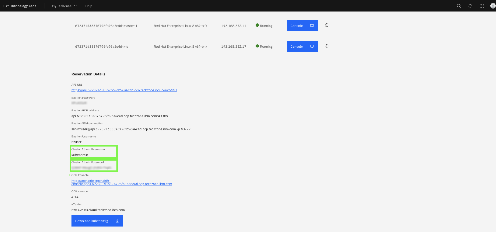

# Single Node OpenShift Cluster

### Summary of the environment

The next Lab environment you will use is the **Single Node OpenShift** cluster deployed on IBM Cloud.

The very first hands-on exercise in the Lab will be accessing your OpenShift cluster and deploying the **zAssistantDeploy** services with all dependent resources, including OpenSearch with the watsonx Assistant for Z RAG and the Client Ingestion service. This will service as a foundation for later deploying AI Agents onto your cluster that can be imported into watsonx Orchestrate for accessing and testing.

***Disclaimer:*** The various components of watsonx Assistant for Z (i.e. zRAG OpenSearch database) are deployed and collocated alongside the deployment of watsonx Orchestrate. For this Lab, you will use a dedicated OpenShift cluster for the sole purpose of deployed these components, with the exception of watsonx Orchestrate (SaaS version), as well as AI agents which will be made accessible within watsonx Orchestrate SaaS.

### Accessing the environment

Follow the below instructions to access your ***Single Node OpenShift*** environment.

1. Click the following link to open a browser window to your ITZ reservations.
   
    <a href="https://techzone.ibm.com/my/reservations" target="_blank">ITZ My reservations</a>

2. Click the **Single Node OpenShift** tile.
   
    

3. Scroll down and record the **Cluster Admin Username** and **Cluster Admin Password**.
   
    

4. Click the **OCP Console** link.
   
    

5. Enter the **Cluster Admin Username** and **Cluster Admin Password** values from step 3 and click **Log in**.
   
    

   

