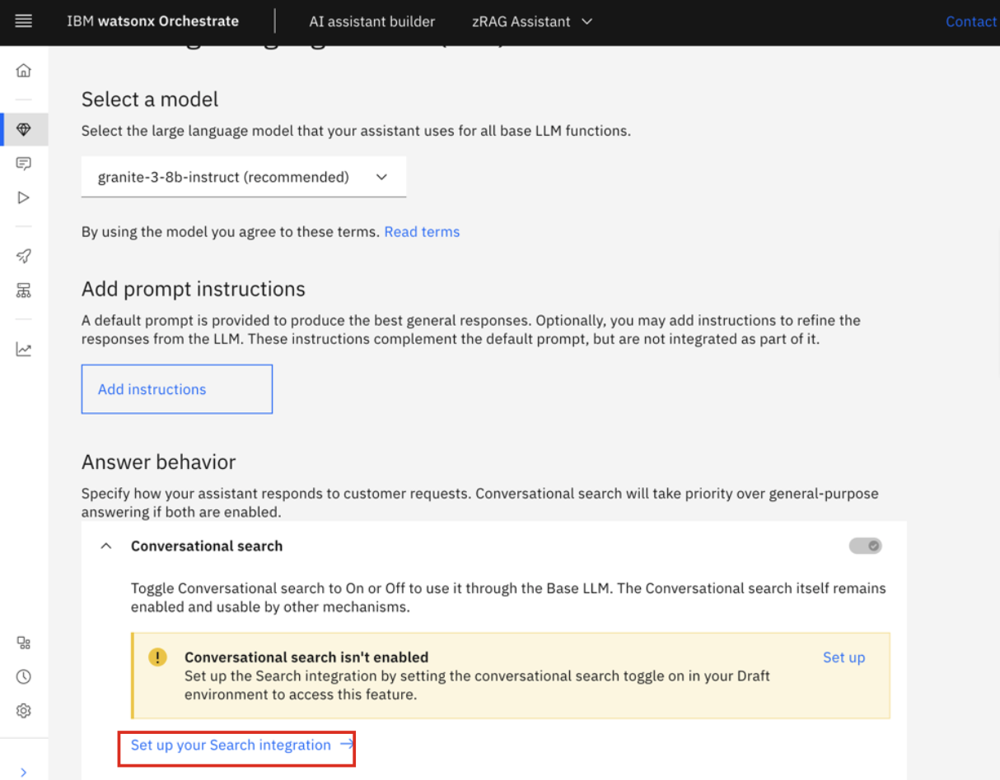
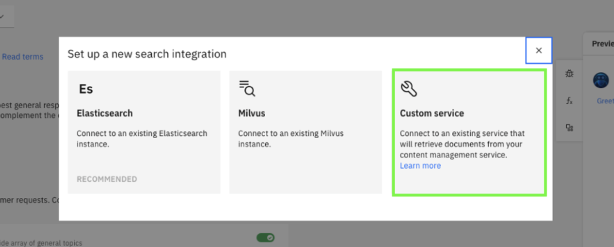
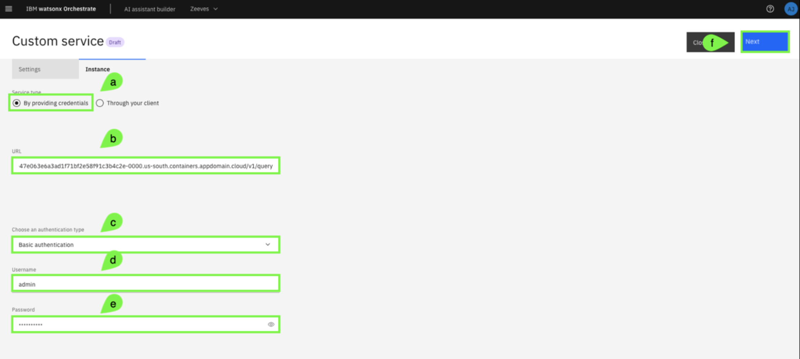

# Setup Conversational Search

In this step, you will configure **conversational search** for your assistant with the **OpenSearch instance** you previously deployed. Exposing the zRAG database to your assistant will augment it with content-grounded knowledge for helping to answer a range of IBM Z related questions.

1. In the Assistant Builder view, hover your cursor over the left-side of the screen to reveal the side-bar and click the **Generative AI** menu item.
   
    

2. Under the **Answer behavior** section, click **Set up your Search integration**.
   
    

    **Note:** By default, conversational search is not enabled when an assistant is created.

3. Click **Customer service**. 
   
    

4. Complete the **Custom service (a-e)** form and then click **Next (f)**.
   
    **a.** Select **By providing credentials**. 

    **b.** Copy and paste your unique `WRAPPER_URL` value that you recorded in Section ***[Verify deployment and acquire OpenSearch connection details](../zAssistantDeploy/verify-deployment.md)***.

    **c.** Select **Basic authentication** in the drop-down list.

    **d.** Enter `admin` in the **Username** field. 

    **e.** Copy and paste your `WRAPPER_PASSWORD` value that you recorded in Section ***[Verify deployment and acquire OpenSearch connection details](../zAssistantDeploy/verify-deployment.md)***.

    

5. Enable **conversational search** and then click **Next**. 
   
    

