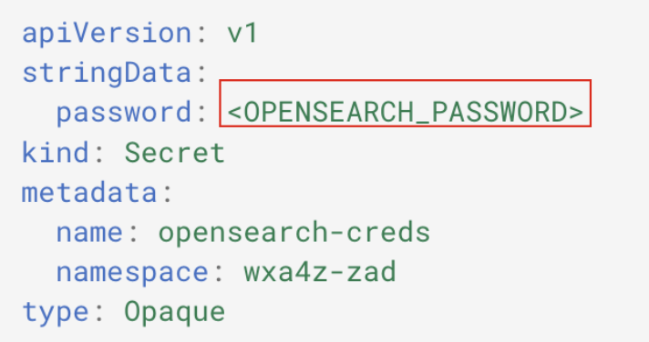
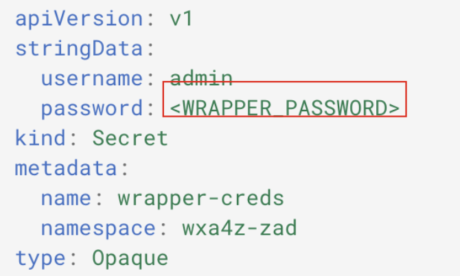

# Deploy required secrets for OpenSearch and Client Ingestion

In this step you will create the required secrets and other pre-configuration for the **zAssistantDeploy services**. For all of the instructions in this section, it is assumed that you’re accessing your local command line or terminal prompt in the ***zAssistDeploy*** directory.

### OpenSearch

OpenSearch enables you to search, analyze, and visualize large volumes of data in real time. 

1. In your downloaded/extracted ***zAssistDeploy*** directory, there is an `os-secret.yaml` file. In a text editor of your choice (i.e.command-line,VSCode,etc.),modify this file to replace `<OPENSEARCH_PASSWORD>` with a secure password of your choice (and save it). 
   
    ***Record this value for later use.***
    
    

2. Create the secret by running the following command within the same directory:
   
    ```
    oc apply -f os-secret.yaml
    ```
   
### Content Ingestion

Customers can ingest their content into the search database to improve the AI Assistant’s ability to retrieve information from their uploaded documents, in addition to leveraging IBM documentation.

1. Modify the `client-ingestion-secret.yaml` file, replacing `<CLIENT_INGESTION_AUTHKEY>` with a 
secure authentication key of your choosing (i.e. a password). 

    ***Record this value for later use.***

    

2. Create the secret by running the following command within the same directory:
   
    ```
    oc apply -f client-ingestion-secret.yaml
    ```
   

### Authorization service

The Authorization service ensures secure access by validating the current login user in watsonx Orchestrate® against the z/OS User Management system.


You can use your own Certificate Authority (CA) signed certificates for mutual TLS (mTLS) by following a simple process, which involves:

- Creating a Certificate Signing Request (CSR)

- Getting it signed by your internal CA

- Importing the signed certificate and your CA’s public key into the system

Alternatively, you can use the default IBM Internal CA-signed certificates, which are available for immediate use.

1. For the purpose of the cloud environments, there is a `wxa4z-authorization-secrets.yaml` file in your downloaded directory that contains a set of **agent auth-token secrets** for each of your agents. 
   
    Either use the pre-defined agent tokens specified in the file, or feel free to modify them, then create the secret by running the following command:

    ```
    oc apply -f wxa4z-authorization-secrets.yaml
    ```    

2. Then run the following command to apply the next required secret:
   
    ```
    oc apply -f wxa4z-authorization-ca.yaml
    ```


### z/OS Topology Service

The **z/OS Topology Service** serves as a central repository for managing the topology of z/OS systems. 

1. Modify the `wxa4z-zos-topology-secrets.yaml` file with the secret values for your system. Open the file in a text editor of your choice.

    You should see the following with placeholders:

    ```
    ZOSMF_USERNAME: "<value>"
    ZOSMF_PASSWORD: "<value>"
    OMEGAMON_TOKEN: "<value>"
    REDIS_PASSWORD: "<value>"
    ```

2. Set the `<value>` for `ZOSMF_USERNAME` to `IBMUSER`.


3. Set the `<value>` for `ZOSMF_PASSWORD` to a unique password/passphrase value that the **IBMUSER** ID uses to log into TSO. 

    To set your new Password value, follow the steps outlined ***[here](../agentdeploy/upgrade-agent/secrets-data.md#set-your-zosmf_password-variable)***. 

4. Once modified and saved, create the secret by running the following command:
   
    ```
    oc apply -f wxa4z-zos-topology-secrets.yaml
    ```

### Wrapper secret

1. Next, modify the `wrapper-creds.yaml` file, replacing `<WRAPPER_PASSWORD>` with a secure password credential. **Record this value for later use as this is what you’ll later use to configure your assistant and agent OpenSearch connection.**
   
    

2. Create the secret by running the following command within the same directory:
   
    ```
    oc apply -f wrapper-creds.yaml
    ```

### Create IFM Secret

Next you will create the IFM secret using the watsonx.ai secret values you recorded in ***Section [Prepare watsonx.ai services](../watsonx-ai/overview.md)***.

In the provided `wxa4z-ifm-credentials.yaml` file, you should see the following section:

```
  CPD_USERNAME:
  WATSONX_URL: <value>
  WATSONX_API_KEY: <value>
  WATSONX_MODEL_ID: <value>
  WATSONX_SPACE_ID: <value>
  WATSONX_PROJECT_ID: <value> 
```

1. Set the `WATSONX_URL` variable to the value you recorded for the Base URL of your watsonx.ai Runtime instance ***[in this section](../watsonx-ai/wml-base-url.md)***.

2. Set the `WATSONX_API_KEY` variable to the Cloud API Key you generated and recorded in ***Section [Generate IBM Cloud API key](../watsonx-ai/api-key.md)***.

3. Set the `WATSONX_MODEL_ID` variable to `meta-llama/llama-3-3-70b-instruct` as this is an x86 based deployment. 

4. Set the `WATSONX_SPACE_ID` variable to the Deployment Space ID you recorded in ***Section [Create Deployment Space](../watsonx-ai/deployment-space.md)***.

5. Set the `WATSONX_PROJECT_ID` variable to the Project ID you recorded in ***Section [Create watsonx.ai Project](../watsonx-ai/project.md)***.

6. Once done and you saved the modified file, create the secret by running the following command:
   
    ```
    oc apply -f wxa4z-ifm-credentials.yaml
    ```


