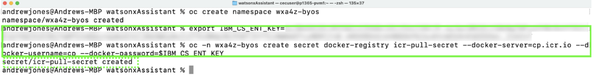

# Install the watsonx Assistant for Z Operator

In this step you will install the watsonx Assistant for Z operator to deploy and configure **zAssistantDeploy** on your cluster. First, you will need to deploy the catalog source using the provided YAML file.

1. In your local command prompt or terminal window, create 2 new namespaces called `wxa4z-operator` and `wxa4z-zad` in the cluster by issuing the following 2 commands in sequence:
   
    ```
    oc create namespace wxa4z-operator
    ```

    ```
    oc create namespace wxa4z-zad
    ```

2. Next, you will need to create or obtain your IBM Container Software production entitlement key. This is required to pull the container images that get deployed by the operator.

    You can create or retrieve an entitlement key by accessing the <a href="https://myibm.ibm.com/products-services/containerlibrary" target="_blank">Entitlement keys page here</a>.

    If you don’t have an entitlement key at the above link, click the **Add new key** to create a new one. 

    If extra assistance is needed, refer to this <a href="https://github.ibm.com/alchemy-registry/image-iam/blob/master/obtaining_entitlement.md" target="_blank">site</a>.

    ***Locate your existing key or create a new one and continue to the next step.***

3. Click **copy** and record your entitlement key for future use in a secure location.
   
    

4. In your command prompt or terminal window, set an environment variable with your production entitlement key.

    Substitute your production entitlement key copied in the last step for `<entitlement key>`.

    ***Mac users:***
    ```
    export IBM_CS_ENT_KEY=<entitlement key>
    ```

    ***Windows users:***
    ```
    set IBM_CS_ENT_KEY=<entitlement key>
    ```

5. Enter the following command (depending on operating system) to create a pull secret for the Container Registry.

    ***Mac users:***
    ```
    oc -n wxa4z-zad create secret docker-registry icr-pull-secret --docker-server=cp.icr.io --docker-username=cp --docker-password=$IBM_CS_ENT_KEY
    ```

    ***Windows users:***
    ```
    oc -n wxa4z-zad create secret docker-registry icr-pull-secret --docker-server=cp.icr.io --docker-username=cp --docker-password=%IBM_CS_ENT_KEY%
    ```

    

6. Create your **catalog source** resource in your OpenShift cluster by running the following command:
   
    ```
    oc apply -f catalogSource.yaml
    ```

    

7. After applying the *catalog source*, install the watsonx Assistant for Z **operator** by running the following command:
   
    ```
    oc apply -f wxa4z-operator.yaml
    ```

8. Lastly, run the following command to monitor/wait until the operator is fully installed and available:
   
    ```
    oc -n wxa4z-operator wait deployments/ibm-wxa4z-operator-controller-manager --for=condition=Available --timeout=1800s
    ```

    Once done, proceed to the next section.


