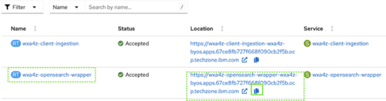
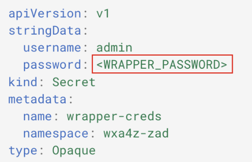

# Verify deployment and acquire OpenSearch connection details

In this section you will verify the successful deployment of your zAssistDeploy service and gather the OpenSearch credentials needed to configure an assistant with conversational search for Q&A.

1. ***Before proceeding***, ensure that all pods in your **wxa4z-zad** namespace have a status of **Running** or **Completed**, as shown below:
   
    

2. Under **Networking**, click **Routes**.
   
    

3. Copy and record the location of the **wxa4z-opensearch-wrapper** route.
   
    

    **IMPORTANT:** *Ensure you copy this URL to a notepad and saved for later as this value will be used frequently throughout the rest of the Lab.*

4. Once copied to a local notepad, append the string `/v1/query` to the end of the URL to complete the URL endpoint.
   
    The URL should look similar to:

    ```
    https://wxa4z-opensearch-wrapper-wxa4z-zad.apps.68b1c328e1b1c3e282ce4781.eu1.techzone.ibm.com/v1/query
    ```

    ***NOTE:** the above URL will not work for you. Use the value of your specific OpenSearch instance.*

5. The final URL (*with the appended string at the end*) should be recorded in your notepad and labeled `WRAPPER_URL`. In later instructions, this value will be referred to as your ‘`WRAPPER_URL`’. Whenever you’re prompted for it, you can retrieve this URL value from your local notepad.


6. Finally, the last thing you’ll need is your **OpenSearch Wrapper Password**. This is the value you added to your local `wrapper_creds.yaml` file, substituted for <WRAPPER_PASSWORD>:
   
    

7. Copy and record this password value to the same notepad, labelling it as your `WRAPPER_PASSWORD`.


    *You will also be prompted for this value throughout the rest of the Lab. So ensure it’s recorded in your notepad for later use.*