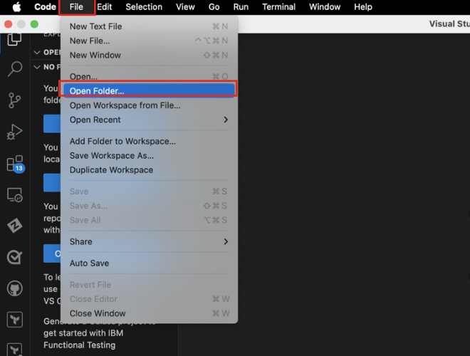
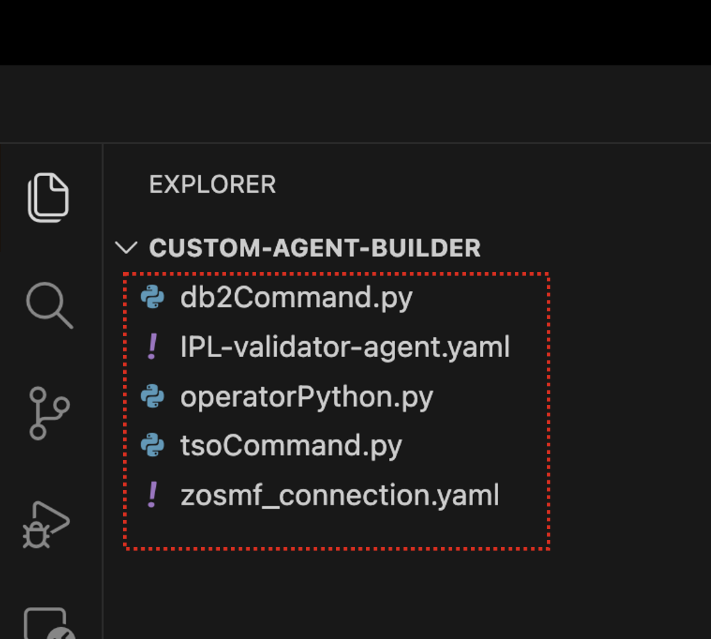
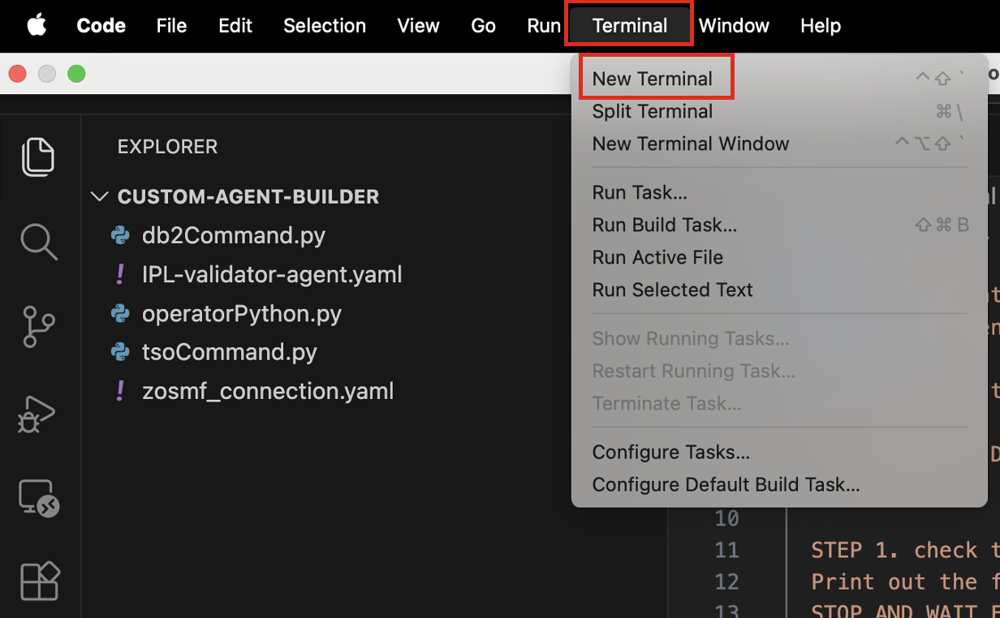

# Setting up VS Code workspace with Agent configuration files

For the following sections of the Lab, you will be using VS Code to build your agents using the ADK.

***Before proceeding, ensure you have the VS Code application installed and accessible on your local workstation.***

1. Download the **Custom-Agent-Builder.zip file** to your local machine: 
   
    <a href="https://ibm.box.com/s/bdve4upiaj9riu58xl78igbp30imwabb" target="_blank">https://ibm.box.com/s/bdve4upiaj9riu58xl78igbp30imwabb</a>
   

2. Click the **download** icon in the top-right corner of the browser to download the agent folder to your local workstation.

3. Once downloaded as a ***.zip*** file, extract the **Custom-Agent-Builder** .zip file in your Downloads directory.

4. Open **VS Code** on your local workstation.

5. Then open the extracted ***Custom-Agent-Builder*** folder within your VS Code workspace by clicking **File -> Open Folder**. 
   
    

6. Then select the extracted ***Custom-Agent-Builder*** folder you previously downloaded and **open it**.
   
7. Once VS Code restarts, you should see the folder opened in the **Explorer** view, with the following files:
   
    - *`zosmf_connection.yaml`*
    - *`tsoCommand.py`*
    - *`operatorCommand.py`*
    - *`db2Command.py`*
    - *`IPL-validator-agent.yaml`*
  
    

    !!! Warning "**What are these files?**"

        **Connections:**

        - ***`zosmf_connection.yaml`:*** configuration file used to group your tools together as a common service and authenticate your tools to the back-end system. In this case, the connection is for your z/OSMF services hosted by the **zD&T environment**.

        **Tools:**

        - ***`tsoCommand.py`:*** a Python-defined tool that executes a TSO/E command via z/OSMF and returns the response back to the user. 

        - ***`operatorCommand.py`:*** a Python-defined tools that issues an MVS operator command through the z/OSMF REST console services, then returns the command response. 
  
        - ***`db2Command.py`:*** a Python-defined tool that calls a series of TSO/E REST APIs via z/OSMF to start a DSN TSO session and issue Db2 for z/OS commands via TSO. Then formats the buffered output before displaying the command output back to the user. 
  
        **Agents:**

        - ***`IPL-validator-agent.yaml`:*** an Agent configuration file to define an agent, titled z/OS_Certificate_Agent which leverages the tools above to help users quickly identify certificate information and assist with the certificate renewal process for expiring certificates

8. Finally, open a **Terminal window** within VS Code by clicking **Terminal -> New Terminal**:
   
    