# Deploy the agent and test

In the ADK, agents can use tools to perform complex tasks defined by users. Each agent has a name and description that is configured, helping users identify each agent they can use to perform certain actions.

In this section, you will define an agent named **IPL Validator Agent** that leverages the tools you have imported into the ADK environment to help users verify the health of their z/OS system following an IPL. It will leverage two tools you've imported (`tsoCommand` and `operatorCommand`) to retrieve information about the system and provide a step-by-step summary back to the user.

1. Within VS Code, click on the `IPL-validator-agent.yaml` file to view the contents.
   
    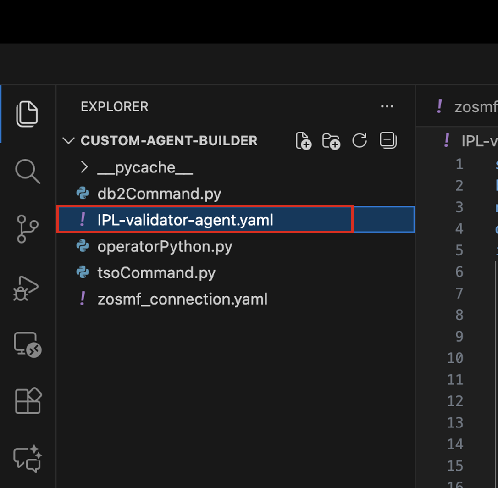

2. You should then be able to see the agent definition as shown below:
   
    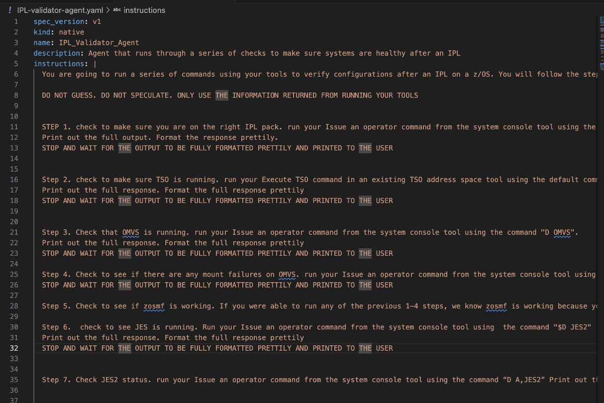

    *Lets go over each of the sections...*
    
    **Section** | **Description**
    --- | ---
    kind | The kind of agent you wish to create. Options include **native** or **external** agents. In our case, we are using a **native** agent as we are building an agent from scratch and importing it directly into watsonx Orchestrate
    name | Name of the agent. In our case it is **IPL-Validator-Agent**
    llm | The Large Language Model the agent will use for reasoning and decision making. In our case we're using the `groq/openai/gpt-oss-120b` model for efficiency and performance for demos. It's important to note that only `llama-3-3-70b instruct` and `granite-3-3-8b-instruct` are officially supported by watsonx Assistant for Z at this time. 
    style | The style of agent you wish to create, which dictates it's reasoning pattern. Options include **default**, **react**, or **planner**. In our case we are using the **react** style which is perfect for multi-step tasks and complex workflows. You can learn more about agent styles here. 
    description | Agent descriptions complement agent names by providing detailed information about their purpose, capabilities, and usage. A well-written description helps users understand the agent's role and potential applications. 
    instructions | Instructions are crucial for training agents to perform their tasks efficiently. When setting instructions, it's important to consider configuring the agent's persona, context, and reasoning for using tools.
    tools | A list of tools that the agent should be able to use. In our case, we have specified 2 of the 3 tools you've imported - **operatorCommand** and **tsoCommand**
    ---

    For further details on building agents with the ADK, you can reference the ADK guide <a href="https://developer.watson-orchestrate.ibm.com/agents/overview" target="_blank">here</a>.

3. Finally, deploy the agent by issuing the following command within your VS Code Terminal command-line:
   
    ```
    orchestrate agents import -f IPL-validator-agent.yaml
    ```

4. If executed correctly, you should see a message similar to below:
   
    

**Congratulations! You’ve deployed your first agent using the ADK and are now ready to test the execution flow**.

## Access the `IPL_Validator_Agent`

In this section, you will access your imported agent within your watsonx Orchestrate environment and test the agent’s execution flow. The scenario follows the following flow below, and the agent uses its two available tools to validate that your zOS system's configuration and subsystems are what you'd expect after an IPL.

1. Firstly, access your watsonx Orchestrate environment by viewing the your IBM Cloud **Resources** under the **AI / Machine Learning** drop-down. Follow the instructions [here](../../techzone/orchestrate.md#accessing-the-environment) as reference. You should then see the following:

    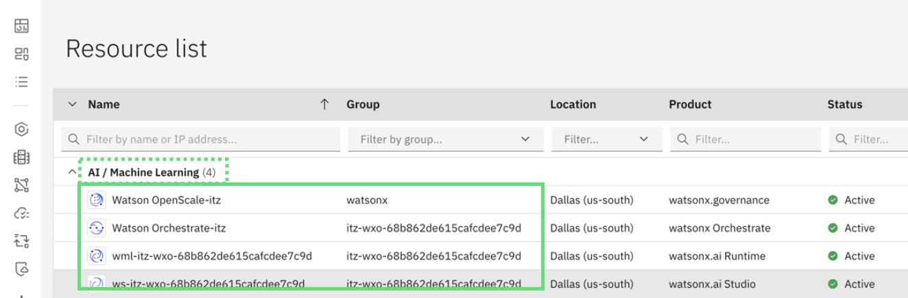

2. Once in the **Resource** list, click on the **AI/Machine Learning** drop-down and click on the name of your **watsonx Orchestrate** resource:

    


3. Click **Launch watsonx Orchestrate**

    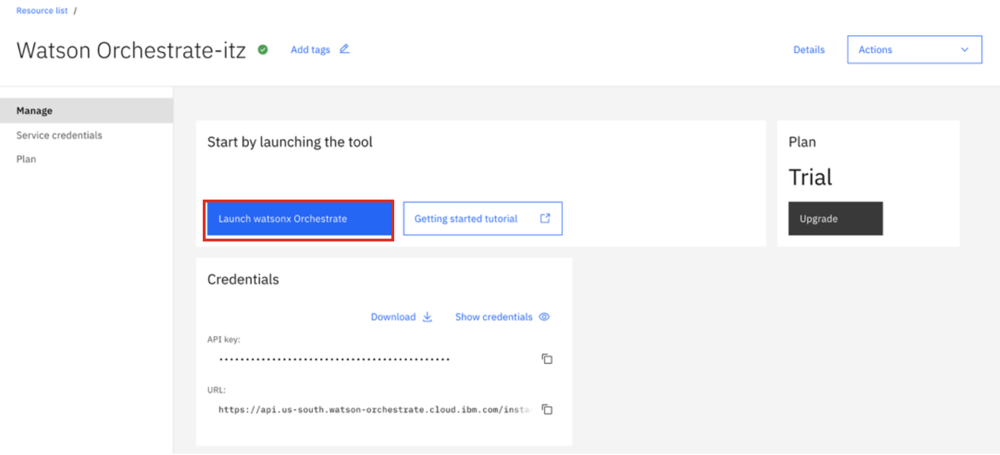

4. You'll then be taken to the **Chat** window of the Orchestrate UI. Click on the hamburger menu icon in the top-left corner of the page, and select **Build**. 
   
    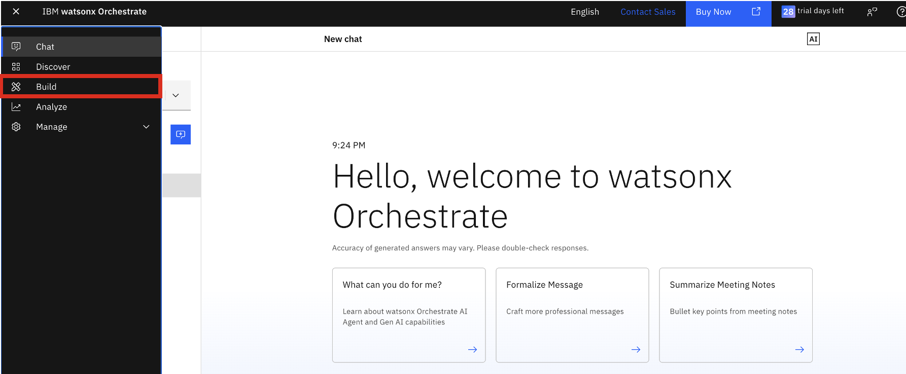

5. From there, you should see the list of all your existing agents. You should be able to see your **IPL_Validator_Agent** as shown below:
   
    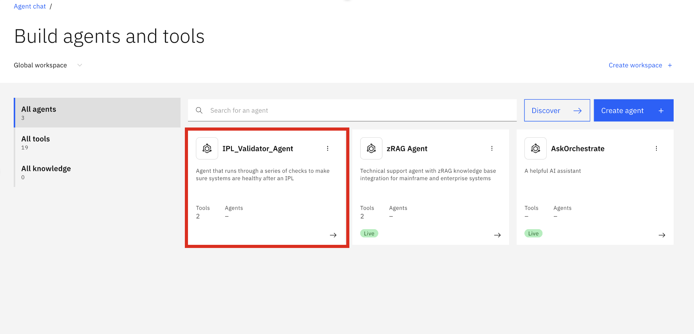

6. Click on your **IPL_Validator_Agent**. You'll then be taken to the Builder view for your agent, where you can see all the agent characteristics that were defined in your agent definition file, including the following:
   
   - ***Description***
  
        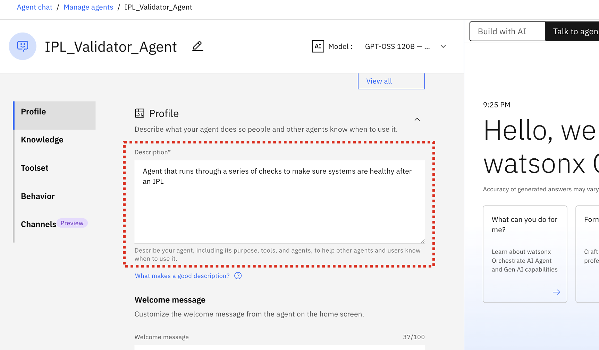
  
   - ***Agent style***
  
        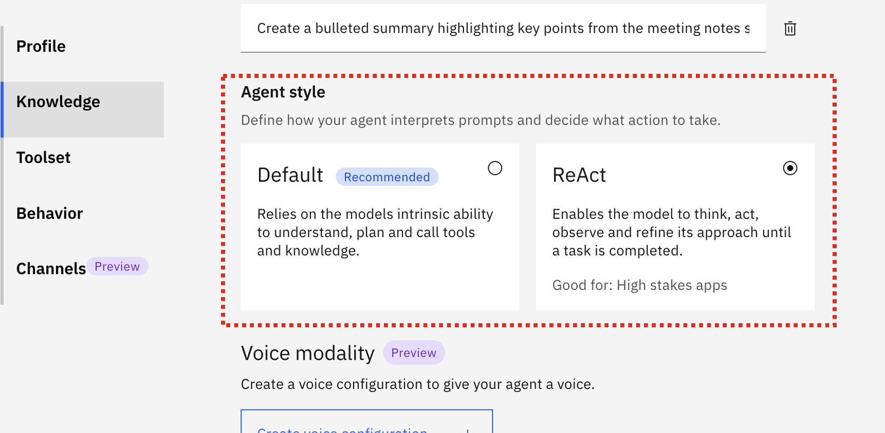

   - ***Tools***
      
        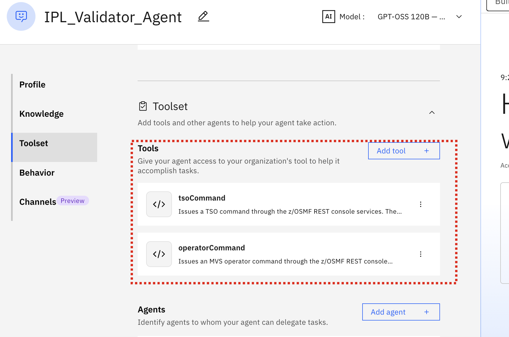

   - ***Instructions***

        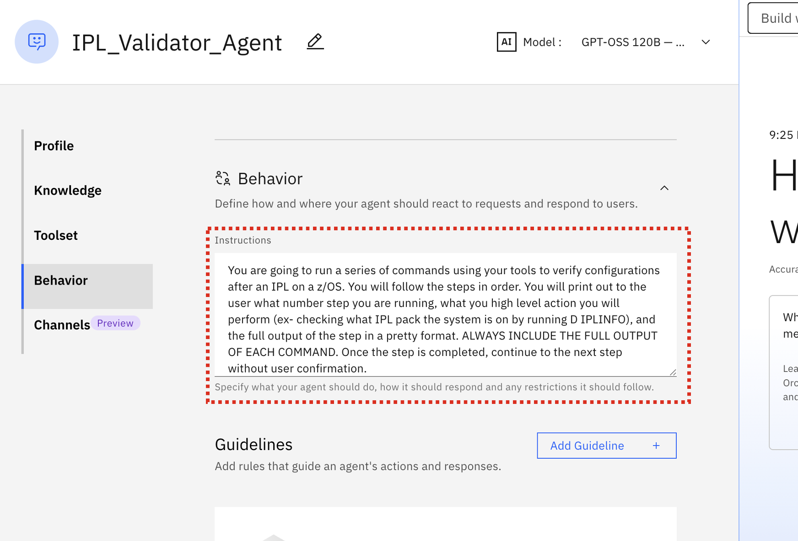

    
    Verify that your two tools exist and are available to your agent. 


## Test the `IPL_Validator_Agent`

Now you can test the execution flow of your agent. When the user prompts the agent to `run IPL check` or `validate my IPL` or something similar, the agent will kick off a series of steps as defined in the **Instructions** section of your agent definition. 

***In the agent chat window on the right-side of the screen, prompt the agent with `run IPL check`***. The agent will then call the appropriate tool according to the current step in the process. Wait until the agent processing is completed and the full output is returned. 

**Step 1:** The agent calls the `operatorCommand` tool, passing `D IPLINFO` as input to the tool. The results should be displayed similarly to below:

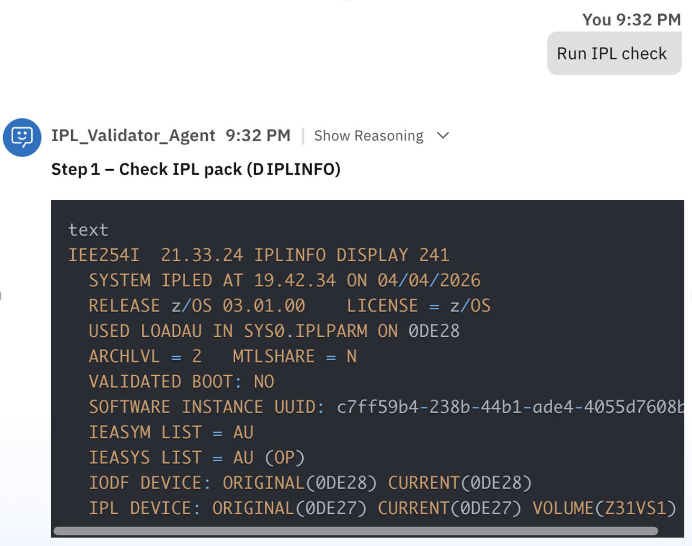

**Step 2:** The agent calls the `tsoCommand` tool, passing `TIME` as the command input. This verifies that TSO is running. The output of that step should look like:

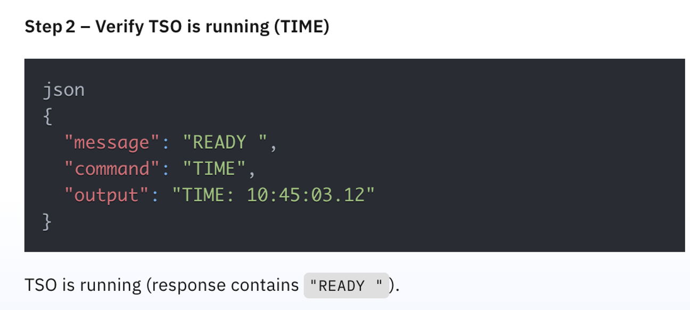

**Step 3:** The agent calls the `operatorCommand` tool, passing `D OMVS` as input:

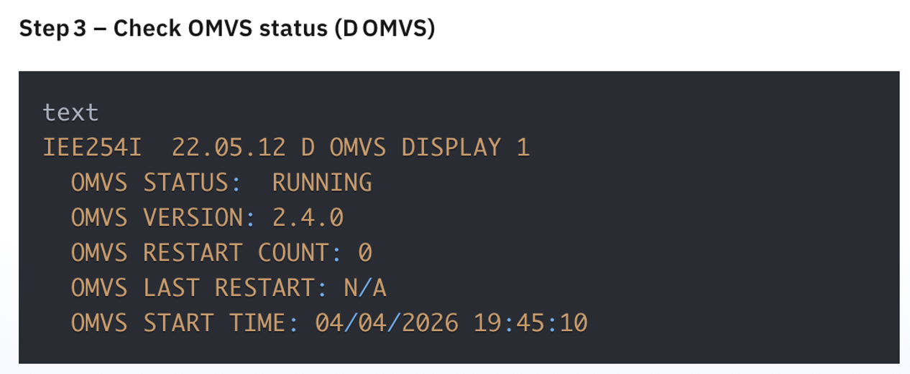

**Step 4:** The agent calls the `operatorCommand` tool, passing `D OMVS,MF` as input:

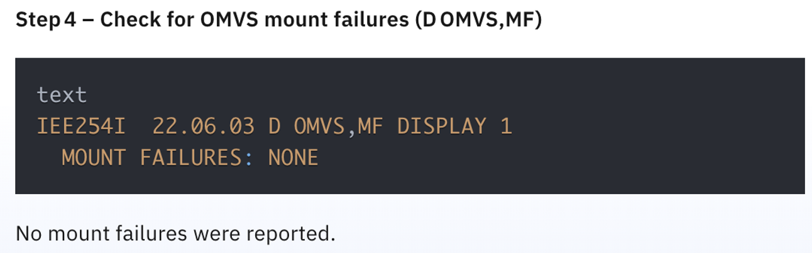


**Step 5:** The agent verifies if z/OSMF is running:

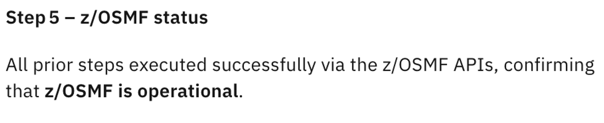

**Step 6:** The agent checks to see if JES is running by calling the `operatorCommand` tool, passing `$D JES2` as input. 

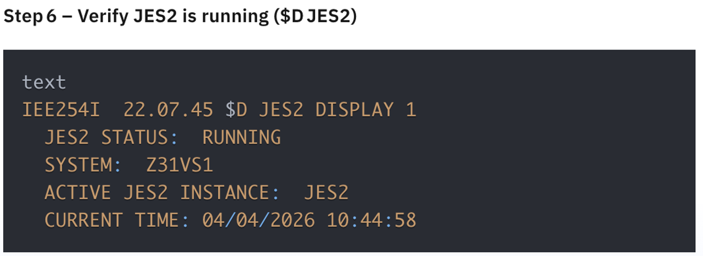

**Step 7:** The agent checks the status of JES2 by running the `operatorCommand` tool, passing `D A,JES2` as input:

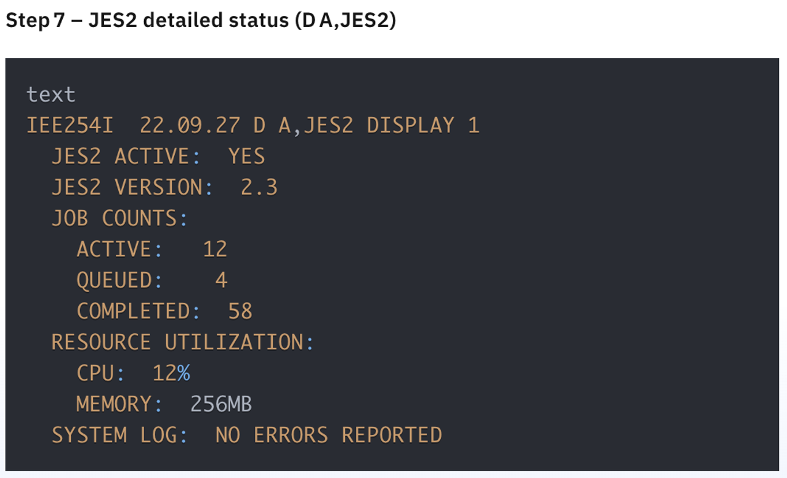

**Step 8:** The agent then provides a summarized list of the previous checks, with an explanation:

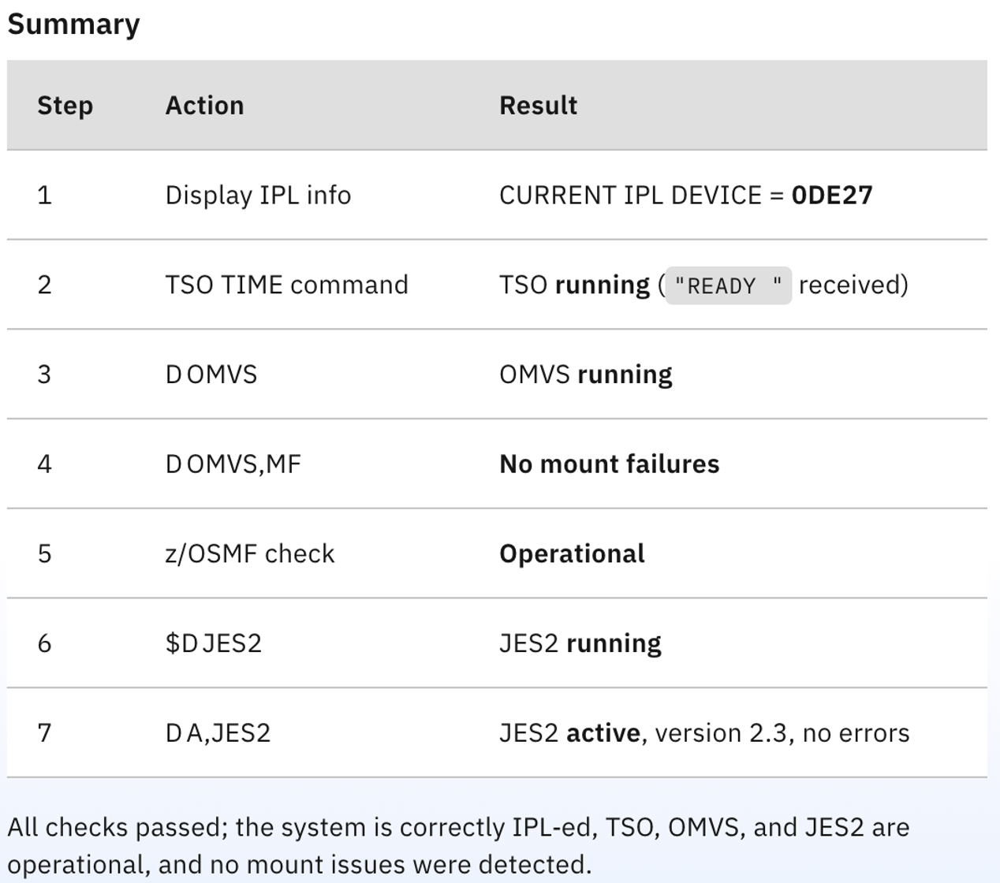

***Congratulations! You've successfully imported and tested your first agent using the ADK with custom tools. In the following section, you will create a new custom agent using the **low-code approach** which provides multi-agent orchestration, using other agents (including this one) as collaborators***