# Hands-on Lab

- watsonx Assistant for Z built on top of watsonx Orchestrate
- Build your own agent use cases
- Ability to build your own agent using Low-code and pro-code approach (will be using both for the purpose of this Lab)

## Lab Overview

- What agents you will be configuring
- Introduction to the ADK 


## Accessing the environments

For this Lab you will be using two different TechZone environments:

1. watsonx Orchestrate
     - pre-configured with the ADK and Agent configuration files pre-installed
     - The first Lab environment is a set of IBM Cloud SaaS resources we’ll refer to in this Lab as the IBM watsonx Orchestrate environment. The resources are dedicated to you and are all available within the same IBM Cloud account you’ve been granted access to. The SaaS resources used in this Lab guide consist of the three components below:

2. Z Dev & Test - emulated z/OS image on Linux x86

### Logging into watsonx Orchestrate and retrieving connection details

In order to log into the ADK environment, you will need two environment details that you will locate and record in this section:

  - WxO **Service Instance URL**
  - IBM Cloud API Key


1. Click on the **Student URL** provided by the instructor for the **watsonx Orchestrate** environment and when prompted, enter the password. 

2. Once done, you should be taken to the environment details page for your **watsonx Orchestrate** environment.
   
3. Record the **Cloud account** name associated with the environment. 
   
    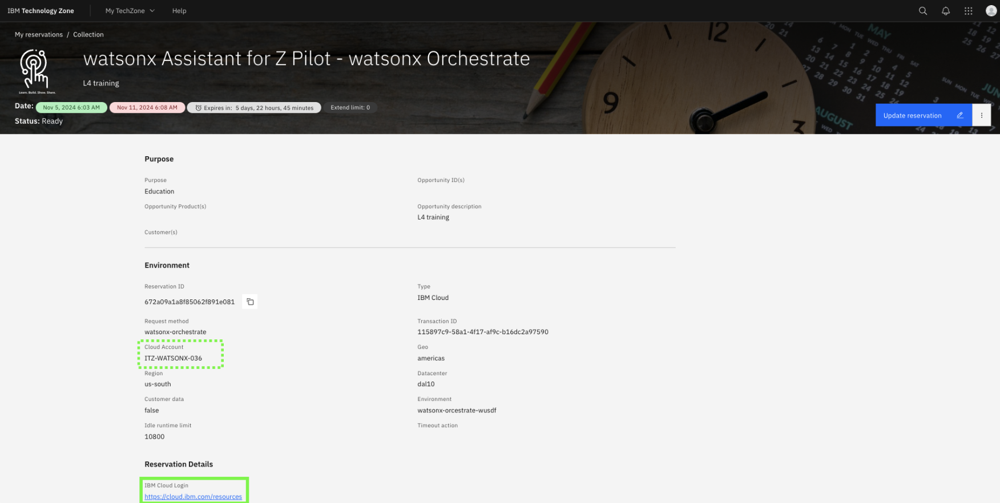

4. Then click the **IBM Cloud Login** link. 
   
    

5. After logging in, verify that the current IBM Cloud account is the same as the account name recorded in the previous step. If the account is not the same, switch to the proper account.

    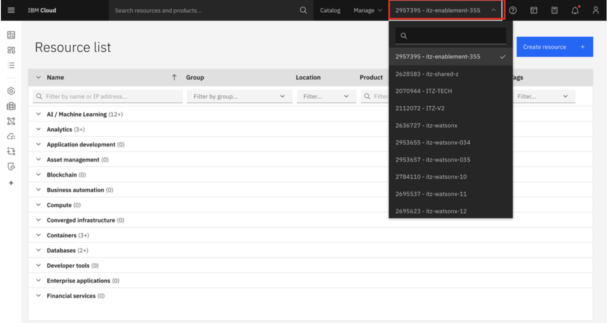

    **NOTE:** **if the cloud account is not listed in the possible options in the drop-down**, you will first need to **join the IBM Cloud account**. Follow the optional steps below to illustrate the process, and then repeat the above steps to access your cloud resources.

    a. When you were invited to join the cloud account, you should have received an email invitation to join. The email should look like the following:

    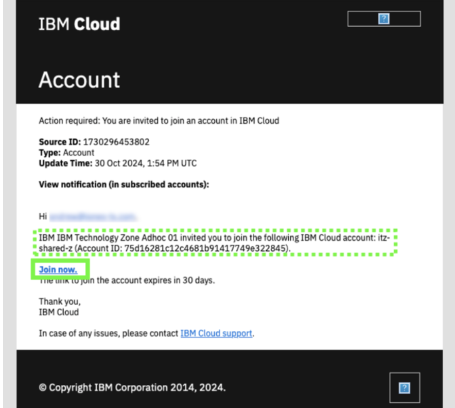

    Click **Join now** in the email invitation. 

    b. In the **Join IBM Cloud** browser window that opens, select the **I accept the product Terms and Conditions** of the registration form, and then click **Join Account**.

    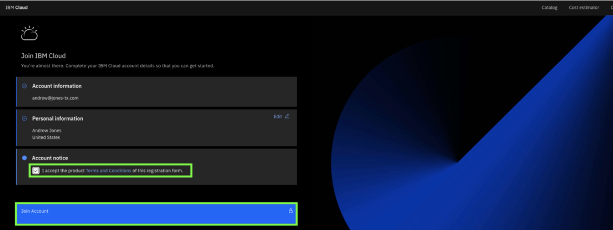

    c. After joining the account, verify that the account appears in your available account list in the IBM Cloud portal.

    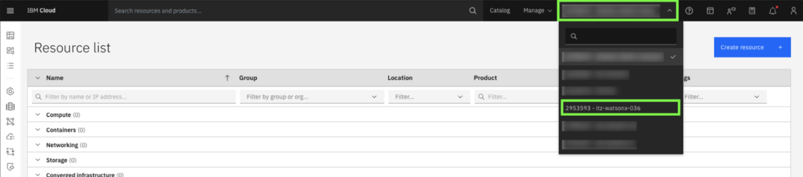

    Note: your cloud account will be different. Refer to your environment details to identify the correct cloud account.

6. Once the appropriate Cloud account is selected from the drop-down, generate a new IBM Cloud **API Key** by clicking on **Manage** --> **Access(IAM)** in the upper right hand corner. 
   
    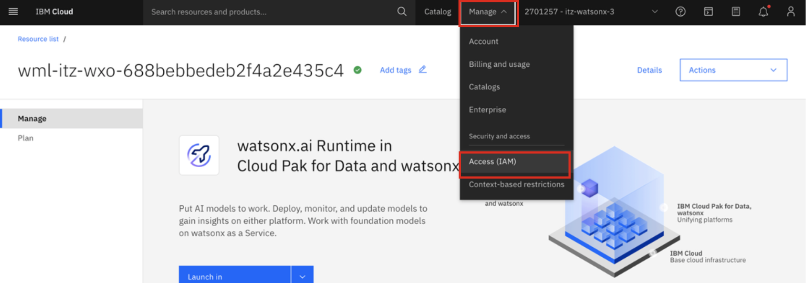

7. In the **IAM** settings page, select **API keys** from the left-hand menu.
   
    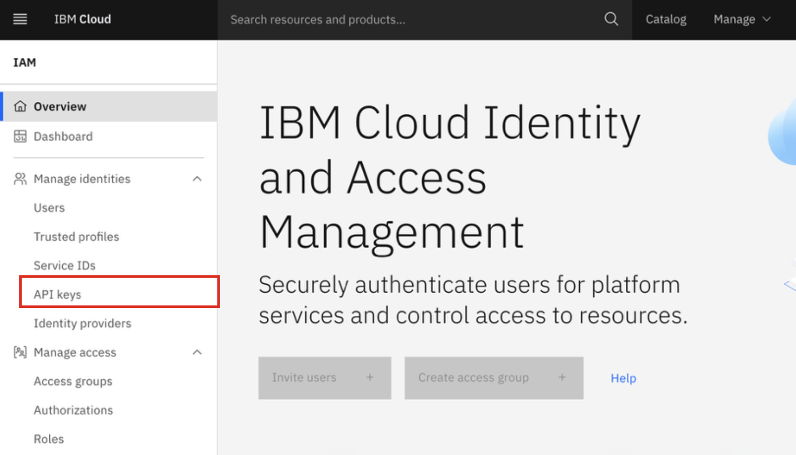

8. In the **API keys** screen, click on **Create +**. 

    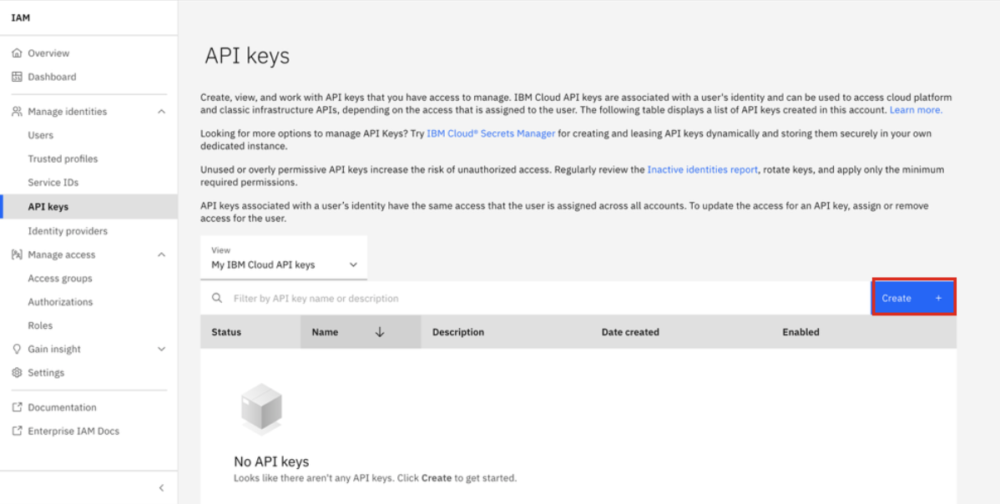

9. Enter any **Name** for your API Key and click **Create**.

    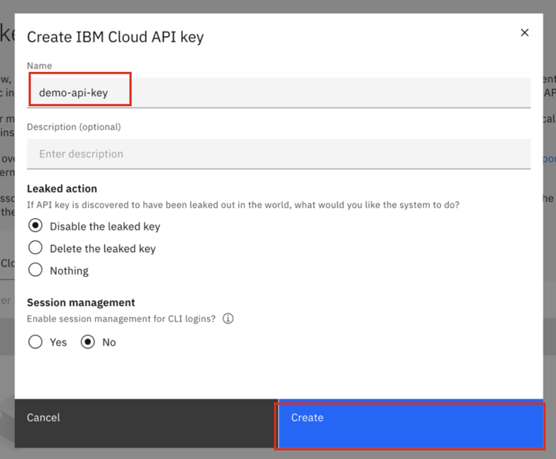

10. You’ll then see a window appear ***“API key successfully created”***

    **IMPORTANT**: Make sure to **Download** and **Copy** your API key (this can only be retrieved once).

    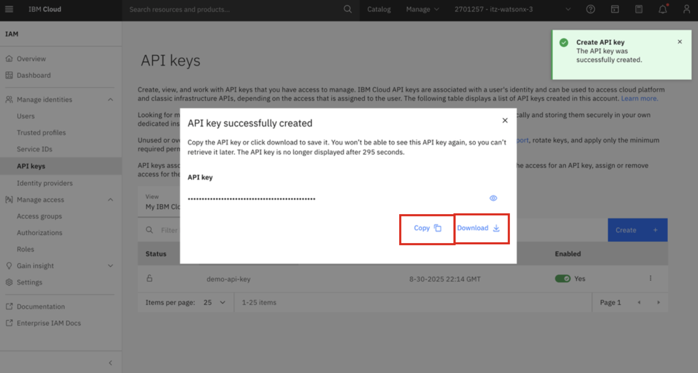

    **Copy and record your API key value in a local notepad on your workstation for later use. This will later be referenced in your agents configuration as a shared secret.**

11. Next you will retrieve and record your watsonx Orchestrate **Service Instance URL**. 
     
    After generating your API key within IBM Cloud in the previous section, click on the ‘hamburger’ menu icon in the top-left corner of the IBM Cloud window and select **Resource list**. 

    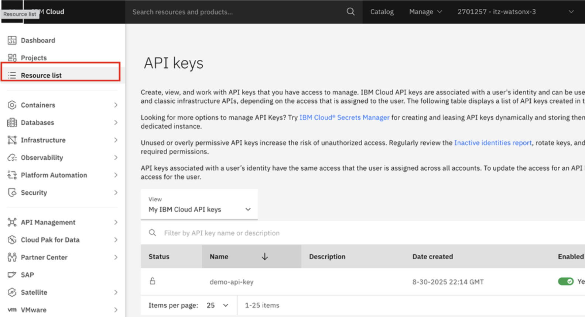

12. Expand the **AI / Machine Learning** section and you should see the following resources available:
   
    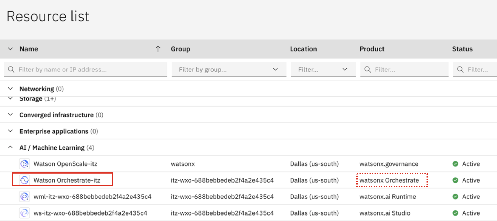

13. Click on the resource shown for the **watsonx Orchestrate** resource: 
    
    

14. Click **Launch watsonx Orchestrate**. 

    

15. In the watsonx Orchestrate UI, click on you **profile icon** in the top-right corner and then **Settings**.

    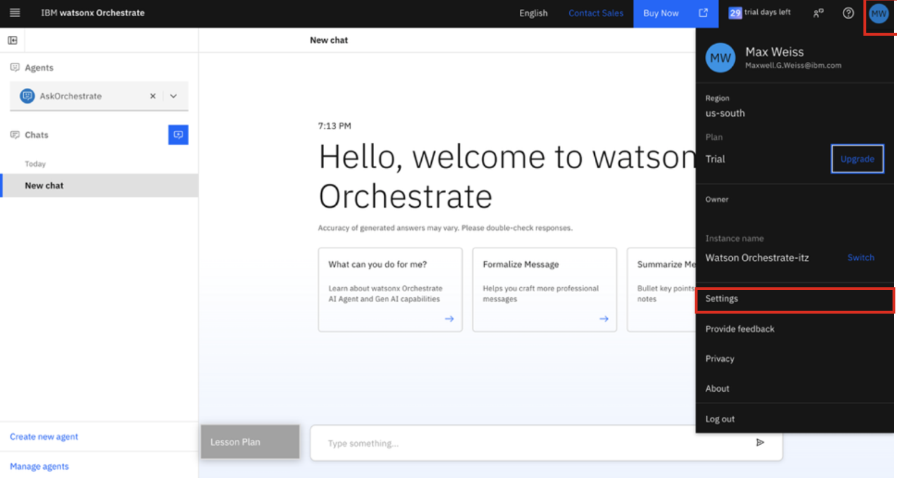


16. In the Settings page, click on the **API details** tab, then **copy and record** your **Service instance URL** to a local notepad for later use.

    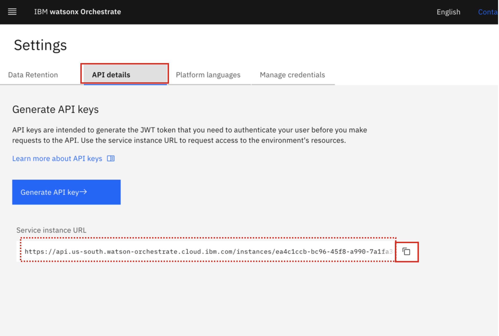

    Once recorded, you can minimize the window to come back to later. 

### Set RACF Passphrase for `IBMUSER` ID on zD&T

1. Click on the **Student URL** provided by the instructor for the **zD&T** environment and when prompted, enter the password. 

2. Once done, you should be taken to the environment details page for your **zD&T** environment which will look something like this:
   
    

3. Locate and record the **Public IP** field for your environment.
   
    

4. At the bottom of the reservation page, click on **Download SSH key** to download the SSH key locally.

    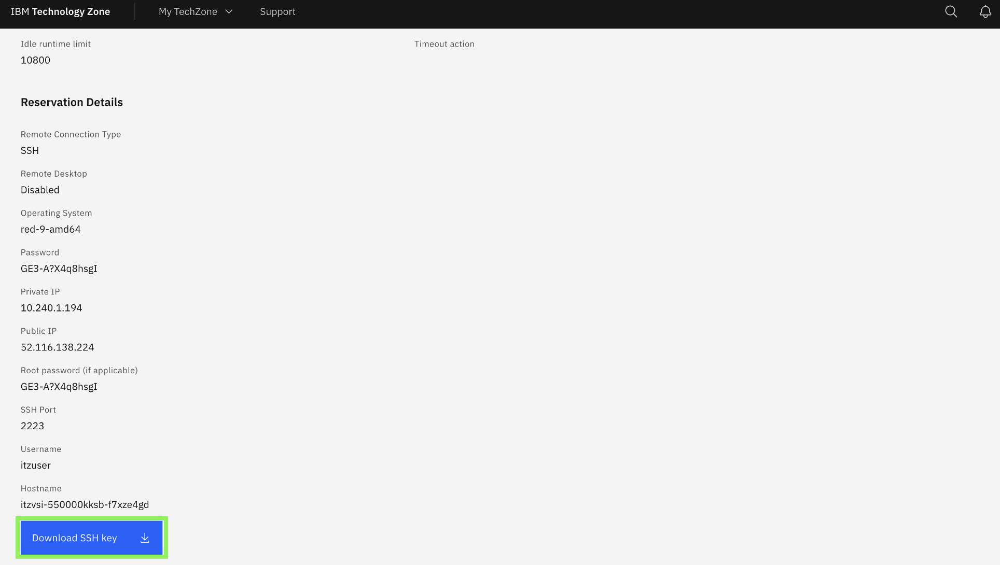

5. In order to set a new Passphrase for your IBMUSER zOS user, you will first need to SSH into z/OS USS, using port 2022.
   
    On your local machine's command line, navigate to the directory of your downloaded SSH key from the previous step (i.e. Downloads).

    `cd Downloads`

6. Set the permissions of your downloaded key to allow SSH access:

    `chmod 600 <ssh-key.pem>`

    For example:

    **IMAGE**

7. Then SSH into z/OS UNIX, by running the below command, replacing `<ssh-key.pem>` with the name of your downloaded key, and replacing `<public ip>` with the IP you recorded in the above section:

    ```
    ssh -i <ssh-key.pem> ibmuser@<public ip> -p 2022
    ```

    Once SSH'ed in successfully, you should see something similar to below:

    **IMAGE**

8. Next, set a new zOS Passphrase for your **IBMUSER** zOS user by running the following command. This is the RACF Passphrase that you will use to log into TSO as the IBMUSER ID.
   
   Once you're SSH'ed into zOS USS, enter the following command, substituting a passphrase of your choice for the string `YOUR PASSWORD PHRASE`:

    ```
    tsocmd "ALTUSER IBMUSER PHRASE('YOUR PASSWORD PHRASE') NOEXPIRE RESUME"
    ```

    **Syntax rules..**

    Note: if you typed the command yourself, be sure to include the single-quotes before and after the password. Record the passphrase as it will be needed later.

    Afterwards, you should see something similar to the following:

    **IMAGE**

9. Exit out of z/OS USS by entering `exit` of the command-line. 


## Log into ADK environment
- Access the ADK by SSH-ing into Linux environment and going to the folder
- Review the configuration files

As mentioned previously, the ADK environment has already been setup for you with all the agent configuration files. In this section you will access the ADK command-line and log into your environment. 

Access the ADK by SSH'ing into the Linux environment hosting the watsonx Orchestrate ADK tools.

1. Previously you SSH'ed into z/OS UNIX using the SSH key you downloaded locally. You will use that same key to SSH into the Linux server. 
   
   On your local machine's command-line, SSH into Linux on port `2223` by running the below command, replacing `<ssh-key.pem>` with the name of your downloaded key, and replacing `<public ip>` with the IP you recorded earlier:

    ```
    ssh -i <ssh-key.pem> itzuser@<public ip> -p 2223
    ```

    You should see the following:

    **IMAGE**

2. Navigate to the **Custom-Agent-Builder** directory on the Linux system:
   
    `cd Custom-Agent-Builder`

    **IMAGE**

    Then type `ls` to view the configuration files.

    **IMAGE**

3. Login and activate your ADK environment by running the following command in the Linux command-line, replacing `<your Service Instance URL>` with your unique **Service Instance URL** you recorded earlier:
   
    ```
    orchestrate env add -n zos -u <your Service Instance URL> --type ibm_iam --activate
    ```

4. After issuing the above command, you will be prompted for your **WXO API key** as shown below:

    **IMAGE**

    **Copy and paste** the value of your **IBM Cloud API key** from the preceding steps and hit **enter**. You should then see that your environment is now active, as shown below:

    **IMAGE**

5. Once activated, verify you’re successfully connected by running the following command to view existing agents in your environment:

    `orchestrate agents list`

    You should see the **zRAG Agent** listed which was pre-deployed for you. 

    **IMAGE**


## Create connection and configure credentials

Within the **Custom-Agent-Builder** directory on Linux, you should see a `zosmf_connection.yaml` file. With watsonx Orchestrate and the ADK, connections provide a way to associate vearious tools together and assigning credentials needed for the tools to access external services on behalf of the agent. In this Lab, the tools you will use are focused on calling z/OSMF APIs to your zD&T zOS image in order to issue various commands and retrieve system details. The first step in deploying your agent is to create a connection to your zOS environment for the tools to use. 

1. Open the `zosmf_connection.yaml` file by typing the following within your **Custom-Agent-Builder** directory on Linux:
   
    ```
    nano zosmf_connection.yaml
    ```

2. Once you're viewing teh file, **replace** `<public-ip>` in the `server_url` variable with the **public IP of your zD&T environment** that you recorded earlier. 
   
   **IMAGE**

   *This must be done for the `server_url` variable in both the draft AND live sections of the file.*

3. Make sure to save the file after modifying it.

4. Now you can import the connection to your ADK environment.

    Once back at the command-line, issue the following command to import the connection:

    ```
    orchestrate connections import --file zosmf_connection.yaml
    ```


## Import the tools
- add the CICS agent tool?

## Access WxO and test the agent

## Multi-agent orchestration
