# Hands-on Lab

- watsonx Assistant for Z built on top of watsonx Orchestrate
- Build your own agent use cases
- Ability to build your own agent using Low-code and pro-code approach (will be using both for the purpose of this Lab)

## Lab Overview

- What agents you will be configuring
- Introduction to the ADK 


## Accessing the environments

For this Lab you will be using two different TechZone environments:

1. watsonx Orchestrate
     - pre-configured with the ADK and Agent configuration files pre-installed
     - The first Lab environment is a set of IBM Cloud SaaS resources we’ll refer to in this Lab as the IBM watsonx Orchestrate environment. The resources are dedicated to you and are all available within the same IBM Cloud account you’ve been granted access to. The SaaS resources used in this Lab guide consist of the three components below:

2. Z Dev & Test - emulated z/OS image on Linux x86

### Logging into watsonx Orchestrate and retrieving connection details

In order to log into the ADK environment, you will need two environment details that you will locate and record in this section:

  - WxO **Service Instance URL**
  - IBM Cloud API Key


1. Click on the **Student URL** provided by the instructor for the **watsonx Orchestrate** environment and when prompted, enter the password. 

2. Once done, you should be taken to the environment details page for your **watsonx Orchestrate** environment.
   
3. Record the **Cloud account** name associated with the environment. 
   
    

4. Then click the **IBM Cloud Login** link. 
   
    

5. After logging in, verify that the current IBM Cloud account is the same as the account name recorded in the previous step. If the account is not the same, switch to the proper account.

    

    **NOTE:** **if the cloud account is not listed in the possible options in the drop-down**, you will first need to **join the IBM Cloud account**. Follow the optional steps below to illustrate the process, and then repeat the above steps to access your cloud resources.

    a. When you were invited to join the cloud account, you should have received an email invitation to join. The email should look like the following:

    

    Click **Join now** in the email invitation. 

    b. In the **Join IBM Cloud** browser window that opens, select the **I accept the product Terms and Conditions** of the registration form, and then click **Join Account**.

    

    c. After joining the account, verify that the account appears in your available account list in the IBM Cloud portal.

    

    Note: your cloud account will be different. Refer to your environment details to identify the correct cloud account.

6. Once the appropriate Cloud account is selected from the drop-down, generate a new IBM Cloud **API Key** by clicking on **Manage** --> **Access(IAM)** in the upper right hand corner. 
   
    

7. In the **IAM** settings page, select **API keys** from the left-hand menu.
   
    

8. In the **API keys** screen, click on **Create +**. 

    

9. Enter any **Name** for your API Key and click **Create**.

    

10. You’ll then see a window appear ***“API key successfully created”***

    **IMPORTANT**: Make sure to **Download** and **Copy** your API key (this can only be retrieved once).

    

    **Copy and record your API key value in a local notepad on your workstation for later use. This will later be referenced in your agents configuration as a shared secret.**

11. Next you will retrieve and record your watsonx Orchestrate **Service Instance URL**. 
     
    After generating your API key within IBM Cloud in the previous section, click on the ‘hamburger’ menu icon in the top-left corner of the IBM Cloud window and select **Resource list**. 

    

12. Expand the **AI / Machine Learning** section and you should see the following resources available:
   
    

13. Click on the resource shown for the **watsonx Orchestrate** resource: 
    
    

14. Click **Launch watsonx Orchestrate**. 

    

15. In the watsonx Orchestrate UI, click on you **profile icon** in the top-right corner and then **Settings**.

    


16. In the Settings page, click on the **API details** tab, then **copy and record** your **Service instance URL** to a local notepad for later use.

    

    Once recorded, you can minimize the window to come back to later. 

### Set RACF Passphrase for `IBMUSER` ID on zD&T

1. Click on the **Student URL** provided by the instructor for the **zD&T** environment and when prompted, enter the password. 

2. Once done, you should be taken to the environment details page for your **zD&T** environment which will look something like this:
   
    

3. Locate and record the **Public IP** field for your environment.
   
    

4. At the bottom of the reservation page, click on **Download SSH key** to download the SSH key locally.

    

5. In order to set a new Passphrase for your IBMUSER zOS user, you will first need to SSH into z/OS USS, using port 2022.
   
    On your local machine's command line, navigate to the directory of your downloaded SSH key from the previous step, for example:

    `cd Downloads`

6. Set the permissions of your downloaded key to allow SSH access:

    `chmod 600 <ssh-key.pem>`


7. Then SSH into z/OS UNIX, by running the below command, replacing `<ssh-key.pem>` with the name of your downloaded key, and replacing `<public ip>` with the IP you recorded in the above section:

    ```
    ssh -i <ssh-key.pem> ibmuser@<public ip> -p 2022
    ```

    Once SSH'ed in successfully, you should see something similar to below:

    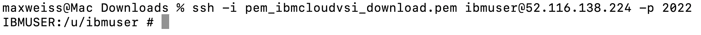

8. Next, set a new zOS Passphrase for your **IBMUSER** zOS user by running the following command. This is the RACF Passphrase that you will use to log into TSO as the IBMUSER ID.
   
    Once you're SSH'ed into zOS USS, enter the following command, substituting a passphrase of your choice for the string `YOUR PASSWORD PHRASE`:

    ```
    tsocmd "ALTUSER IBMUSER PHRASE('YOUR PASSWORD PHRASE') NOEXPIRE RESUME"
    ```


    ??? Tip "Syntax rules for RACF Password Phrases (below)"
    
        - minimum length: 9 characters
        - Must contain at least 2 alphabetic characters (A - Z, a - z)
        - Must contain at least 2 non-alphabetic characters (numerics, punctuation, or special characters, including spaces)
        - Must not contain more than 2 consecutive characters that are identical
  
    **Note:** *if you typed the command yourself, be sure to include the single-quotes before and after the password.* ***Record the passphrase as it will be needed later.***

    Afterwards, you should see something similar to the following:

    

9. Exit out of z/OS USS by entering `exit` on the command-line. 


## Log into ADK environment
- Access the ADK by SSH-ing into Linux environment and going to the folder
- Review the configuration files

As mentioned previously, the ADK environment has already been setup for you with all the agent configuration files. In this section you will access the ADK command-line and log into your environment. 

Access the ADK by SSH'ing into the Linux environment hosting the watsonx Orchestrate ADK tools.

1. Previously you SSH'ed into z/OS UNIX using the SSH key you downloaded locally. You will use that same key to SSH into the Linux server. 
   
    On your local machine's command-line, **SSH into Linux** on port `2223` by running the below command, replacing `<ssh-key.pem>` with the name of your downloaded key, and replacing `<public ip>` with the IP you recorded earlier:

    ```
    ssh -i <ssh-key.pem> itzuser@<public ip> -p 2223
    ```

    You should see the following:

    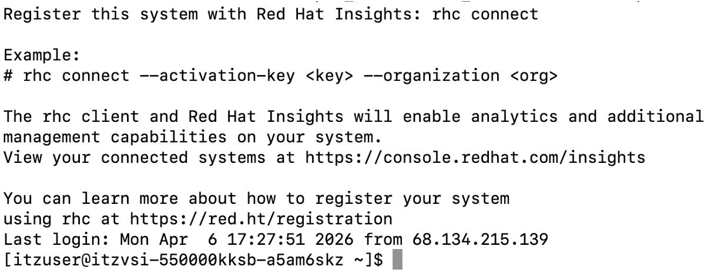

2. Navigate to the **Custom-Agent-Builder** directory on the Linux system:
   
    `cd Custom-Agent-Builder`

    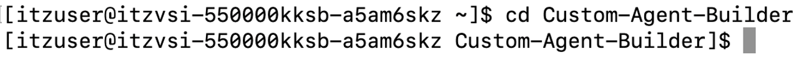

    Then type `ls` to view the configuration files.

    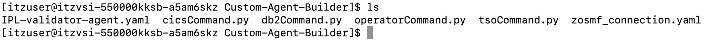

3. Login and activate your ADK environment by running the following command in the Linux command-line, replacing `<your Service Instance URL>` with your unique **Service Instance URL** you recorded earlier:
   
    ```
    orchestrate env add -n zos -u <your Service Instance URL> --type ibm_iam --activate
    ```

4. After issuing the above command, you will be prompted for your **WXO API key** as shown below:

    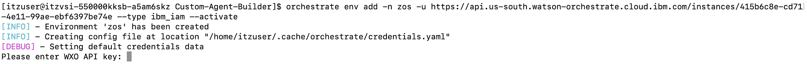

    **Copy and paste** the value of your **IBM Cloud API key** from the preceding steps and hit **enter**. You should then see that your environment is now active, as shown below:

    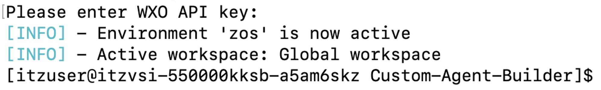

5. Once activated, verify you’re successfully connected by running the following command to view existing agents in your environment:

    `orchestrate agents list`

    You should see the **zRAG Agent** listed which was pre-deployed for you. 

    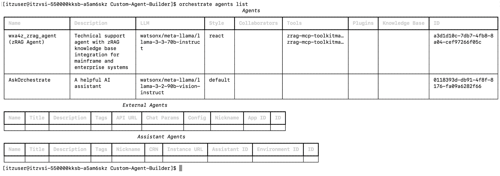


## Create connection and configure credentials

Within the **Custom-Agent-Builder** directory on Linux, you should see a `zosmf_connection.yaml` file. With watsonx Orchestrate and the ADK, connections provide a way to associate vearious tools together and assigning credentials needed for the tools to access external services on behalf of the agent. In this Lab, the tools you will use are focused on calling z/OSMF APIs to your zD&T zOS image in order to issue various commands and retrieve system details. The first step in deploying your agent is to create a connection to your zOS environment for the tools to use. 

1. Open the `zosmf_connection.yaml` file by typing the following within your **Custom-Agent-Builder** directory on Linux:
   
    ```
    nano zosmf_connection.yaml
    ```

2. Once you're viewing the file, **replace** `<public-ip>` in the `server_url` variable with the **public IP of your zD&T environment** that you recorded earlier. 
   
    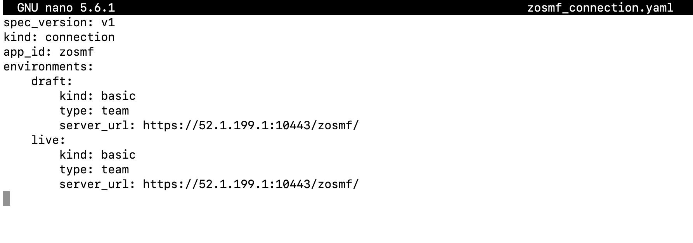

   *This must be done for the `server_url` variable in both the draft AND live sections of the file.*

3. Make sure to save the file after modifying it.
   
    To save the file, press **Ctrl+S** to save the file.

    Then exit from the editor view by clicking **Ctrl+X**.

4. Now you can import the connection to your ADK environment.

    Once back at the command-line, issue the following command to import the connection:

    ```
    orchestrate connections import --file zosmf_connection.yaml
    ```

    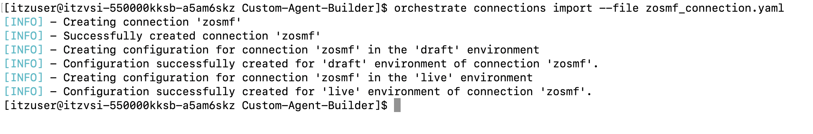


5. Verify the connection was successfully imported by running the following command at the Linux command-line:
   
    ```
    orchestrate connections list
    ```

    In the output of the command, notice that your new connection is listed with *app-id* **zosmf** and that the Credentials have not yet been set (as shown below).

    

    **Note**: *you may need to scroll to the top of the connections list.*

    You will next set your connection credentials.

6. The connection credentials you provide will later be used to authenticate tools to access your environment's z/OSMF APIs. 
   
    Credentials hold the values used to authorize against external services. In the case of your previously created connection, you configured it with kind: basic which enforces username and password credentials (i.e. the username and password used by the z/OS IBMUSER ID).

    To set your connection credentials for the **draft** environment, enter the following command in the Linux command-line, replacing `<your-passphrase>` with the value of the RACF Passphrase you set earlier for **IBMUSER**.

    ```
    orchestrate connections set-credentials --app-id zosmf --env draft --username 'IBMUSER' --password '<your-passphrase>'
    ```

    For example:

    ```
    orchestrate connections set-credentials --app-id zosmf --env draft --username 'IBMUSER' --password 'YOUR PASSWORD PHRASE'
    ```

7. Next, set your connection credentials for the **live** environment by issuing the same command as above, but replace `--env draft` with `--env live`. 
   
   You should see a `Credentials successfully set...` message.

8. Now re-verify the connection with your newly set credentails by entering the following command:


    ```
    orchestrate connections list
    ```

    You should now see that your previous `zosmf` connection now has credentials set, as shown below:

    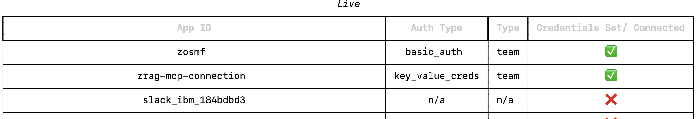


## Import the tools

Tools are essential components of agents, enabling them to perform actions such as querying data, creating documents, or executing jobs on behalf of user. Tools often require a connection to work properly, i.e. in the case of z/OSMF where the tools must authenticate before calling an API.

With the ADK, tools can be created either using OpenAPI specifications, or by using Python scripts. This section will be focused on using Python tools.

In this scenario, your ***IPL Validator Agent*** will be leveraging 2 different tools:

- ***operatorCommand***
    
    This is a Python defined tool that allows the agent to issue MVS operator commands via the z/OSMF Console API. The agent will be able to execute any operator command and receive synchronous command responses. Some examples of how it can be used include:

    - D A,L - Display active address spaces
    - D U,DASD - Display DASD usage
    - D IPLINFO - Display IPL information
    - D M=CPU - Display CPU configuration
    - F jobname,command - Modify job command


- ***tsoCommand***

    Another python defined tools that allows the agent to execute TSO commands via z/OSMF TSO/E Address Space Services API. The agent will be able to execute TSO commands on z/OS and retrieve the corresponding output from z/OS. Some examples of how it can be used include:        
    
    - TIME - Display current time and date
    - LISTDS - List dataset information
    - LISTCAT - List catalog entries
    - ALLOCATE - Allocate datasets
    - DELETE - Delete datasets
    - RENAME - Rename datasets
    - SEND - Send messages to users
    - PROFILE - Display or modify TSO profile

!!! Tip "**What about db2Command.py?**"

    In your workspace you will also see a `db2Command.py` file. This won't be used by the **IPL-validator** agent directly. But rather by a new agent that you will later create. While you will import the tool in this section, it won't be used immediately by the agent. 

In this section, you will use the provided tool files in the Linux **Custom-Agent-Builder** directory to import your agent tools for later use. 

1. From within the **Custom-Agent-Builder** directory, view the contents of the `operatorCommand.py` file by issuing the following command:
   
    ```
    nano operatorCommand.py
    ```
   
    Take some time to review the contents. Specifically, note the following section:

    ```
    get_status_url = urljoin(base_url, f'restconsoles/consoles/iserVS01')
    
    request_body = {
        "cmd": cmd,
        "sol-key": "JES"
    }
    ```

    The resulting z/OSMF API endpoint that will get called in this tool is:
    
    `https://<public-ip>:10443/zosmf/restconsoles/consoles/iserVS01`

    Within the body of the API call, `cmd` gets passed as input from the agent. Depending on the step in the IPL validation, the agent may pass `D A,L` as the command to execute, as an example. 

    Then close out of the editor view by clicking **Ctrl+X**.

2. Then do the same for the `tsoCommand.py` file and take some time to review its content as well. 

3. Import the `operatorCommand` tool by running the following command from your Linux command-line:
   
    ```
    orchestrate tools import -k python -f operatorCommand.py --app-id zosmf 
    ```

    After issuing the command, you should see a message similar to what's shown below:

    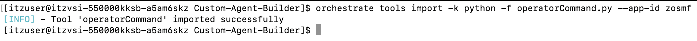

    That indicates that the `operatorCommand` tool was imported successfully. 

4. Similarly, import the `tsoCommand` tool by running the following command:
   
    ```
    orchestrate tools import -k python -f tsoCommand.py --app-id zosmf
    ```

    Confirm that this tool was also imported successfully. 

5. Finally, import the `db2Command` tool, which is a tool used for later, by running the following command:
   
    ```
    orchestrate tools import -k python -f db2Command.py --app-id zosmf
    ```

6. Once you’ve successfully imported all 3 tools, verify they’re now active by running the following command:
    
    ```
    orchestrate tools list
    ```

    This should output a table similar to below showing all your imported tools.

    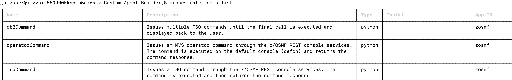

## Deploy your agent and test

In the ADK, agents can use tools to perform complex tasks defined by users. Each agent has a name and description that is configured, helping users identify each agent they can use to perform certain actions.

In this section, you will define an agent named **IPL Validator Agent** that leverages the tools you have imported into the ADK environment to help users verify the health of their z/OS system following an IPL. It will leverage two tools you've imported (`tsoCommand` and `operatorCommand`) to retrieve information about the system and provide a step-by-step summary back to the user.

1. In the Linux command-line,open the `IPL-validator-agent.yaml` file by issuing:
   
    ```
    nano IPL-validator-agent.yaml
    ```
   
2. You should then be able to see the agent definition as shown below:
   
    

    *Lets go over each of the sections...*
    
    **Section** | **Description**
    --- | ---
    kind | The kind of agent you wish to create. Options include **native** or **external** agents. In our case, we are using a **native** agent as we are building an agent from scratch and importing it directly into watsonx Orchestrate
    name | Name of the agent. In our case it is **IPL-Validator-Agent**
    llm | The Large Language Model the agent will use for reasoning and decision making. In our case we're using the `groq/openai/gpt-oss-120b` model for efficiency and performance for demos. It's important to note that only `llama-3-3-70b instruct` and `granite-3-3-8b-instruct` are officially supported by watsonx Assistant for Z at this time. 
    style | The style of agent you wish to create, which dictates it's reasoning pattern. Options include **default**, **react**, or **planner**. In our case we are using the **react** style which is perfect for multi-step tasks and complex workflows. You can learn more about agent styles here. 
    description | Agent descriptions complement agent names by providing detailed information about their purpose, capabilities, and usage. A well-written description helps users understand the agent's role and potential applications. 
    instructions | Instructions are crucial for training agents to perform their tasks efficiently. When setting instructions, it's important to consider configuring the agent's persona, context, and reasoning for using tools.
    tools | A list of tools that the agent should be able to use. In our case, we have specified 2 of the 3 tools you've imported - **operatorCommand** and **tsoCommand**
    ---

    For further details on building agents with the ADK, you can reference the ADK guide <a href="https://developer.watson-orchestrate.ibm.com/agents/overview" target="_blank">here</a>.

3. Then exit the editor view by clicking **Ctrl+X**.
   
4. Finally, deploy the agent by issuing the following command within your Linux command-line:

    ```
    orchestrate agents import -f IPL-validator-agent.yaml
    ```
5. If executed correctly, you should see a message similar to below:
   
    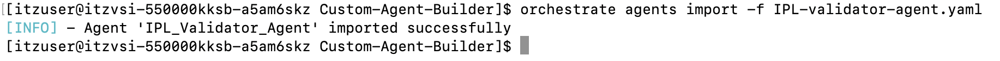

**Congratulations! You’ve deployed your first agent using the ADK and are now ready to test the execution flow**.

## Access WxO and test the agent

### Access the `IPL_Validator_Agent`

In this section, you will access your imported agent within your watsonx Orchestrate environment and test the agent’s execution flow. The scenario follows the following flow below, and the agent uses its two available tools to validate that your zOS system's configuration and subsystems are what you'd expect after an IPL.

***NOTE:*** **this step requires that you're already logged into your watsonx Orchestrate environment. You may have the UI already opened from earlier when retrieving your Service Instance URL. If not, please refer to Section above [Logging into watsonx Orchestrate](#logging-into-watsonx-orchestrate-and-retrieving-connection-details).**


## Multi-agent orchestration
