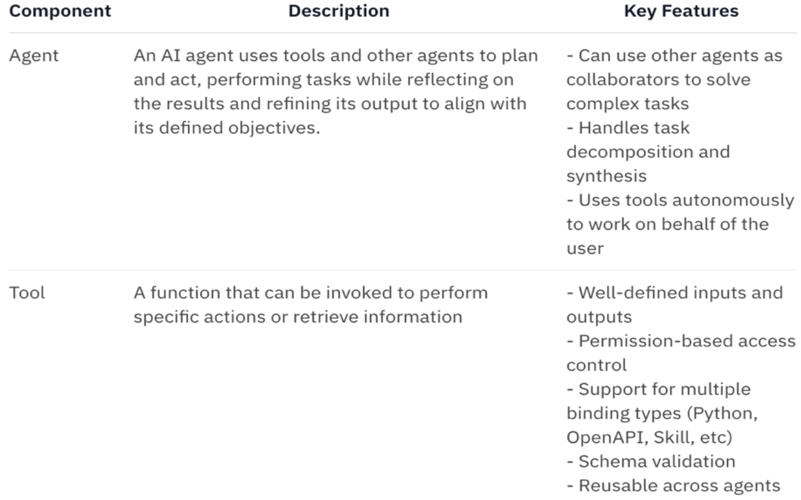

# Introduction to the Agent Development Kit (ADK)

Built on top of IBM watsonx Orchestrate, the watsonx Assistant for Z offering also enables flexible agent development for all users, empowering both business users and developers with a unified studio supporting low-code and pro-code development for key Z-specific use cases.

The **watsonx Orchestrate Agent Development Kit (ADK)** is a set of tools designed to make it easy to build and deploy agents. It is packaged as a Python library and command-line tool that allows builders to configure agents that run on the platform. The ADK also supports integrating agents and tools built on other frameworks.

The Agent Development Kit (ADK) is set of CLI utilities and python modules that helps you create agents and tools for watsonx Orchestrate. You can use these agents and tools across different watsonx Orchestrate offerings, including:

- watsonx Orchestrate on-premises
- watsonx Orchestrate IBM Cloud
- watsonx Orchestrate AWS
- watsonx Orchestrate Developer Edition

### ADK Components

The ADK has a CLI. The CLI can streamline the process of building, testing, and importing agents and tools

The ADK also provides a framework for developers to easily define new tools and agents programmatically.

1. Tools are defined using one of the available binding types (Python, OpenAPI, MCP, etc.) and then imported into the Orchestrate platform using the Orchestrate CLI.

2. Agents are defined using the ADK and then imported into the Orchestrate platform using the Orchestrate CLI. Agents use the tools defined in step 1.

3. Once an agent is imported, it can be used to start conversations with users either through the Orchestrate Agent Chat UI or through the Orchestrate API.

For more information on the ADK, reference the ADK documentation **<a href="https://developer.watson-orchestrate.ibm.com/" target="_blank">here</a>**.

### Lab Flow

For this Lab scenario, you are building an agent augmented with tools for calling Ansible playbooks that will help someone like a mainframe Security Administrator (SA) verify that their critical security certificates are up to date and reduce the risk of expired certificates disrupting their organization’s services.

Secure Sockets Layer (SSL) certificates, often referred to as digital certificates, are used to establish an encrypted connection between communicating parties over a network. Certificate management is crucial for maintaining the security of a company’s z/OS environment. The SA has not performed the tasks to manage and renew a certificate in some time. The SA recalls that there are many steps that are required on z/OS and various RACF commands that need to be run to renew a certificate. Rather than going to their senior SA for assistance, demonstrate how using watsonx Assistant for Z can help the SA automate the certificate renewal process via a dedicated AI Agent.

This hands-on lab shows how easy it is to create your own agents for key IBM Z use cases, in addition to the set of pre-built Z agents that ship with the product. In this section, you will build a z/OS Certificate Agent for managing z/OS certificates and automating certificate renewal for expiring certificates.

The tasks involved include:

- Installing and setting up your local ADK environment
- Configuring your AAP environment
- Setting up VS Code workspace
- Configuring agent connection with credentials
- Importing the provided tools
- Deploying the agent
- Accessing agents and testing execution