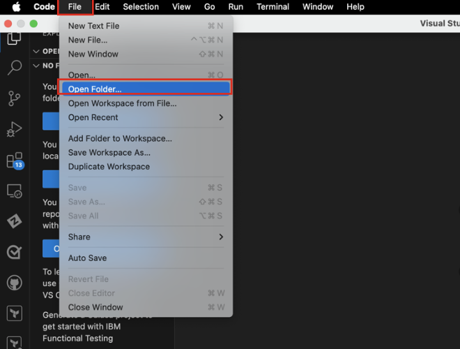
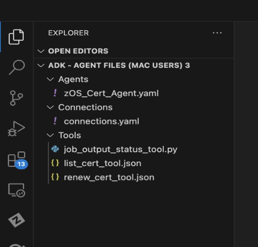
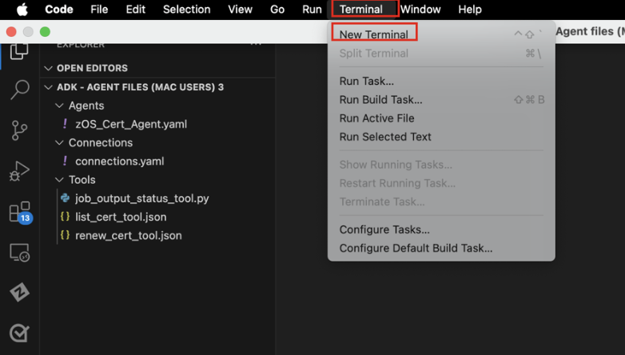

# Setting up VS Code workspace with Agent configuration files

For the following sections of the Lab, you will be using VS Code to build your agents using the ADK.

***Before proceeding, ensure you have the VS Code application installed and accessible on your local workstation.***

1. Download the **Agent configuration .zip file** by accessing one of the box folders depending on your machine’s operating system:
   
    - **Mac users:** <a href="https://ibm.box.com/s/8gr5i1v0evadep36tlf3ez9yeg4xrkz2" target="_blank">https://ibm.box.com/s/8gr5i1v0evadep36tlf3ez9yeg4xrkz2</a>
    - **Windows users:** <a href="https://ibm.box.com/s/6yja7kolhqhxfp0wz68evpzhd014cfhd" target="_blank">https://ibm.box.com/s/6yja7kolhqhxfp0wz68evpzhd014cfhd</a>

2. Click the **download** icon in the top-right corner of the browser to download the agent folder to your local workstation.

3. Once downloaded as a ***.zip*** file, extract the **ADK – Agent files** folder in your Downloads directory.

4. Open **VS Code** on your local workstation.

5. Then open the extracted ***ADK – Agent files*** folder within your VS Code workspace by clicking **File -> Open Folder**. 
   
    

6. Then select the extracted ***ADK – Agent files*** folder you previously downloaded and **open it**.
   
7. Once VS Code restarts, you should see the ***ADK – Agent files*** folder opened in the **Explorer** view, with various sub-folders:
   
    - *Agents*
    - *Connections*
    - *Tools*
  
    

    !!! Warning "**What are these files?**"

        **Connections:**

        - ***connections.yaml:*** configuration file used to group your tools together as a common service and authenticate your tools to your external AAP environment for running Ansible jobs

        **Tools:**

        - ***job_output_status_tool.py:*** a Python-defined tool that retrieves the ansible job status and output to display insights back to the user (i.e. certificate details and job completion).
  
        - ***list_cert_tool.json:*** an OpenAPI-defined tool that calls an Ansible API to run an Ansible job for retrieving certificate details. This tools calls the z/OS Certs – List Cert Ansible template in AAP.
  
        - ***renew_cert_tool.json:*** an OpenAPI-defined tool that calls an Ansible API to run an Ansible job for renewing a certificate. This tools calls the z/OS Certs – Search and Renew Ansible template in AAP.
  
        **Agents:**

        - ***zOS_Cert_Agent.yaml:*** an Agent configuration file to define an agent, titled z/OS_Certificate_Agent which leverages the tools above to help users quickly identify certificate information and assist with the certificate renewal process for expiring certificates

8. Finally, open a **Terminal window** within VS Code by clicking **Terminal -> New Terminal**:
   
    