# Test the agent execution flow

In this final section, you will access your deployed agent within your watsonx Orchestrate environment and test the agent’s execution flow. The scenario follows the following flow:

- You will firstly execute the ***get_cert*** tool to trigger an Ansible playbook that retrieves your certificate details
- You will then trigger the ***status_output_tool*** to get the status and output of the job logs to verify the expiration date of your certificate - indicating that the certificate is expiring
- You will then execute the ***renew_cert*** tool to trigger an Ansible playbook that automates the renewal process of your expiring certificate
- Lastly, you will again trigger the ***status_output_tool*** tool to get the status and output of the previous job logs to monitor the renewal process, and finally getting a confirmation message

1. You will start the demo flow by prompting the agent with the following:
   
    `Get my certificate details`

    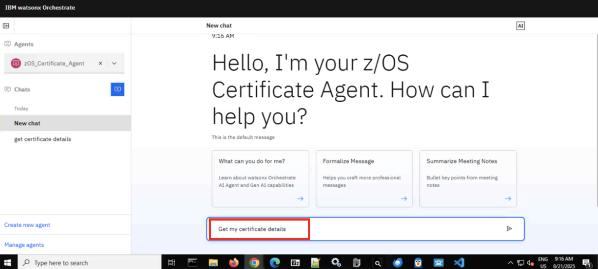

2. After prompting the agent with the above, the agent will respond asking `“What is the certificate label?”`
   
    In response, prompt the assistant with the name of the SITE certificate you created earlier in AAP:

    `DEMOCERT`

    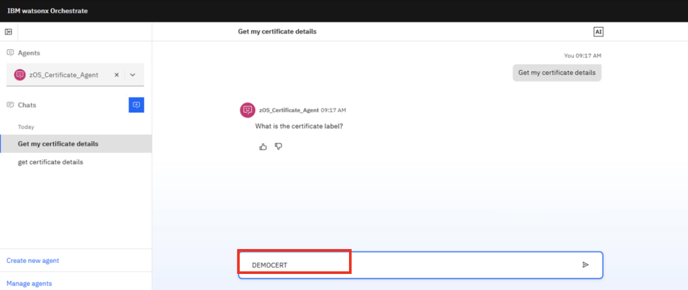

3. Next, the Agent should ask `“What type of certificate is it? (Options include SITE, CERTAUTH, USER)”`
   
    Respond with `SITE`

    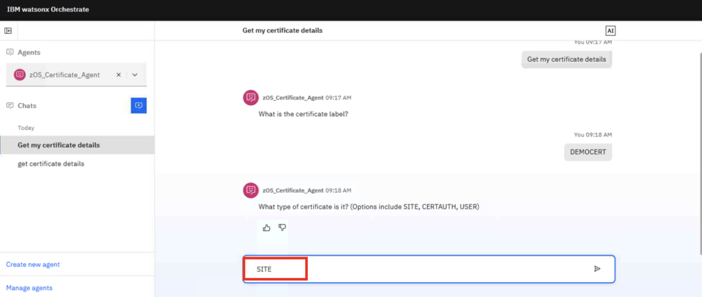

4. After providing the type of certificate, the Agent does 2 things:
   
    **a.** Invokes the *get_cert* tool to execute the **z/OS Certs – List Cert** ansible playbook, passing the certificate label and cert type as inputs to the playbook.

    **b.** Responds with a message similar to what's shown below:

    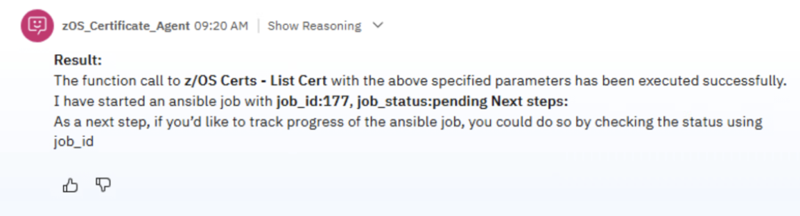

    In the response, the Agent provides a confirmation that the playbook started executing successfully, as well as a **job_id** for the ansible job that you can use to check the status of the job.

5. Click on **Show reasoning** and then the **Step 1** drop-down to view the logic the agent took.
   
    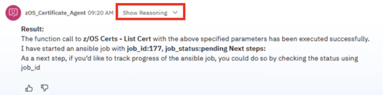

    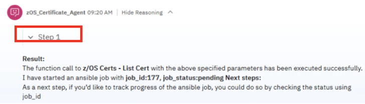

6. You should then see something similar to the screenshot below, indicating that the *get_cert* tool was invoked and the values that were passed to the Ansible playbook’s inputs:
   
    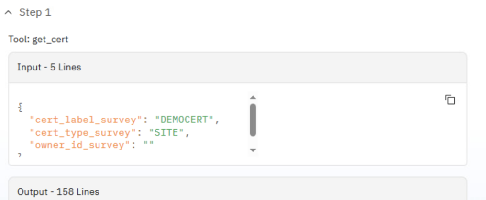

7. Next, scroll back down to the chat field and prompt the agent with:
   
    `Get status of job <your job_id that the agent outputted above>`

    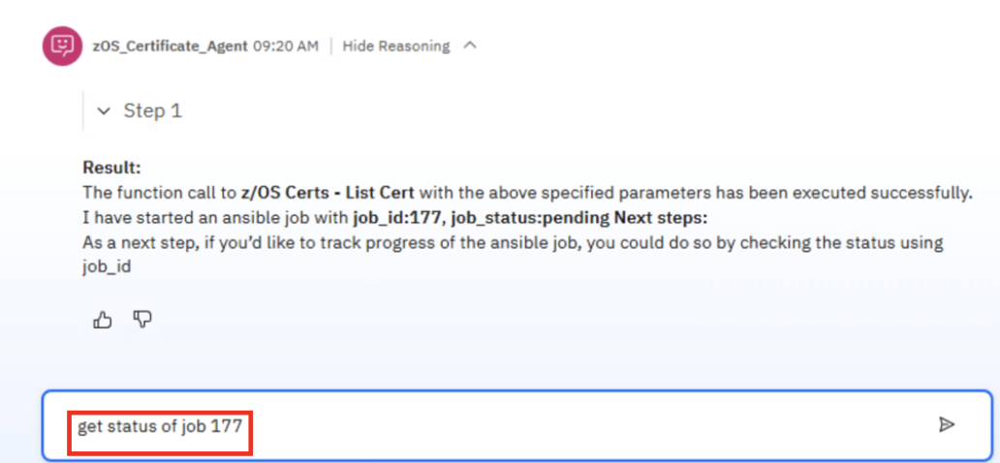

    **NOTE:** your job_id will be different than what's shown above. 

8. After prompting the agent, it should invoke the *get_status_output* tool, passing your job_id as input and provide the following information:
   
    **a.** **job id**

    **b.** **job status**

    **c.** **logs**

    If the `job status` was `successful`, then the logs should contain your certificate label, start date, and expiration date as shown below:

    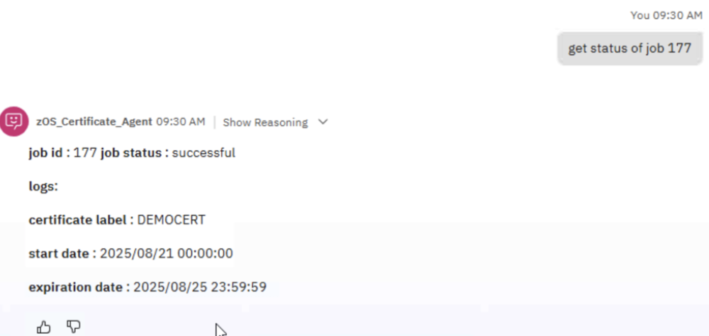

    The key point is that the expiration date indicates that your certificate is going to expire in the next 30 days. And the next step would be to invoke the renew_cert tool to automate the certificate renewal process.

9. Next, prompt the agent with the following:
    
    `Renew my certificate`

    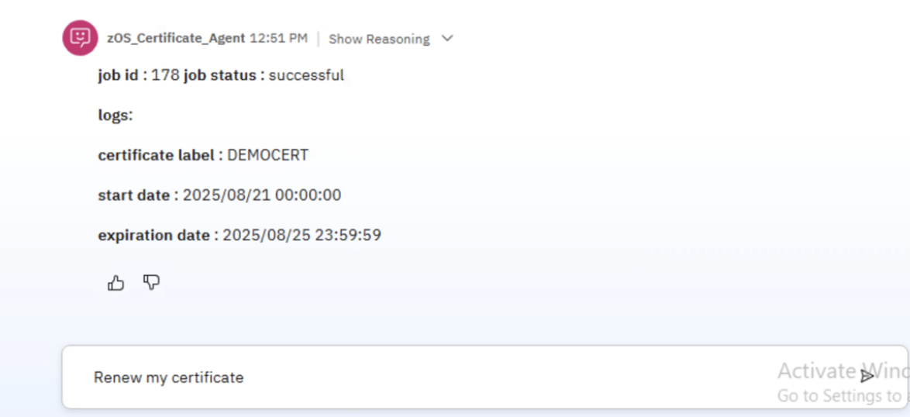

10. After prompting the agent with the above, the agent will respond asking `“What type of signing certificate will be used? (Options include CERTAUTH, SITE, Self)”`
    
    In response, prompt the assistant with `CERTAUTH`

    This is because the DEMOCERT certificate you created earlier is signed by your TESTCA certificate authority.

    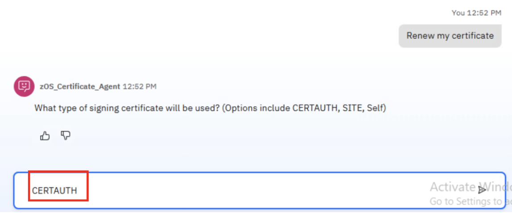

11. Next, the Agent asks `“What is the label of the signing certificate?”`
    
    Respond with `TESTCA`

    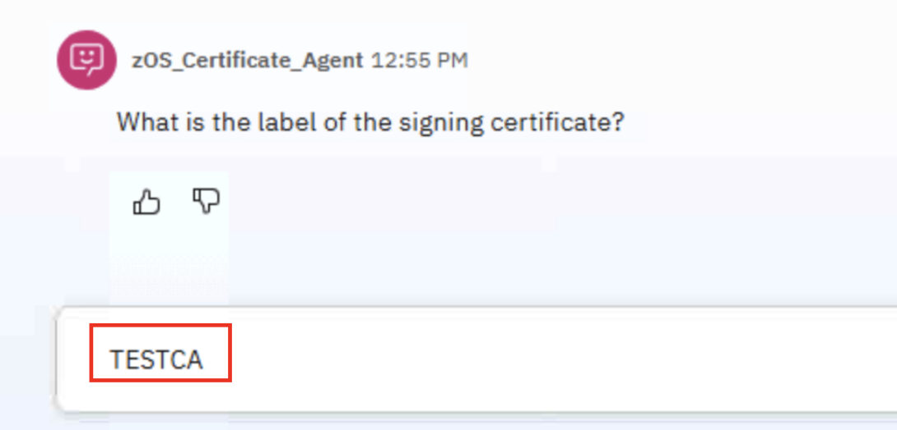

12. And finally, the Agent asks `“What is the certificate’s new expiration date? (Enter in the form of YYYY-MM- DD)”`
    
    Respond with `2030-01-01`

    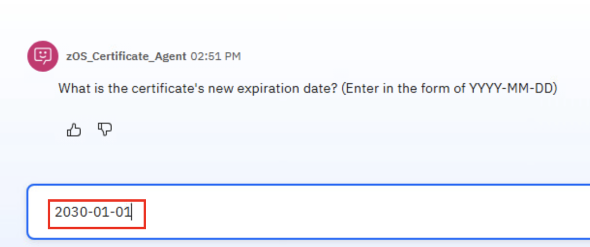

13. After providing the details above, the Agent again does 2 things:
    
    **a.** Invokes the *renew_cert* tool to execute the **z/OS Certs – Search and Renew** ansible playbook, passing the needed inputs to the playbook.

    **b.** responds with a message similar to what's shown below:

    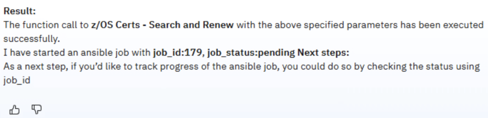

    In the response, the Agent provides a confirmation that the playbook started executing successfully, as well as a **job_id** for the ansible job that you can use to check the status of the job.

14. Click on **Show reasoning** and then the **Step 1** drop-down to view the logic the agent took.

    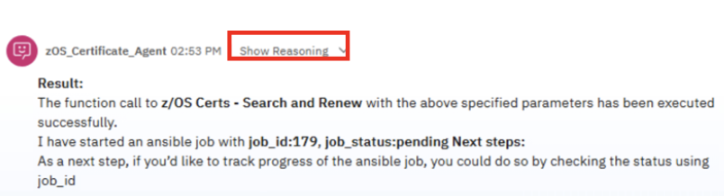

    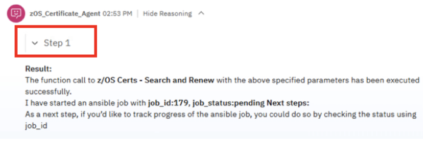

15. You should then see something similar to the screenshot below, indicating that the *renew_cert* tool was invoked and the values that were passed to the Ansible playbook’s inputs:
    
    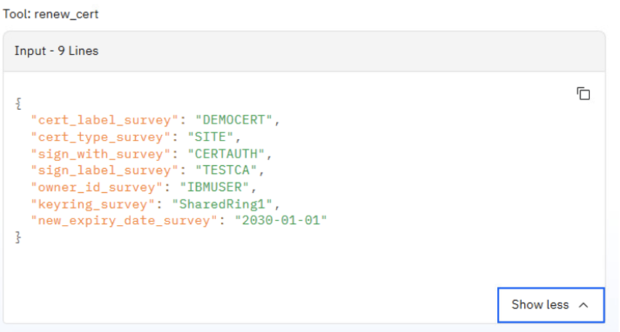

    ***Notice** how the agent provided the inputs for the ‘sign_with_survey’, ‘sign_label_survey’, and ‘new_expiry_date_survey’ variables. These were the variables you manually entered into the chat.*

    *Additionally, the inputs for the ‘cert_label_survey’ and ‘cert_type_survey’ were not directly provided to the tool, but carried over from the original get_cert tool as the agent has context awareness.*

    *And finally, for the ‘owner_id_survey’ and ‘keyring_survey’ inputs, these were never provided directly to the agent. Instead, the agent read the output log of the first ansible playbook and automatically picked up these values to pass as inputs to the renew_cert tool.*

16. Next, scroll back down to the chat field and prompt the agent with:
    
    `Get status of job <your job_id that the agent outputted above>`

    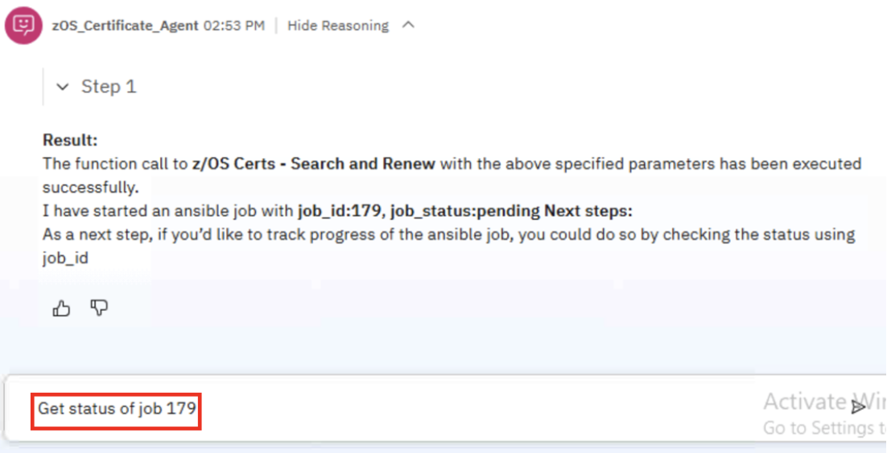

17. After prompting the agent, it should invoke the *get_status_output* tool just like previously, passing your job_id as input and provide the following information:

    **a.** **job id**

    **b.** **job status**

    **c.** **logs**

    If the **job status** was `successful`, then the logs should contain a confirmation message that the certificate has been renewed as shown below:

    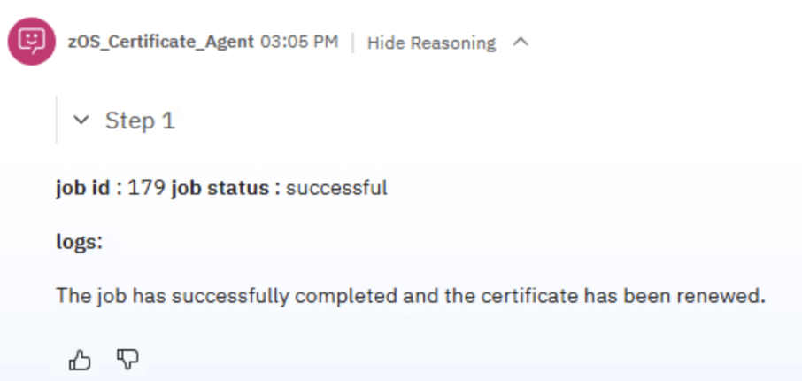

    However, if the **job status** shows as still `running`, then the logs would instead contain a summary of what the ansible playbook has done so far. If any errors occur in the processing, then the agent would also provide an analysis of what went wrong.

    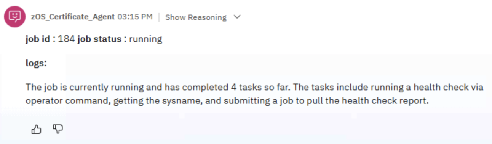

    ***Congratulations! You’ve deployed and tested your own agent for renewing z/OS certificates. If there’s any time remaining feel free to continue testing or contact one of the lab instructors for any questions.***