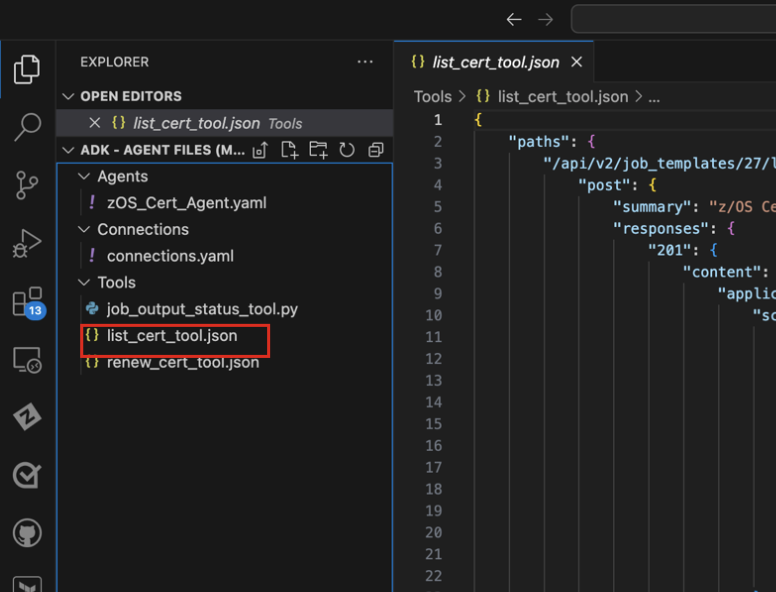
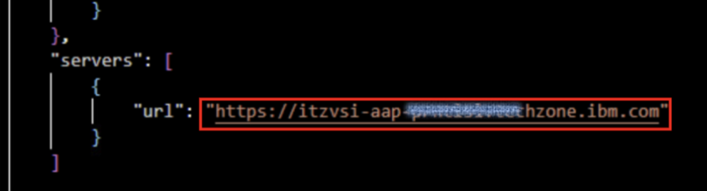
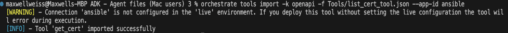
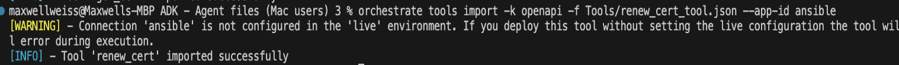
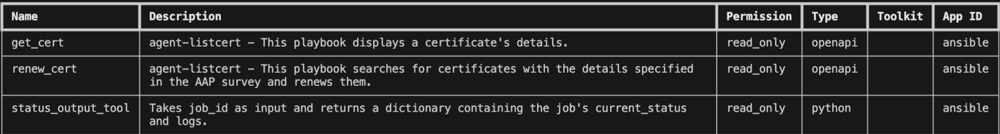

# Importing tools 

Tools are essential components of agents, enabling them to perform actions such as querying data, creating documents, or executing jobs on behalf of user. Tools often require a connection to work properly, i.e. in the case of Ansible where the tools must authenticate to AAP before calling an API.

With the ADK, tools can be created either using OpenAPI specifications, or by using a Python program.

In this scenario, your ***zOS Certificate Agent*** will be leveraging 3 different tools:

- ***get_cert***
    - This is an OpenAPI defined tool that calls an Ansible API in order to run an Ansible job for retrieving certificate details (depending on the inputs provided). This tool calls the **z/OS Certs – List Cert** Ansible template that you saw earlier

- ***renew_cert***
    - This is also an OpenAPI defined tool that calls an Ansible API in order to run an Ansible job. When executed it runs the **z/OS Certs – Search and Renew** Ansible template in order to renew a certificate that may be expiring soon.

- ***status_output_tool***
    - Unlike the first two tools, this tool is defined as a Python script that **retrieves the ansible job status and output** to display back to the user. It takes the job ID from one of the earlier job executions as input, and then passes information and logs of the job back to the agent to provide a response to the end-user.

In this section, you will import the tool files within your `Tools` sub-folder to create your agent tools for later use. For more details on creating tools, see <a href="https://developer.watson-orchestrate.ibm.com/tools/overview" target="_blank">here</a>.

1. Within VS Code, click on the `list_cert_tool.json` file under the ‘Tools’ sub-folder to view the contents.
   
    

2. Scroll to the bottom of the file and replace `<AAP UI URL>` with the **AAP UI URL** of your own environment (*paste it within the double-quotes*). It should look similar to the following:
   
    

    *Make sure to save the file before moving on*

3. Next, open up the `renew_cert_tool.json` file under the ‘Tools’ sub-folder to view the contents.
   
   

4. Just as before, scroll to the bottom of the file and replace `<AAP UI URL>` with the **AAP UI URL** of your own environment (within double-quotes).
   
    *Again, make sure to save the file before moving on.*

5. Import the first OpenAPI tool from the `list_cert_tool.json` file by running the following command from your VS Code Terminal command-prompt:
   
    ```
    orchestrate tools import -k openapi -f Tools/list_cert_tool.json --app-id ansible
    ```

6. After issuing the command, you should see a message similar to what’s shown below:
   
    

    This indicates that your `get_cert` tool was imported successfully.

7. Next, import the second OpenAPI tool from the `renew_cert_tool.json` file by running the following
command:

    ```
    orchestrate tools import -k openapi -f Tools/renew_cert_tool.json --app-id ansible
    ```

1. After issuing the command, you should get a message indicating that your `renew_cert` tool was imported successfully:
   
    

2. Finally, you will import the Python tool from the `job_output_status_tool.py` file. 
    
    To do this, copy and paste the following command into your VS Code Terminal command-prompt and click enter.

    ```
    orchestrate tools import -k python -f Tools/job_output_status_tool.py --app-id ansible
    ```

3.  Once you’ve successfully imported all 3 tools, verify they’re now active by running the following command:
    
    ```
    orchestrate tools list
    ```

    This should output a table similar to below showing all your imported tools.

    
