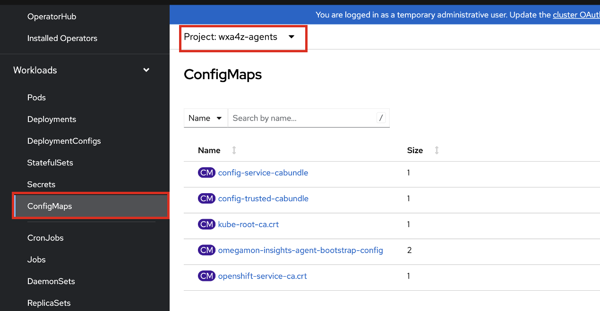
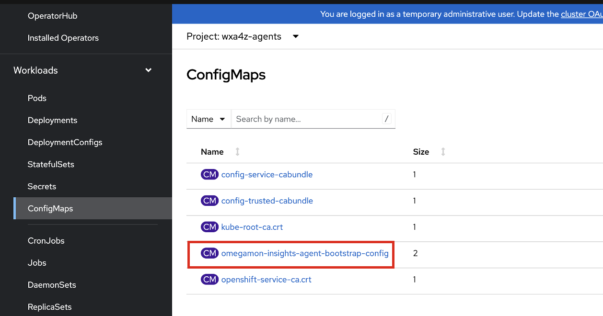
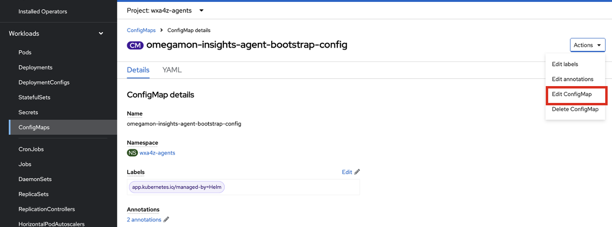
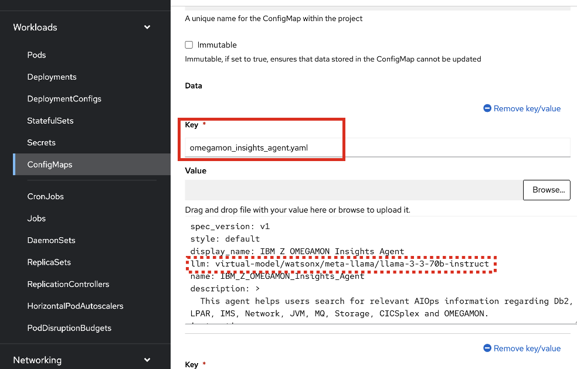
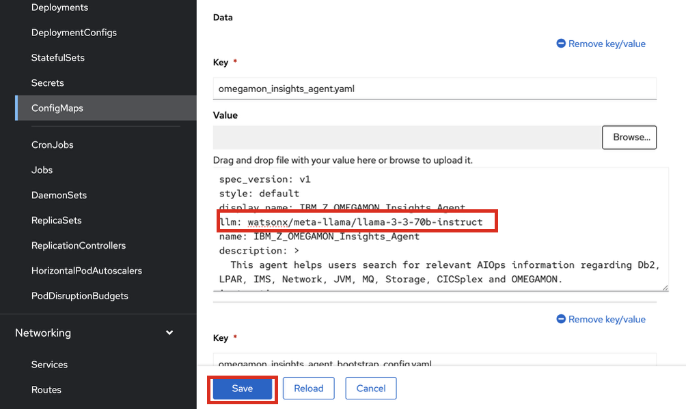

# Modifying `llm` config

There is a manual step that must be done prior to **subscribing** any of the agents (nuance of TechZone environment).

After applying/creating each agent's `custom service` (`cr.yaml`), but before subscribing the agent, perform the following steps:    

1. First modify the **configMap** for the agent bootstrapper. In the case of the **OMEGAMON Insights Agent**, this is labeled as `omegamon-insights-agent-bootstrap-config`.
   
    Navigate to the `ConfigMaps` section in your `wxa4z-agents` namespace:

    

2. Click on the configMap for the corresponding agent.

    


3. Click on **Edit ConfigMap**. 

    


4. In the Editor view, find the `llm` section in the first part of the configMap:

    


5. If using the `meta-llama/llama-3-3-70b-instruct` **MODEL_ID**, modify the `llm` section by removing the `virtual-model` string. The result should be:

    ```
    llm: watsonx/meta-llama/llama-3-3-70b-instruct
    ```

    Modify to whichever model_id is appropriately defined for your watsonx Orchestrate environment. (TIP: run `orchestrate models list --all` command in ADK session)

6. Then click **Save**. 

    

    The purpose of this is to properly select the LLM used by the Orchestrator agent when it gets bootstrapped. For watsonx Orchestrate SaaS, the `llm` value should be `watsonx/meta-llama/llama-3-3-70b-instruct` or `groq/openai/gpt-oss-120b` as 2 examples. 