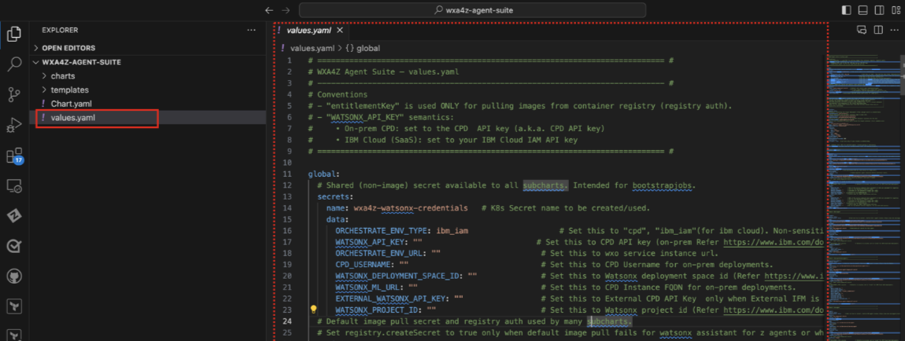

# Configuring Shared (Global) Agent variables

Within your `values.yaml` file of the ***wxa4z-agent-suite*** sub-folder, the first section of the file references `global` variables that get set first and are used by each of the agents.

After the global variables there are sections for each of the agents with agent-specific variables that must be set. In this section you will configure the global variables section of your `values.yaml` file.

**ACTION:** Within your VS Code window, click on the `values.yaml` file within the **wxa4z-agent-suite** sub-folder to open up the contents within VS Code.



**This is the file that you will be modifying in the following sections to prepare for your agents’ deployment. Ensure that you have the contents of this file opened within your VS Code window.**


### Configuring the `ORCHESTRATE_ENV_TYPE` global variable

At the very top of your `values.yaml` file, under global , there is a `secrets.data` section. You should see the first variable labeled `ORCHESTRATE_ENV_TYPE`:

```
secrets:
  name: wxa4z-watsonx-credentials 
  data:
    ORCHESTRATE_ENV_TYPE:
    ...
```

This is the instance type of your watsonx Orchestrate environment. Set the value to `ibm_iam` (for IBM Cloud). It should look like the following:

```
secrets:
  name: wxa4z-watsonx-credentials 
  data:
    ORCHESTRATE_ENV_TYPE: ibm_iam
    ...
```

### Configuring the `WATSONX_API_KEY` global variable

Below the previous variable (also under `secrets.data`) there is a global variable labeled `WATSONX_API_KEY`.

`WATSONX_API_KEY: “”`

Within the double-quotes, copy and paste your unique **API key** that you generated in the IBM Cloud console and recorded during Section ***[Generate IBM Cloud API key](../watsonx-ai/api-key.md)***.

### Configuring the `ORCHESTRATE_ENV_URL` global variable

Next you will see the `ORCHESTRATE_ENV_URL` variable under `secrets.data`. Within the double-quotes, copy and paste the value of your unique URL which you recorded in Section ***[Retrieve watsonx Orchestrate Service Instance URL](../watsonx-ai/service-instance-url.md)***.


### Configuring the `WATSONX_DEPLOYMENT_SPACE_ID` global variable

For the `WATSONX_DEPLOYMENT_SPACE_ID` global variable,copy and paste your unique Deployment Space ID within the double-quotes, which you recorded in Section ***[Create Deployment Space](../watsonx-ai/deployment-space.md)***.

### Configuring the `WATSONX_ML_URL` global variable

For the `WATSONX_ML_URL` global variable, copy and paste the value for your environment which you recorded in Section ***[Locate your WML Base URL](../watsonx-ai/wml-base-url.md)***.

### Configuring the `WATSONX_PROJECT_ID` global variable

Finally, for the `WATSONX_PROJECT_ID` global variable,copy and paste your unique Project ID that you recorded in Section ***[Create watsonx.ai Project](../watsonx-ai/project.md)***.


### Setting your registry entitlement key for wxa4z (for foundational agents)

After setting the above global variables within the `secrets.data` section of the `values.yaml` file, the last global secret to set is the registry image pull secret that will be used for pulling the images for the foundational agents. It should look like this by default under the `global` variables section:

```
registry:
    name: wxa4z-image-pull-secret 
    createSecret: true
    server: cp.icr.io
    username: cp 
    entitlementKey: “”
```

For the `entitlementKey` parameter, copy and paste the entitlement key you used in Section ***[Install the watsonx Assistant for Z Operator](../zAssistantDeploy/install-wxa4z-operator.md)***.

!!! Warning "If you forget your entitlement key"

    In the case that you don't remember the entitlement key you used and you need to generate a new one, follow these steps:

    1. Access the entitlement keys page [here](https://myibm.ibm.com/products-services/containerlibrary).
   
    2. Locate your existing entitlement key and click **copy**.


### Set `caTrustSync.enabled` to `false`

Following the `global` settings/variables section, you will see a `caTrustSync` section as shown below:

```
caTrustSync:
  enabled: true
  # Namespace containing the target Deployment & Pods (merged secret is created here)
  targetNamespace: cpd-instance-1
  # Target Deployment and the EXACT container name to exec into
  targetDeployment: wo-conversation-controller
  targetContainer: wo-conversation-controller
```
By default, `enabled` is set to `true`. As you are not using an on-prem version of Watsonx Orchestrate for the Lab, this can be set to `false` instead of configuring an internal CA certificate.

Set the **`enabled`** parameter value to **`false`** as shown below:

```
caTrustSync:
  enabled: false
  # Namespace containing the target Deployment & Pods (merged secret is created here)
  targetNamespace: cpd-instance-1
  # Target Deployment and the EXACT container name to exec into
  targetDeployment: wo-conversation-controller
  targetContainer: wo-conversation-controller
```


### Disable foundational agents not in scope

Before proceeding with the agent setup and deployment, you will need to disable the agents that aren’t in scope for this lab. Each agent in the suite can be customized individually in the `wxa4z-agent-suite/values.yaml` file. Settings differ slightly for **Foundational** Agents versus **IBM z/OS Product** Agents.

***Configuration for Foundational Agents:***

* enabled by default
* only requires `enabled: true` within the agent's particular section of `values.yaml`
  
For example:

```
support-agent:
  enabled: true
  # additional agent-specific config...
```

***Configuration for Foundational Agents:***

* not enabled by default
* to enable each agent, user must set `enabled: true` and `acceptLicense: true`, as well as provide a unique entitlement key for that particular Product Agent. 

***NOTE:*** *For this lab, you will only be deploying three of the Foundational Agents:*

* *IBM Z Upgrade Agent*
* *IBM Z Support Agent*
* *IBM Z OMEGAMON Insights Agent*


As mentioned above, the **Prebuilt IBM Z Product Agents** are disabled by default, while the **Foundational Agents** are enabled by default. For the purpose of this lab, ***you will need to disable*** the following Foundational Agents:

* IBM Z Automation Insights Agent
* IBM Z Workload Scheduler Insights Agent

1. Within your `values.yaml` file within the `wxa4z-agent-suite` sub-folder, scroll through the file until you get to the first **Default agent**.
   
    For example:

    ```
    # Default: support-agent
    support-agent:
      enabled: true
      image:
        # additional agent-specific config...
    ```

    For the purpose of this Lab, you are deploying the **IBM Z Support Agent**, so you can leave `enabled` set to `true` by default. 

2. Scroll down to the next **Default** agent section, which should be for the IBM Z OMEGAMON Insights Agent, as shown below:

    ```
    # Default: omegamon-insights-agent
    omegamon-insights-agent:
      enabled: true
      image:
        # additional agent-specific config...
    ```

    You can also leave `enabled` set to `true` as you will be deploying this agent.
  
3. Scrolling down further, you will next see the section for the **IBM Z Automation Insights Agent**, as shown below:
   
    ```
    # Default: automation-insights-agent
    automation-insights-agent:
      enabled: true
      image:
        # additional agent-specific config...
    ```

    As you will not be deploying this agent for the Lab, you will need to **disable** the agent by setting **`enabled`** to **`false`** as shown below:

    ```
    # Default: automation-insights-agent
    automation-insights-agent:
      enabled: false
      image:
        # additional agent-specific config...
    ```

4. The next agent is for the **IBM Z Upgrade Agent**. Leave the default with `enabled` set to `true`. 

    ```
    # Default: upgrade-agent
    upgrade-agent:
      enabled: true
      image:
        # additional agent-specific config...
    ```

5. Finally, scrolling to the last **Default** agent is the **IBM Z Workload Scheduler Insights Agent**. Make sure to set `enabled` to **`false`** as shown below:
   
    ```
    # Default: workload-scheduler-agent-z
    workload-scheduler-agent-z:
      enabled: false
      image:
        # additional agent-specific config...
    ```