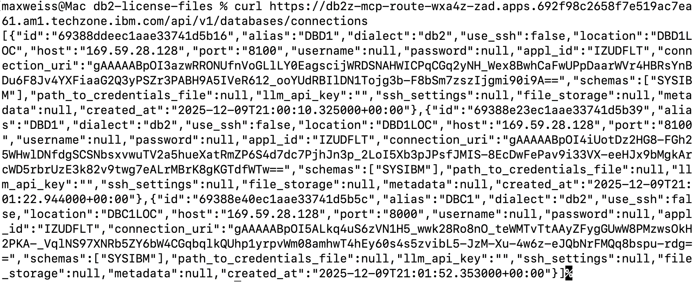

# Configuring your Db2 Agent with Db2 connections

Now that you've successfully deployed your Db2 for z/OS Agent, you must configure it which involves a few manual steps covered in this section. 

***NOTE:*** at the time of deployment, the Db2 for z/OS Agent does not initially have connectivity to the back-end subsystems. The connections must be made via REST API using the MCP server which will be covered later in this section. 

### Enabling your Db2 subsystems on Wazi aaS to use the non-default ports

In the TechZone z/OS environment, there are two Db2 subsystems provisioned (DBD1 and DBC1). For convenience, there is a playbook you can run on the provisioned AAP environment in order to configure these Db2 subsystems to use the non-default ports which allows the Agent to connect via ODBC. 

1. Log into your **AAP** instance and navigate to the **Templates** tab under **Resources**. 
   
    **IMAGE**

2. In the **Templates** list, you should see a pre-loaded template called **Config-Db2-Ports** as shown below. 
   
    **IMAGE**

    Click the **Launch** icon. 

3. Once launched, wait until the job completes. Afterwards, the DBD1 and DBC1 subsystems will be successfully configured for the later steps. 


### Mount the Db2 license file

As a pre-req for using the Db2 for z/OS Agent, it must have ODBC connectivity enabled. Server-side verification is recommended, however, client-side verification is supported by mounting the license into the deployed container at `/usr/local/lib64/python3.12/site-packages/clidriver/license`. 

*NOTE:* missing license files at the above location will lead to a licensing error when later creating a connection to Db2 via MCP server REST API endpoint. 

Follow the below instructions to mount the license in the deployed agent pod.

1.  Download the **db-license-files.zip** file from Box <a href="https://ibm.box.com/s/uizr5o5d6mu2yc4oqn3qxhj2uvy6rrwx" target="_blank">here (internal only)</a>.

2. Extract/unzip the file in your Downloads folder


3. In a new terminal session, change directory to the **db2-license-files** folder.

    

4. In a local notepad, copy and paste the following command block to a local notepad, and replace the `<YOUR DB2 POD NAME>` placeholder with the name of your deployed Db2 agent pod:
   
    ```
    NS="wxa4z-zad"
    POD="<YOUR DB2 POD NAME>"
    CTR="db2z-agent"

    SRC_DIR="./"  
    DEST="/usr/local/lib64/python3.12/site-packages/clidriver/license"

    tar -C "${SRC_DIR}" -cf - . \
    | oc exec -i -n "${NS}" "${POD}" -c "${CTR}" -- env DEST="${DEST}" \
      python -c 'import sys, os, tarfile
    d = os.environ["DEST"]
    os.makedirs(d, exist_ok=True)
    with tarfile.open(fileobj=sys.stdin.buffer, mode="r|*") as t:
        t.extractall(d)
    '
    ```
    
    In the below screenshot, example, the corresponding line would become `POD="db2z-agent-66c75cb94d-xtk8q"`

    


5. In your terminal/command-line session, and assuming you're in the **db2-license-files** folder, copy and paste the modified command script into the session and hit **`<enter>`**.
   
    The result may look similar to what's shown below:

    

6. Optionally, confirm that it's been added by navigating to your **Db2z-agent** pod in the OCP web console, clicking on the **Terminal** tab.
   
    **IMAGE**

    Then copy and paste the following command:

    `cd /usr/local/lib64/python3.12/site-packages/clidriver/license`

    Entering the `ls` command from the above directory should output the files you copied over. 

    **IMAGE**


### Bind the ODBC DBRMs to Db2 subsystems

Prior to setting an agent connection to your Db2 subsystems, you must also bind some required packages on your Db2 subsystems. Follow the below steps:

1. Assuming you're already in the **Terminal** view of your agent pod, click on the drop-down to select the **db2z-mcp-server** pod

    **IMAGE**

2. Navigate to the following directory by running the following command: `cd $IBM_DB_HOME/bin`


3. Run the command below to bind the packages on the **DBD1** Db2 subsystem, replacing the following values with your own unique values:

    - `<host>`: public IP of your Wazi aaS
    - `<password>`: the RACF passphrase you set for your IBMUSER ID


    ```
    ./db2cli bind $IBM_DB_HOME/bnd/@db2cli.lst -database DBD1LOC:<host>:8100 -user IBMUSER -passwd "<password>"
    ```

4. Run the command below to bind the packages on the **DBC1** Db2 subsystem, replacing the following values with your own unique values:

    - `<host>`: public IP of your Wazi aaS
    - `<password>`: the RACF passphrase you set for your IBMUSER ID


    ```
    ./db2cli bind $IBM_DB_HOME/bnd/@db2cli.lst -database DBC1LOC:<host>:8000 -user IBMUSER -passwd "<password>"
    ```


### Creating Db2 connections

Now that you've mounted the license file and binding the required packages, you can define the Db2 connections for your agent. 

1. Record the route URL for your **db2-mcp-route** in your OpenShift cluster.
   
    Navigate to **Networking --> Routes** and then copy the **Location** URL for the **db2-mcp-route** as shown below.

    


2. Define a new connection to your DBD1 subsystem by modifying the following command:
   
    ```
    curl -X POST -H "Content-Type: application/json" -d '{"alias": "DBD1", "host": "<your z/OS public IP>", "port": "8100", "connection_uri": "db2+ibm_db://IBMUSER:<zOS passphrase>@<your z/OS public IP>:8100/DBD1LOC", "appl_id": "IZUDFLT", "username": "IBMUSER", "password": "<zOS passphrase>", "location": "DBD1LOC"}' <db2-mcp-route>/api/v1/databases/connections
    ```

    - replace `<your z/OS public IP>` with the public IP address found in your environment details for Wazi aaS
    
    - replace `<zOS passphrase>` with the same passphrase value you set when configuring the `ZOSMF_PASSWORD` secret for the Z Upgrade Agent

    - replace `<db2-mcp-route>` with the route URL you recorded in the previous step


    And finally, issue the command in your local terminal to create the connection. 

3. And finally, define a new connection to your DBC1 subsystem by modifying the following command:

    ```
    curl -X POST -H "Content-Type: application/json" -d '{"alias": "DBC1", "host": "<your z/OS public IP>", "port": "8000", "connection_uri": "db2+ibm_db://IBMUSER:<zOS passphrase>@<your z/OS public IP>:8000/DBC1LOC", "appl_id": "IZUDFLT", "username": "IBMUSER", "password": "<zOS passphrase>", "location": "DBC1LOC"}' <db2-mcp-route>/api/v1/databases/connections
    ```

    - replace `<your z/OS public IP>` with the public IP address found in your environment details for Wazi aaS
    
    - replace `<zOS passphrase>` with the same passphrase value you set when configuring the `ZOSMF_PASSWORD` secret for the Z Upgrade Agent

    - replace `<db2-mcp-route>` with the route URL you recorded in the previous step

    And finally, issue the command in your local terminal to create the connection. The result should look similar to what's shown below:

4. To verify your database connections, you can run the following command, replacing `<db2-mcp-route>` with your own unique route.
   
    `curl <db2-mcp-route>/api/v1/databases/connections`

    Example:

    