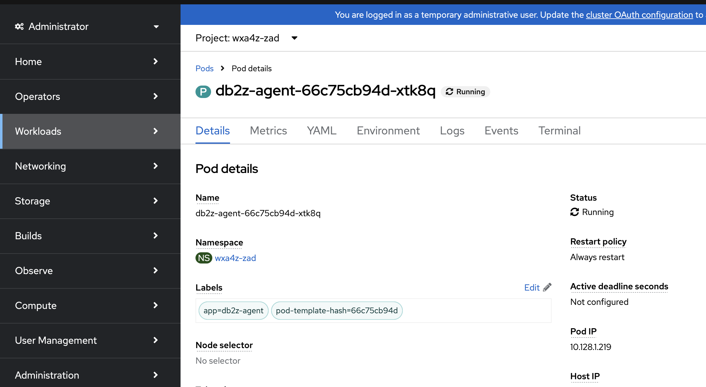
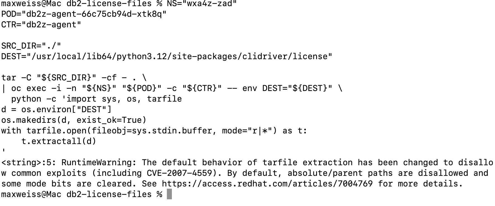
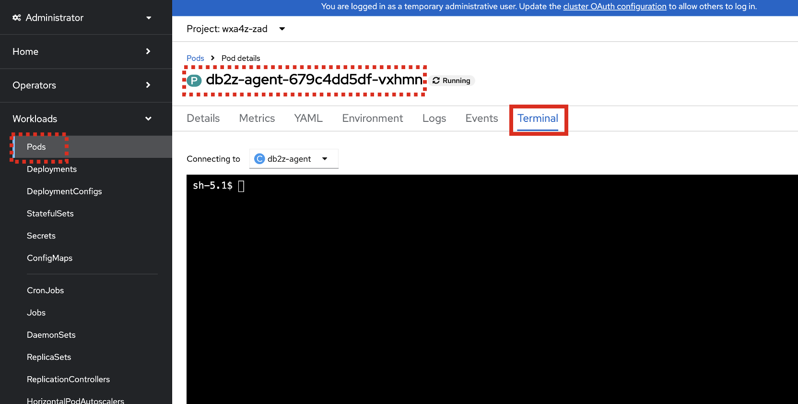
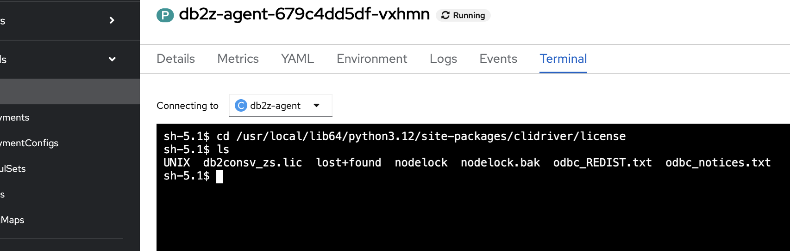
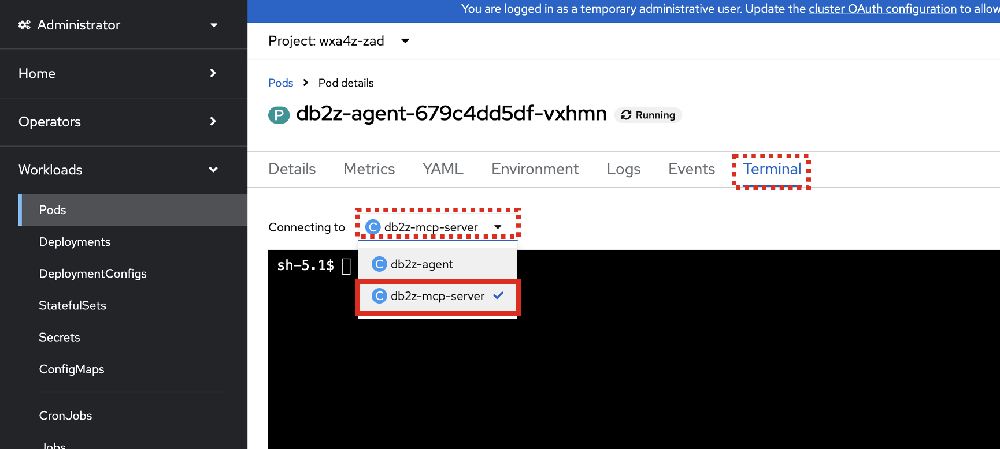
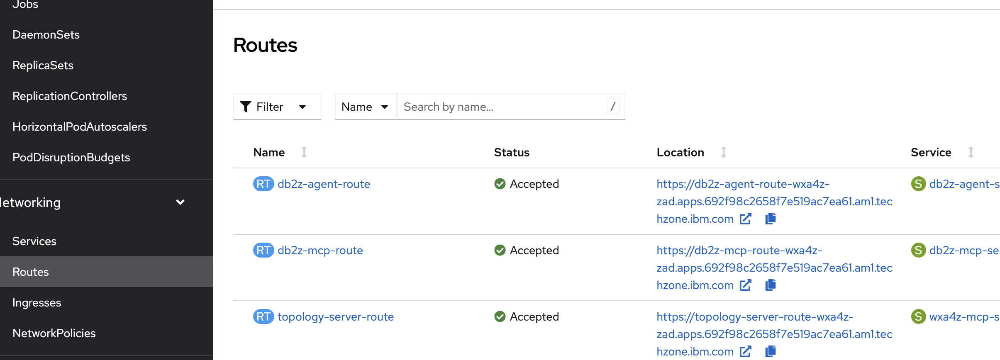
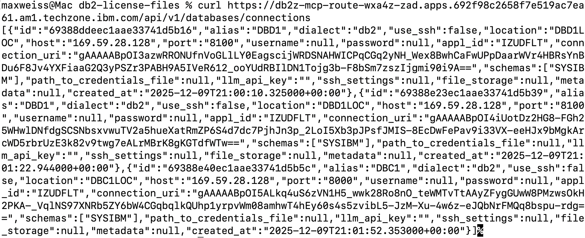

# Configuring agent connections for Db2 for z/OS Agent

Now that you've successfully deployed your Db2 for z/OS Agent, you must configure it which involves a few manual steps covered in this section. 

### Mount the Db2 license file

As a pre-req for using the Db2 for z/OS Agent, it must have ODBC connectivity enabled. Server-side verification is recommended, however, client-side verification is supported by mounting the license into the deployed container at `/usr/local/lib64/python3.12/site-packages/clidriver/license`. 

***NOTE:*** *missing license files at the above location will lead to a licensing error when later creating a connection to Db2 via MCP server REST API endpoint.* 

Follow the below instructions to mount the license in the deployed agent pod.

1.  Download the **db-license-files.zip** file from Box <a href="https://ibm.box.com/s/uizr5o5d6mu2yc4oqn3qxhj2uvy6rrwx" target="_blank">here (internal only)</a>.

2. Extract/unzip the file in your Downloads folder


3. In a new terminal session, change directory to the **db2-license-files** folder.

4. In a local notepad, copy and paste the following command block to a local notepad, and replace the `<YOUR DB2 POD NAME>` placeholder with the name of your deployed Db2 agent pod:
   
    ```
    NS="wxa4z-zad"
    POD="<YOUR DB2 POD NAME>"
    CTR="db2z-agent"

    SRC_DIR="./"  
    DEST="/usr/local/lib64/python3.12/site-packages/clidriver/license"

    tar -C "${SRC_DIR}" -cf - . \
    | oc exec -i -n "${NS}" "${POD}" -c "${CTR}" -- env DEST="${DEST}" \
      python -c 'import sys, os, tarfile
    d = os.environ["DEST"]
    os.makedirs(d, exist_ok=True)
    with tarfile.open(fileobj=sys.stdin.buffer, mode="r|*") as t:
        t.extractall(d)
    '
    ```
    
    In the below screenshot, example, the corresponding line would become `POD="db2z-agent-66c75cb94d-xtk8q"`

    


5. In your terminal/command-line session, make sure your current directory is the **db2-license-files** folder, the paste the full modified command script into the session and hit **`<enter>`**.
   
    The result may look similar to what's shown below:

    

6. Optionally, confirm that it's been added by navigating to your **Db2z-agent** pod in the OCP web console and clicking on the **Terminal** tab.
   
    

    Then copy and paste the following command:

    `cd /usr/local/lib64/python3.12/site-packages/clidriver/license`

    Entering the `ls` command from the above directory should output the files you copied over. 

    


### Bind the ODBC DBRMs to Db2 subsystem

Prior to setting an agent connection to your Db2 subsystems, you must also bind some required packages. Follow the below steps:

1. Assuming you're already in the **Terminal** view of your agent pod, click on the drop-down to select the **db2z-mcp-server** container.

    

2. Navigate to the following directory by running the following command: `cd $IBM_DB_HOME/bin`


3. Run the command below to bind the needed packages on the **DBD1** Db2 subsystem, replacing the following values with your own unique values:

    - `<host>`: public IP of your Z Dev & Test image
    - `<password>`: the RACF passphrase you set for your IBMUSER ID

    ```
    ./db2cli bind $IBM_DB_HOME/bnd/@db2cli.lst -database DBD1LOC:<host>:8100 -user IBMUSER -passwd "<password>"
    ```
### Creating Db2 connections

Now that you've mounted the license file and binded the required packages, you can define the Db2 connections for your agent. 

1. Record the route URL for your **db2-mcp-route** in your OpenShift cluster.
   
    Navigate to **Networking --> Routes** and then copy the **Location** URL for the **db2-mcp-route** as shown below.

    


2. Define a new connection to your DBD1 subsystem by modifying the following command:
   
    ```
    curl -X POST -H "Content-Type: application/json" -d '{"alias": "DBD1", "host": "<public-ip>", "port": "8100", "connection_uri": "db2+ibm_db://IBMUSER:<passphrase>@<public-ip>:8100/DBD1LOC", "appl_id": "IZUDFLT", "username": "IBMUSER", "password": "<passphrase>", "location": "DBD1LOC"}' <db2-mcp-route>/api/v1/databases/connections
    ```

    - replace `<public-ip>` with the public IP address found in your environment details for the Z Dev & Test image
    
    - replace `<passphrase>` with the same passphrase value you set for `IBMUSER` on your zD&T image ([reference](../../techzone/zdt.md#set-new-passphrase-for-ibmuser)).

    - replace `<db2-mcp-route>` with the route URL you recorded in the previous step


    And finally, issue the command in your local terminal to create the connection. The result should look similar to what's shown below:

    ```
    {"id":"69e43245cbfbcd29ca7f7276","alias":"DBD1","dialect":"db2","use_ssh":false,"location":"DBD1LOC","host":"150.240.65.119","port":"8100","username":"gAAAAABp5DJEBqzRD438PnJBChK8XgVwWqh8vrhCGaCr4ItzhZb0AZStz1cTkQWgdh6NtwWq9Oq6Amuo0KVl_1COeLelUPG98A==","password":"gAAAAABp5DJEgGFm1phowqfofcR8cCqR7mg27AxMgImiWfClcyJxiqdT3Vq0FBprMhHPt46UPPrdjtA9pLc7-jaCCTBlreysWzJlPhTeYTSoy3wIBCtnidQ=","appl_id":"IZUDFLT","connection_uri":"gAAAAABp5DJELQSrz9b0naWItBIUVyFtC1logF0ksw56FScmegIUXWn8pHTaJFNH3v6lPyNr-_wSDoOS9AJyadiO51aZeyHa3mJofaoQMRY7hgRJ3SaCz2zt2jCQcP6NtEHmkvYq9Rr7OTPL-PhoDPVl00qAVeIwshBgfUjdh_G3AJgFZbivQqE=","schemas":["SYSIBM"],"path_to_credentials_file":null,"llm_api_key":"","ssh_settings":null,"file_storage":null,"metadata":null,"created_at":"2026-04-19T01:39:16.610804+00:00"}
    ```

3. To verify your database connections, you can run the following command, replacing `<db2-mcp-route>` with your own unique route.
   
    `curl <db2-mcp-route>/api/v1/databases/connections`

    Example:

    

### Enabling catalog table discovery

To enable the agent's ability to access information in Db2® catalog tables, you need to scan the catalog tables by running the Scan Database REST API.

Run the below command, replacing the following values:
    
- replace `<db2-mcp-route>` with your own unique route
    
- replace `<db_conn_id>` with the string associated with the `id` parameter in the output of the previous command
    
- replace `<passphrase>` with the same passphrase value you set for `IBMUSER` on your zD&T image ([reference](../../techzone/zdt.md#set-new-passphrase-for-ibmuser)).

    ```
    curl --request POST --url '<db2-mcp-route>/api/v1/tables/descriptions/scan?db_connection_id=<db_conn_id>' --header 'accept: application/json' --header 'content-type: application/json' --data '{"username": "IBMUSER","password": "<passphrase>"}'
    ```

*Your agent is now configured with a subsystem connection and you can now test the agent scenarios.*