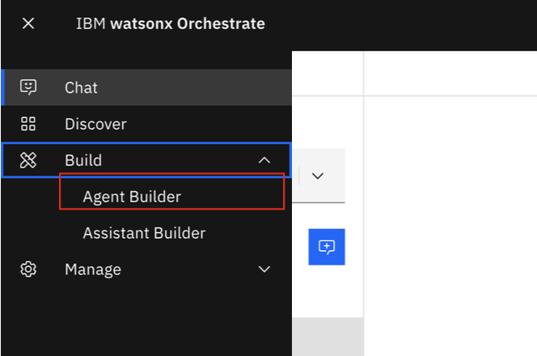
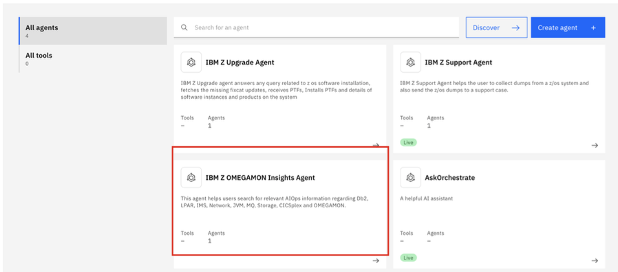
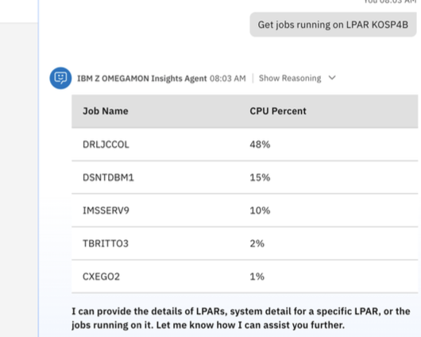
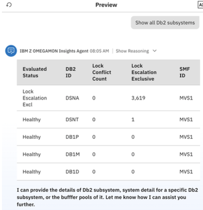

# Test the IBM Z OMEGAMON Insights Agent

Next, you will test your **IBM Z OMEGAMON Insights Agent**. 

1. From the **Agent chat**, navigate back to the Agent builder page by clicking on the hamburger icon and selecting **Build -> Agent builder**.
   
    

2. Within the **Agent Builder** view, click on the tile for your **IBM Z OMEGAMON Insights Agent**.

    

Now you will test a set of prompts spanning the capabilities for the IBM Z OMEGAMON Insights Agent.

!!! Tip "Note about demo scenarios"

    Only a couple scenarios are documented here for testing purposes. For the full list of agent capabilities to test, you can reference ***[Summary of IBM Z OMEGAMON Insights Agent capabilities](../omegamon-agent/overview.md)***.

### LPAR Insights

```
Show all LPARs
```
***Example output:***


```
Show system details for LPAR KOSP4B
```
***Example output:***


```
Get jobs running on LPAR KOSP4B
```
***Example output:***



### Db2 Insights

```
Show all Db2 subsystems
```
***Example output:***



```
Provide details for DSNA
```
***Example output:***


```
Show buffer pools for DSNA
```
***Example output:***


### Deploy the agent

Once satisfied with the testing of your agent, you can then deploy/publish your IBM Z OMEGAMON Insights Agent just as you did in ***[this section](./support-agent.md#deploy-the-agent)***.

