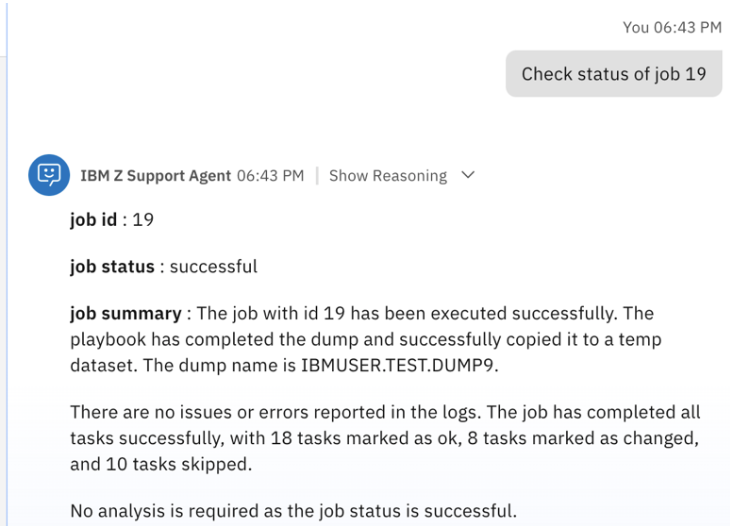

# Test the IBM Z Support Agent

In this section you will test the capabilities of the **IBM Z Support Agent**.

1. Within the **Agent Builder** view, click on the tile for your **IBM Z Support Agent**.
   
    

2. On the right-hand side of the screen, you should see the **Preview chat** window for your agent. Click in the text-box of the **Preview** chat window and prompt the agent with the following, replacing `<dump title>` with a unique name for your dump:
   
    ```
    Take z/OS dump with dump title <dump title>
    ```

    

3. You’ll then get a response from the agent prompting you for more details. Respond with the following information:
   
    **a.** **storage areas** (optional): provide a list of storage areas to include in the dump, or exclude to use the default

    **b.** **jobname**: provide a unique job name for running the job on z/OS

    **c.** **dataset name**: provide a unique dataset name used to capture the dump

    - ensure your dataset name follows standard dataset naming conventions and rules on z/OS
  
    **d.** **verbosity** (optional): provide a verbosity level to use, or exclude to use the default

    **For example:**

    ```
    use jobname *MASTER* and dataset name IBMUSER.TEST.DUMP9
    ```

    

4. Based on the inputs provided, the agent may request for more details in order to run the job. If provided enough details, the agent will then provide a summary of the parameters supplied and ask to approve or reject.
   
    Respond with `approve`. 

    

5. After approving the job, the agent will return a response, including the **job_id** and **job_status**. This initiates a run of the corresponding Ansible playbook in AAP to capture a z/OS system dump.
   
6. You can next check the status of the job by prompting the agent with the following, replacing `<job_id>` with the **job id** returned by your agent.
   
    **For example:**
    ```
    Check status of job <job_id>
    ```

    

7. In the above example, the job status is **successful**. As a next step, you could initiate the transmitting of the z/OS dump to IBM support via a case number. For example, this can be done with the following prompt:
   
    ```
    Send z/OS dump from dataset <dataset-name> to case
    number TS019840250
    ```

    **NOTE:** For this tool execution, you can use case # TS019840250.

8. After prompting the agent, it will then provide a summary asking you to approve or reject, as shown below:
   
    

9. Once approved, the agent will return a summary, including the **job_id** and **job_status** as shown below:
    
    

10. Like before, you can check the status by prompting the agent with the following, replacing `<job_id>` with the **job id** returned by your agent:
    
    ```
    Check status of job <job_id>
    ```

    

    **NOTE:** you can continue monitoring the status of the job with the above command until the agent returns that the job was successful.

### Deploy the agent


