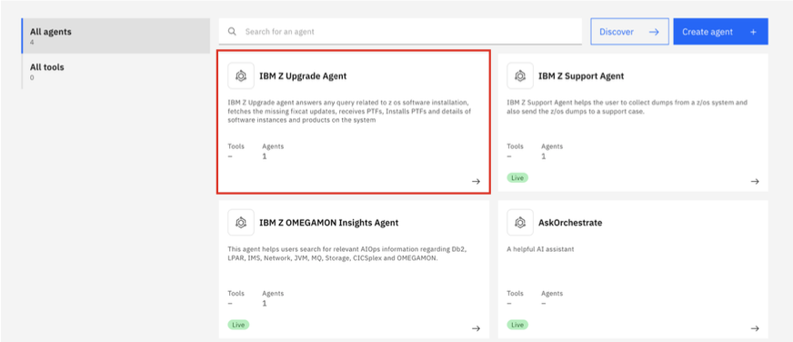
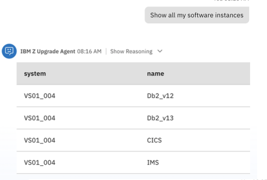
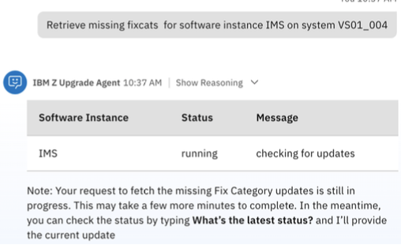
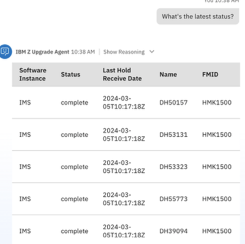
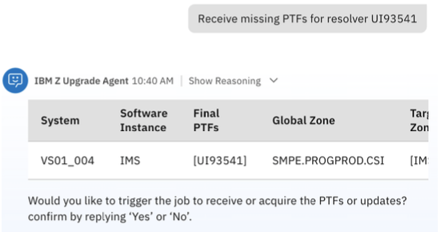
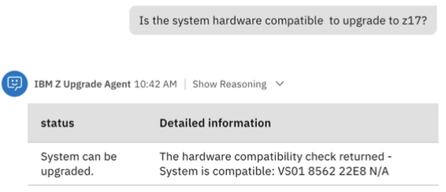
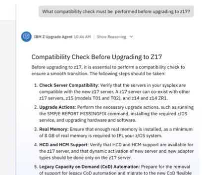
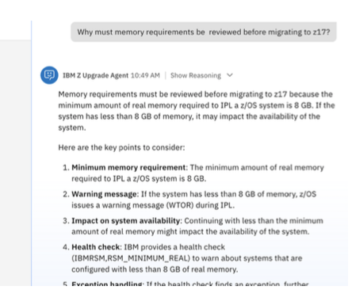

# Test the IBM Z Upgrade Agent

Finally, you will test your **IBM Z Upgrade Agent**. 

Navigate back to the **Agent builder** page and click on the agent tile for your **IBM Z Upgrade Agent**, as shown below:



*This section will walk through a few of the capabilities using example prompts you can use to test. Feel free to try your own prompts based on the agent capabilities referenced* ***[here](../upgrade-agent/overview.md)***.

### List software instance details

```
Show all my software instances
```
***Example output:***



### Retrieve missing FIXCATs by software instance

```
Retrieve missing fixcats for software instance IMS on system VS01_004
```
***Example output:***



```
What's the latest status?
```
***Example output:***




### Acquire missing FIXCAT updates

```
Retrieve missing fixcats for software instance IMS on system VS01_004
```
***Example output:***



### Check hardware-compatibility for upgrade

```
Is the system hardware compatible to upgrade to z17?
```
***Example output:***



### Upgrade workflow-related queries using zRAG documentation

```
What compatibility check must be performed before upgrading to z17?
```
***Example output:***



```
Why must memory requirements be reviewed before migrating to z17?
```
***Example output:***




### Additional questions to test 

```
What updates should be made to ensure system images are ready for z16?
```

```
What are the compatibility checks we need to perform to upgrade from z15 to z16?
```

```
Does the z16 upgrade workflow include steps for checking missing service using FIXCATs?
```


### Deploy the agent

Once satisfied with the testing of your agent, you can then deploy/publish your IBM Z Upgrade Agent just as you did in ***[this section](./support-agent.md#deploy-the-agent)***.


