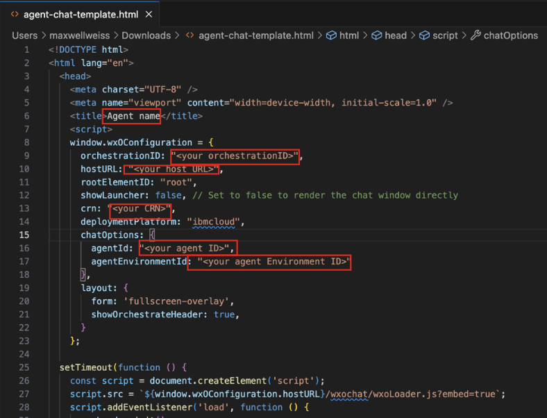
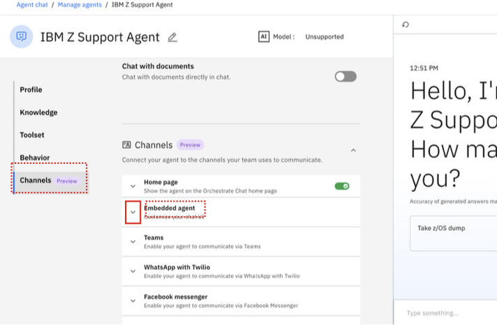
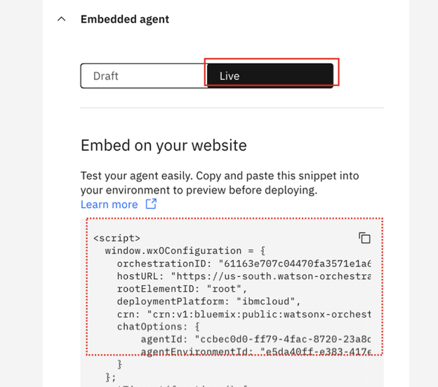

# Embed Agent Chat in Web Page

Once you’ve deployed your agents to the ***Live*** version within the **watsonx Orchestrate** UI, you’ll then be able to integrate your agent chat into a webpage for external use and surfacing within web UI applications.

Follow the instructions below on how to do this. 
**Note:** the steps must be done for each agent you wish to embed. The examples below use the ***IBM Z Support Agent*** as an example.

!!! Warning "One-time security setup for Orchestrate environment"

    The below steps will only work for *anonymous* access to the agent chat. When security is disabled to allow anonymous access, requests to the embedded chat API do not require authentication. If you go this route, ensure your watsonx Orchestrate instance does not provide access to sensitive data. 

    ***Options:***

    **1.** Disable security for embedded chat by following the <a href="https://blog.oofdev.com/2025/11/enable-anonymous-access-ibm-watsonx-orchestrate-embedded-chat-security-disable.html" target="_blank">configuration steps here</a>, then completing the remaining steps in this section. 

    **2.** Enabling security by following the ADK guide <a href="https://developer.watson-orchestrate.ibm.com/agents/integrate_agents#security-configuration" target="_blank">here</a>. 

1. Firstly, download the **Agent chat template file** from Box here: 

    <a href="https://ibm.box.com/s/d79agcwownfbg7pi25x0ix0brr6jqawd" target="_blank">https://ibm.box.com/s/d79agcwownfbg7pi25x0ix0brr6jqawd</a>

2. Once downloaded locally, open the **agent-chat-template.html** file within VS code (or any text editor of your choice).

3. Within the template html file, you will see placeholders for unique values that you must provide for each particular agent:
   
    - Agent name
    - orchestrationID
    - hostURL
    - crn
    - agentId
    - agentEnvironmentId
  
      

4. In the `<title>` brackets towards the top of the file, replace `Agent name` with the name of your agent (i.e. `IBM Z Support Agent`).
   

5. For each of the other parameters in the **html** file, you can find your agent’s unique values by navigating to the **Agent Builder** view within the watsonx Orchestrate UI, and clicking on the **Live** version of your deployed agent.
   
    

6. Once you’re in your agent’s editor view, scroll to the bottom to the **Channels** section and expand the **Embedded agent** section.
   
    

7. Once expanded, click on the **Live** tab for your deployed agent. You should then see a sample code snippet unique for your environment, as shown below.
   
    

8. Copy and paste each of the following values from the provided code snippet to your **agent-chat-template.html** file:

    - orchestrationID
    - hostURL
    - crn
    - agentId
    - agentEnvironmentId

9. Finally, as a best practice, **save your .html file with a new file name**. For example, in the case of the IBM Z Support Agent, saving the file name as ***support-agent-chat.html***

10. Once saved, open up the HTML file via web browser and test the agent scenarios.