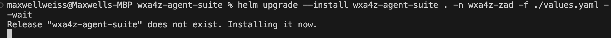

# Execute Agent Deployment

Now that you’ve set the required **`global` (shared) agent variables** and set the relevant agent-specific variables, you are ready to execute the deployment of the scoped agent set onto your OpenShift cluster. As part of the deployment process, the agents will be *automatically bootstrapped* to your **watsonx Orchestrate** environment so the agents will appear by default when you log in. As a recap, the agents you will deploy for this lab include:

- zRAG Agent
- IBM Z Upgrade Agent
- IBM Z Support Agent
- IBM Z OMEGAMON Insights Agent
- Db2 for z/OS Agent

1. Within VS Code, open up a new terminal window by clicking on **Terminal --> New Terminal**. 
   
    For example (on Mac):

    

    By default, the current working directory in the Terminal session will be the root `z-ai-agents` folder.

2. In your Terminal session, change the current working directory to the `wxa4z-agent-suite` sub-folder. 
   
    For example, on a Mac this can be done with the following command:
    ```
    cd wxa4z-agent-suite
    ```

    


3. Download and install the `helm` command-line utility by following the instructions in the link below:

    <a href="https://helm.sh/docs/intro/install/" target="_blank">https://helm.sh/docs/intro/install/</a>

4. Verify that `helm` was successfully installed by running the following command in your VS Code terminal:
   
    `helm --help`


5. Within the terminal session, run the following command to update the chart dependencies for the umbrella chart:

    ```
    helm dependency update
    ``` 


6. Next, run the following command to deploy the agents:
   
    ```
    helm upgrade --install wxa4z-agent-suite . -n wxa4z-zad -f ./values.yaml --wait
    ```

7. After executing the above command, you should see something like the following:
   
    

    !!! Tip "What is the command doing?"
    
        The above command will deploy all of the `enabled` agents simultaneously. 

        Because the `--wait` flag was used, the command won't return until all the required agent images are pulled successfully.

8. Ensure there are no immediate errors in the command output. Once complete, you may see a message returned like the following:
   
    

### Verify successful deployment

1. To verify the successful deployment of your agents, navigate back to your OCP Web console and log in.

2. Once logged in, navigate to **Workloads --> Pods** within the ***wxa4z-zad*** namespace and verify that you see the 3 new pods (one for each agent), and that they’re in the ***Running*** status:
   
    

    ***NOTE:** you may also see pods with the **bootstrap** label. These are ephemeral pods used to register each of the agents to your Orchestrate environment. Once the bootstrapping job is completed, these pods will terminate on their own*.

    

***Congratulations! You’ve successfully deployed your first set of watsonx Assistant for Z agents. In the following section you will access and test each of the agents capabilities.***


### Troubleshooting
