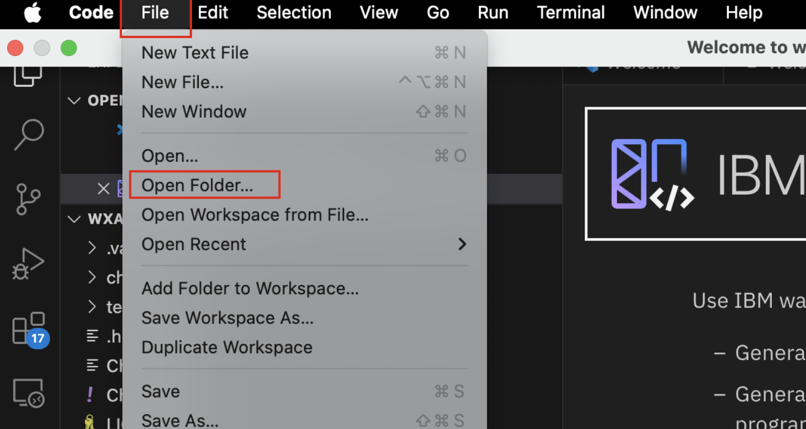

# Setup VS Code workspace with the **wxa4z-agent-suite** Helm Charts

In this section you will setup your VS Code workspace with the *IBM watsonx Assistant for Z - Agent Suite* Helm Charts that you will later deploy onto your cluster. The helm chart deploys multiple z/OS agents with a single command, using shared configuration and per-agent overrides. In the following section you will see how the **Agent suite** works.

1. The very first step in configuring the **Agent Suite** is to firstly download the **z-ai-agents.zip** file to your local workstation, which contains the Agent Suite Helm Charts.

    Navigate to the below link and download the provided .zip file from Box to your local workstation:

    <a href="https://ibm.box.com/s/6s6khnvokxq1mxiw9bjzhqg6mcrikbo8" target="_blank">https://ibm.box.com/s/6s6khnvokxq1mxiw9bjzhqg6mcrikbo8</a>

    !!! Warning "**Guidance on the agent suite**"

        The  **Agent Suite Helm Charts** are made publicly available to customers via the Git repo found <a href="https://ibm.box.com/s/6s6khnvokxq1mxiw9bjzhqg6mcrikbo8" target="_blank">here</a>.

        This public git repo hosts only the Agent Deployment Guide, and not the agents themselves, as a valid entitlement key must be obtained before agents can be properly deployed.

        ***For the purpose of the lab***, the provided Helm charts are available to download from the Box link above, and have been slightly modified for quicker deployment.

2. After downloading the .zip file, unzip or extract the file to your local workstation.

3. Once extracted, open up a new VS Code session (if not already open), and open your extracted ***z-ai-agents*** folder on your local workstation.
   
    * If opening a new VS code window, this can be done by clicking **Open Folder**
    
        

    * If using an existing VS code window, you can go to **File --> Open Folder...**
  
        

4. Then select your extracted **z-ai-agents** folder to access the folder in your VS Code window.

    

    