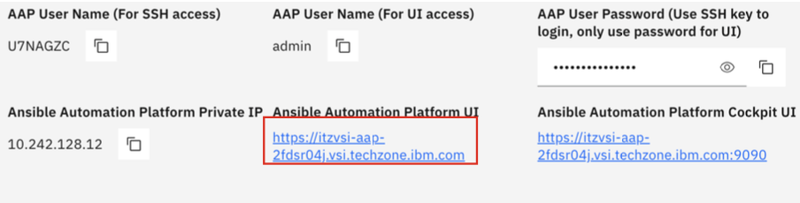
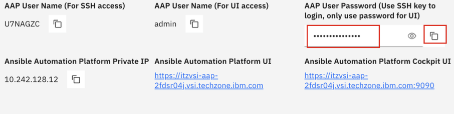
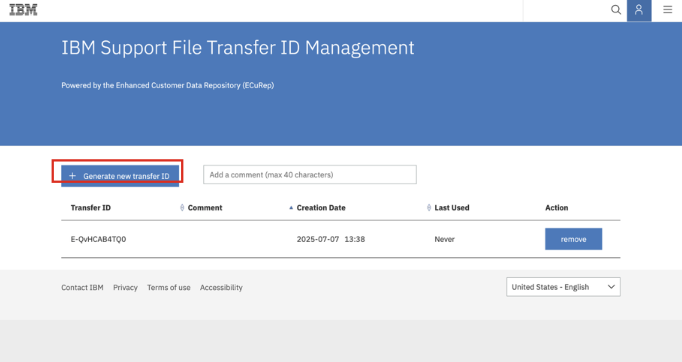

# Configuring the `secrets.data` variables

Scrolling down further in the **IBM Z Support Agent** section of your `values.yaml` file, you will see a **`secrets.data`** section with additional variables you must configure. It will look like what’s shown below:

```
secrets:
  data:
    AAP_ENDPOINT: ""
    AAP_USERNAME: ""
    AAP_PASSWORD: ""
    SEND_DUMP_TRANSFER_ID: ""
    SEND_DUMP_TRANSFER_PASSWORD: ""
    AGENT_AUTH_TOKEN: ""
```

The below table describes each of the variables in the `secrets.data` variables section. The rows with default values can be set to what's shown in the `Default value to set` column. The rows without default values are unique to your environment and will require you to set that value using the instructions below in this section. 


**Variable name** | **Description** | **Default value to set**
--- | --- | ---
**AAP_ENDPOINT** | URL of your AAP instance to login to the AAP web console. | -------
**AAP_USERNAME** | Username for logging into your AAP Web console | "admin"
**AAP_PASSWORD** | Password for logging into your AAP Web console | -------
**SEND_DUMP_TRANSFER_ID** | Transfer ID required for send dump job | -------
**SEND_DUMP_TRANSFER_PASSWORD** | Transfer password required for send dump job | -------
**AGENT_AUTH_TOKEN** | Authentication token used to register the agent with WxO | "support_auth_token"

1. Set the **default** variable values for the rows above in your `values.yaml` file:

    * `AAP_USERNAME: "admin"`
    * `AGENT_AUTH_TOKEN: "support_auth_token"`


2. Set the `AAP_ENDPOINT` variable to your **AAP UI URL** used for logging into the AAP web console. This can be retrieved from your environment details as shown below:
   
    

3. Set the `AAP_PASSWORD` variable to your **AAP User Password** used for logging into the AAP web console. This can be retrieved from your environment details as shown below:
   
    

4. To generate the values for the `SEND_DUMP_TRANSFER_ID` and `SEND_DUMP_TRANSFER_PASSWORD`, you must first create a new **IBM Support File Transfer ID** on ***EcuRep***. 
   
    Follow the steps below to create and record your transfer ID credentials. 

    - Create a new IBM Support File Transfer ID on ECuRep by accessing the link below:
    <a href="https://www.ecurep.ibm.com/transferids/" target="_blank">https://www.ecurep.ibm.com/transferids/</a>

    - Once authenticated, click on **+ Generate a new transfer ID**
  
        
    
    - You will then be provided a **Transfer ID** and **Password**. The password will only be shown once, so make sure to **record both details in a local notepad**.

    - In your `values.yaml` file under the `env` variables section, set the value of the `SEND_DUMP_TRANSFER_ID` variable to your recorded **TransferID**, and set the value of the `SEND_DUMP_TRANSFER_PASSWORD` variable to your recorded **Transfer Password**.

Once you’ve modified the above variables for the **IBM Z Support Agent**, make sure to save your `values.yaml` file to ensure the changes get saved.

Finally, you will proceed to setting up the needed variables for the **IBM Z OMEGAMON Insights Agent**.