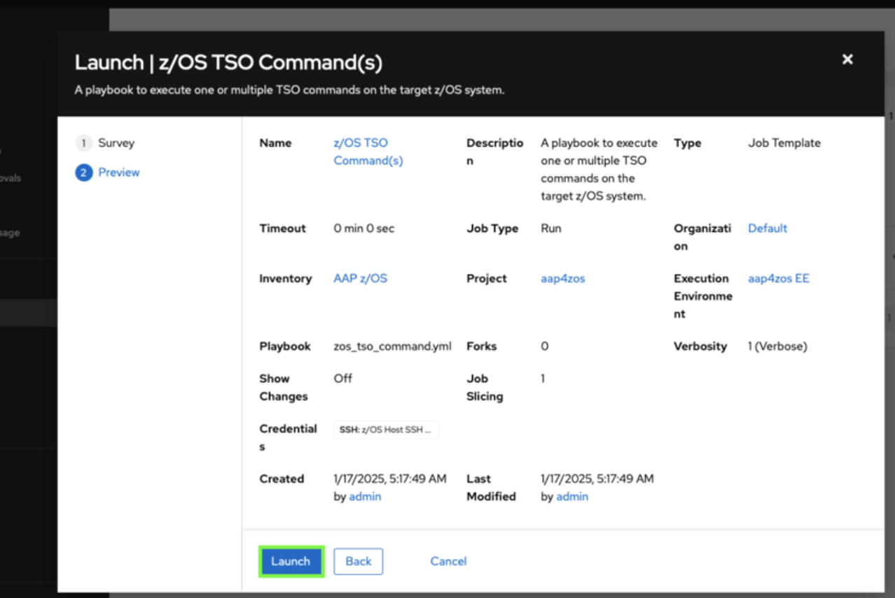

# Configuring the `secrets.data` variables

Scrolling down further in the **IBM Z Upgrade Agent** section of your `values.yaml` file, you will see a **`secrets.data`** section with additional variables you must configure. It will look like what’s shown below:

```
secrets:
  data:
    ZOSMF_ENDPOINT: ""
    ZOSMF_USERNAME: ""
    ZOSMF_PASSWORD: ""
    AGENT_AUTH_TOKEN: ""
    WRAPPER_USERNAME: ""
    WRAPPER_PASSWORD: ""
    INGESTION_PASSWORD: ""
```

The below table describes each of the variables in the `secrets.data` variables section. The rows with default values can be set to what's shown in the `Default value to set` column. The rows without default values are unique to your environment and will require you to set that value using the instructions below in this section. 


**Variable name** | **Description** | **Default value to set**
--- | --- | ---
**ZOSMF_ENDPOINT** | Endpoint URL for z/OSMF, provided by IBM for managing and interacting with z/OS systems. | -------
**ZOSMF_USERNAME** | User ID for connecting to the z/OSMF endpoint | "IBMUSER"
**ZOSMF_PASSWORD** | Password/Passphrase for connecting to the z/OSMF endpoint | -------
**AGENT_AUTH_TOKEN** | Authentication token used to register the agent with WxO | "upgrade_auth_token"
**WRAPPER_USERNAME** | Username for accessing the WRAPPER_URL endpoint | "admin"
**WRAPPER_PASSWORD** | Password for accessing the WRAPPER_URL endpoint | -------
**INGESTION_PASSWORD** | Password for accessing the INGESTION_URL endpoint | -------

**ACTION:** Set the **default** variable values for the rows above in your `values.yaml` file:

* `ZOSMF_USERNAME: "IBMUSER"`
* `AGENT_AUTH_TOKEN: "upgrade_auth_token"`
* `WRAPPER_USERNAME: "admin"`

### Set your `ZOSMF_ENDPOINT` variable

Now, you will set the `ZOSMF_ENDPOINT` variable to the unique z/OSMF endpoint URL of your Wazi z/OS environment. This can be gathered with the following steps. 

1. Locate and record the value of your ***Ansible Automation Platform UI*** URL found in your environment details, i.e. https://itzvsi-aap-ebds04j.vsi.techzone.ibm.com

    

2. Within your copied URL, change the **`aap`** string to **`zos`**. In the above example, it would then look like the following:
   
    https://itzvsi-zos-ebds04j.vsi.techzone.ibm.com

3. And finally, append **`:10443/zosmf`** to the end of the string. The result should look similar to the following:
   
    https://itzvsi-zos-ebds04j.vsi.techzone.ibm.com:10443/zosmf

    This would be the final value to set for the `ZOSMF_ENDPOINT` variable (***note** - your URL will be different and is dependent on your Lab environment*)

### Set your `ZOSMF_PASSWORD` variable

Set the `ZOSMF_PASSWORD` variable to a new RACF Password/Passphrase that the IBMUSER ID uses to log into TSO. 

Follow the below steps to reset your RACF passphrase for the IBMUSER user and set the value to the `ZOSMF_PASSWORD` variable.

1. Open and log into the **Ansible Automation Platform (AAP) web console** using the same **AAP UI URL** referenced above in your Lab env details.

2. Click **templates** under the **Resources** section. 
   
    

3. Click the **launch** icon for the `z/OS TSO Command(s)` template.
   
    

4. Replace the default command with the command that follows, and substituting a *passphrase* of your choice for the string **`YOUR_PASSWORD_PHRASE`**:
   
    ```
    ALTUSER IBMUSER PHRASE('YOUR_PASSWORD_PHRASE') NOEXPIRE RESUME
    ```
   
    ??? Tip "Syntax rules for RACF Password Phrases (below)"
    
        - minimum length: 9 characters
        - Must contain at least 2 alphabetic characters (A - Z, a - z)
        - Must contain at least 2 non-alphabetic characters (numerics, punctuation, or special characters, including spaces)
        - Must not contain more than 2 consecutive characters that are identical
  
    **Note:** *if you typed the command yourself, be sure to include the single-quotes before and after the password.* ***Record the password as it will be needed later.***

    

5. Click **Launch**. 
    
    

6. Verify that the job is **Successful** by locating the message `"failed": false` in the job output. 
   
    

7. Verify that you can log into z/OSMF in a new browser tab. Navigate to z/OSMF using the `ZOSMF_ENDPOINT` URL you previously recoreded and set in VS Code. 

8. Enter (**a**) `IBMUSER` for the z/OS USER ID, (**b**) the passphrase you just set for the z/OS PASSWORD, and then (**c**) click **LOG IN**. 
   
    
   
    Once successfully logged in, make sure to set the `ZOSMF_PASSWORD` variable in `values.yaml` to the passphrase you entered.


### Set your `WRAPPER_PASSWORD` variable

Set the **`WRAPPER_PASSWORD`** variable to the `<WRAPPER_PASSWORD>` value you set in your **wrapper-creds.yaml** file in Section ***[Deploy secrets for OpenSearch and Client Ingestion](../../zAssistantDeploy/deploy-secrets.md)***.

### Set your `INGESTION_PASSWORD` variable

Finally, set the `INGESTION_PASSWORD` variable to the **authkey** value you set in your **client-ingestion-secret.yaml** file in Section ***[Deploy secrets for OpenSearch and Client Ingestion](../../zAssistantDeploy/deploy-secrets.md)***.