# Custom Search Configurations for zRAG Retriever

Once deployed, the zRAG Agent may require additional fine-tuning depending on the use case and the topic of questions being asked. 

When a user queries the zRAG Agent with a question, the following flow is executed:

1. User issues query to zRAG Agent chat interface in Orchestrate
2. Orchestrate agent invokes the **zrag_retriever** tool with the exact query.
3. **zrag_retriever** executes document retrieval against OpenSearch knowledge base, leveraging the search configuration that is configured in the **zrag-mcp-connection** Orchestrate connection. 
4. Search is executed and the tool returns ranked document set with metadata
5. zRAG Orchestrate agent passes results to LLM for answer generation.
6. Final answer streams back to chat window with citations. 

## Modifying Search Configuration

In step 3 of the flow above, document retrieval is done leveraging the search configuration defined in the `zrag-mcp-connection` connection within watsonx Orchestrate. By default, the connection details are set during the zRAG Agent bootstrapping process. But depending on use case and for fine-tuning purposes, these connection search parameters should be modified as discussed below. 

This section will outline the most relevant scenarios for modifying the search configuration. For full details, refer to the **<a href="https://github.com/IBM/z-ai-agents/tree/main/agent-helm-charts/zrag-agent#custom-search-configurations-for-zrag-retriever" target="_blank">documentation here</a>**.

There are two methods of modifying the `zrag-mcp-connection` search configuration:

### Method 1: Using watsonx Orchestrate UI

The first method is by using the watsonx Orchestrate web interface to set connection credentials directly as key-value pairs. To do this, follow the below steps:

1. Log into your watsonx Orchestrate environment UI by following the steps ***[here](../../watsonx-ai/service-instance-url.md)***.

2. Once logged in, go to the **Connections** view by clicking on the hamburger icon in top-left, then selecting **Manage --> Connections**. 

    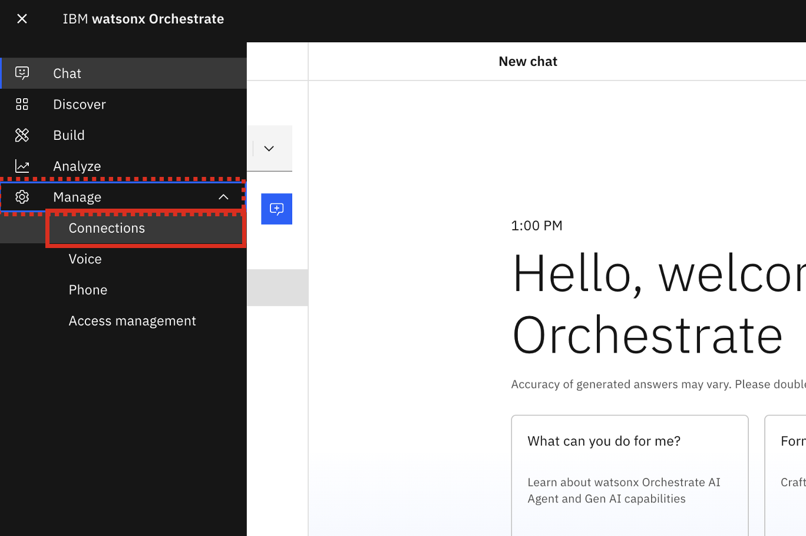

3. There you should see your `zrag-mcp-connection` pre-defined. 
   
    Click on the **Credentials** tab. 

    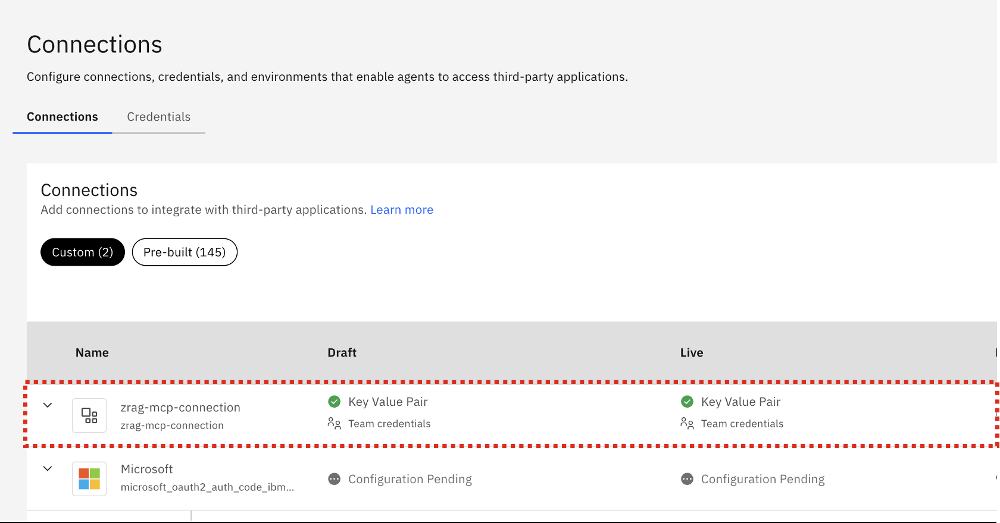

4. In the **Credentials** view, you'll see a tab for both the **Draft** and **Live** environment. Ensure that any changes you test/verify for the **Draft** environment also gets made to the **Live** environment in order to take affect for end-users. 
   
    Next to the `zrag-mcp-connection`, click on the ellipses then select **Edit**. 

    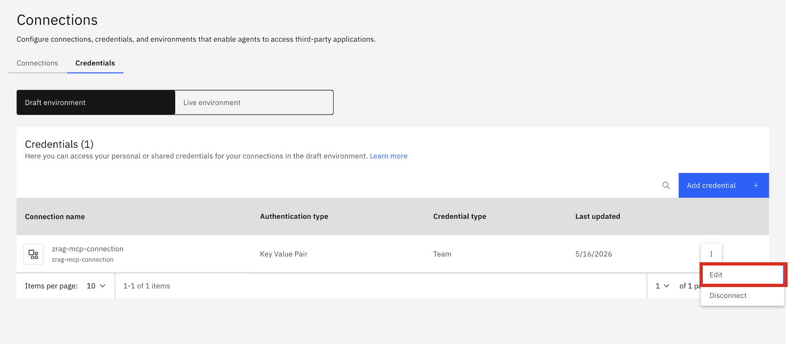

5. Modify any of the default key-pair values by clicking on the pencil icon based on requirement. 
   
    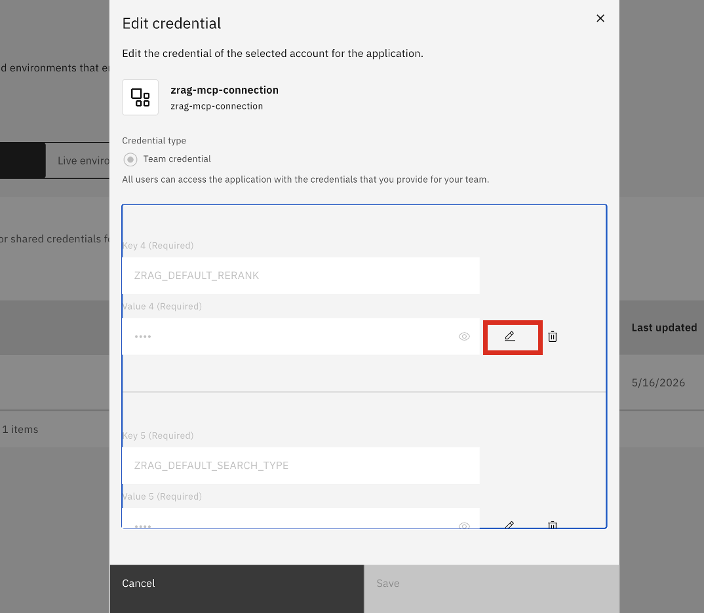

    Or alternatively, add a new key-pair value for a search parameter that isn't assigned by default (i.e. `ZRAG_TOPICS_ENABLE`, `ZRAG_TOPICS_DISABLE`, `ZRAG_METADATA_PRODUCT_WEIGHT`, etc.). This can be done by scrolling to the bottom and selecting **Add key value pair +**. 

    

6. Once done, save the changes. 
   
    For a full list of available search parameters, refer to the **<a href="https://github.com/IBM/z-ai-agents/tree/main/agent-helm-charts/zrag-agent#custom-search-configurations-for-zrag-retriever" target="_blank">documentation here</a>**.

### Method 2: Using Orchestrate ADK CLI

Alternatively, you can modify the connection credentials programatically using the ADK CLI. For steps on doing this, reference the **<a href="https://github.com/IBM/z-ai-agents/tree/main/agent-helm-charts/zrag-agent#method-2-using-orchestrate-adk-cli" target="_blank">steps here</a>**.

# Scenarios

The below scenarios outline the most common search configuration updates you may need to make with examples. 

## 1.) Disabling certain topics

One of the most common scenarios is disabling certain topics that are not relevant to the customer or the use case. As an example, if when using the default zRAG search settings, references to z/VM or z/TPF are unintentionally surfacing in generated responses and citations, you may need to explicitly disable these topics from being referenced. 

This can be done using the `ZRAG_TOPICS_DISABLE` search parameter. By default, this parameter is not included in the connection credentials and will need to be added if you intend on using it. 

To use this parameter to disable the z/TPF topic for example, you can first modify the connection credentials for the draft environment:

1. Follow the steps in **[Method 1: Using watsonx Orchestrate UI](./zrag-config.md#method-1-using-watsonx-orchestrate-ui)** to edit the **Draft** connection credentials.
   

2. At the bottom of the **Edit credential** view, click **Add key value pair +** as this parameter isn't included by default. 
   
    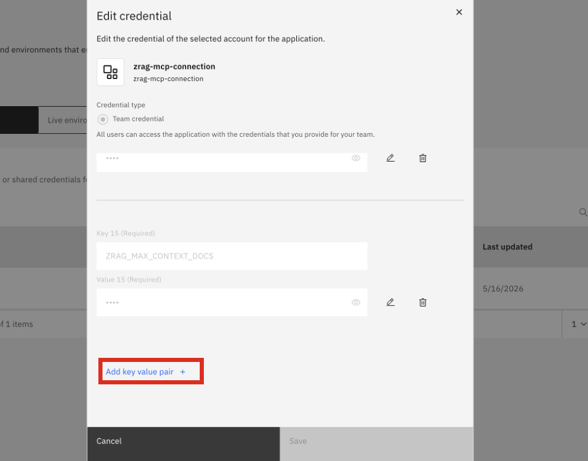

3. In the **Key** field, enter `ZRAG_TOPICS_DISABLE`. In the **Value** field, enter `ztpf` for this example. 
      
    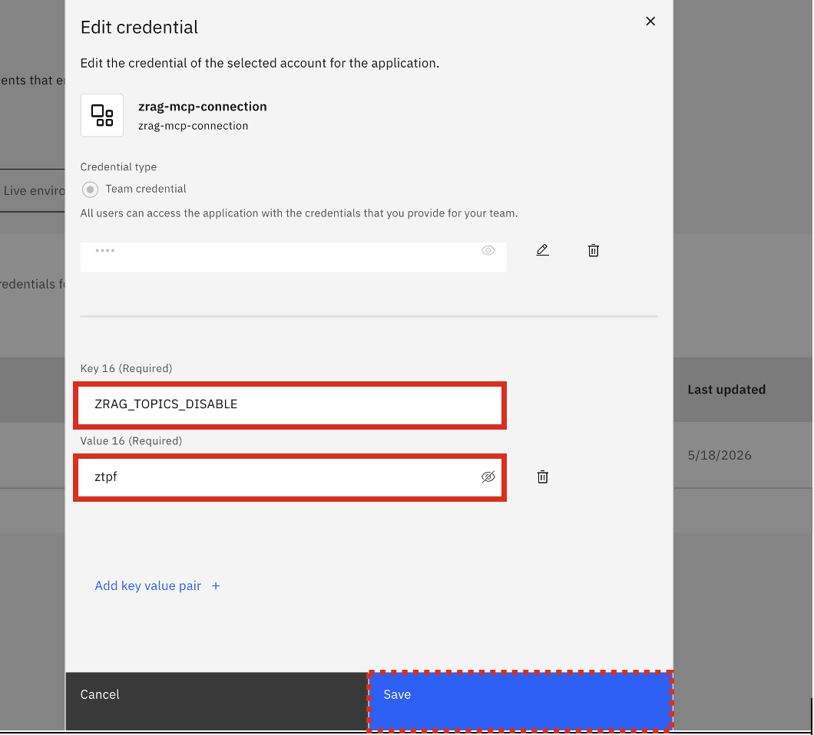

4. Then click **Save**. 
   

    !!! Warning "Modifying the **Draft** credentials..."

        Because you only modified the connection credentials for the **Draft** environment, the search configuration will only be passed to the retriever when prompting the agent in the **Draft/Editor** view of the watsonx Orchestrate UI. It won't take affect for end-users until you also modify the **Live** environment credentials. 

### Testing the configuration

Once modified, you can verify that the connection credentials were successfully set by prompting the **zRAG Agent** with a query and viewing the logged metadata in the **opensearch-wrapper** pod on OpenShift. 

1. Go back to viewing the **Draft** version of your **zRAG Agent** in the watsonx Orchestrate UI and prompt the agent with a query, i.e.:
    
    `What operating systems can run on an IBM Z LPAR?`
   
    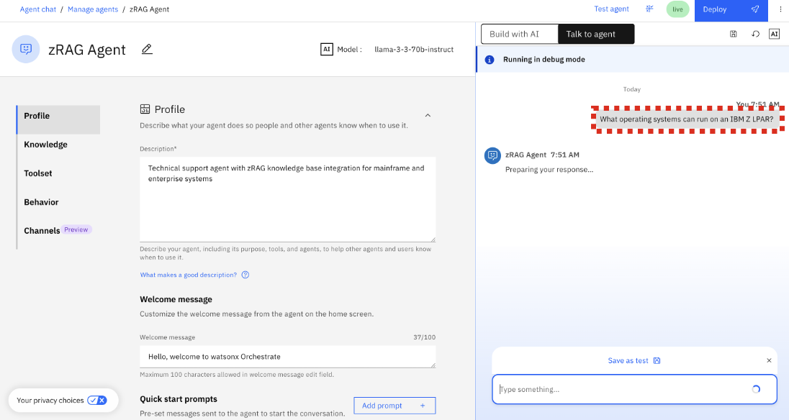

    Again, if you've only modified the **Draft** version of the connection credentials, the changes can only be verified when prompting the **Draft** version of your agent. 

2. After prompting the agent, navigate to the Pod view of your opensearch-wrapper pod by navigating to **Pods** under the **Workloads** section of the OpenShift Web UI.
   
    Then click on the `wxa4z-opensearch-wrapper` pod.

    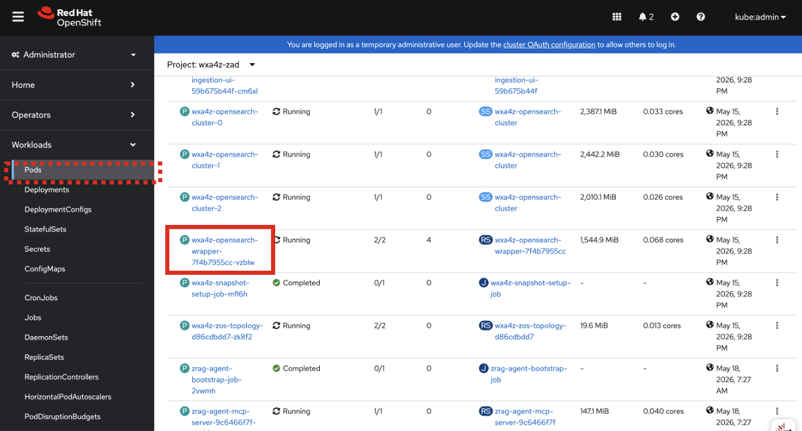

3. Then click on the **Logs** tab and scroll to the bottom. 
    
    From there, you should be able to view log records including the query you prompted, as well as the disabled topics as shown in the image below:
   
    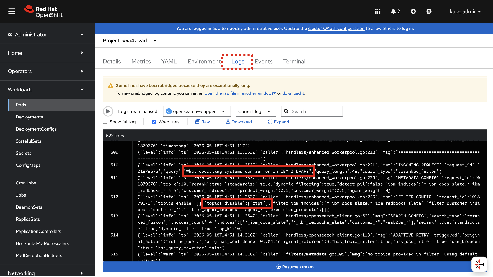

    This verifies that the connection credentials were successfully set. 

    Before making the changes for the **Live environment**, ensure you fully test a range of questions using the new filter. 

## 2.) Enabling only certain topics

Alternatively, if the use case is very tightly scoped on base z/OS functionality and ignoring other IBM tooling/middleware/products, you can scope the search to only the base z/OS documentation, forcing the retrieval to ignore all other topics. This can be done using the `ZRAG_TOPICS_ENABLE` search parameter.

!!! Warning "Use of ENABLE/DISABLE search parameters..."

    Only the `ZRAG_TOPICS_ENABLE` or the `ZRAG_TOPICS_DISABLE` parameters can be set at the same time. They cannot be set simultaneously or you'll get an error. 

To configure the search parameters for this scenario:

1. First delete the `ZRAG_TOPICS_DISABLE` key-value pair from the **Draft** version of your connection credentials within the Orchestrate UI.

    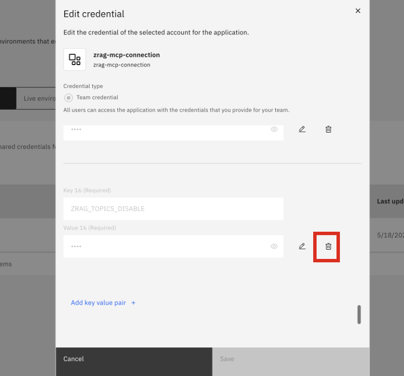

2. At the bottom of the **Edit credential** view, click **Add key value pair +** and enter `ZRAG_TOPICS_ENABLE` for the **Key** field, and `z/os` for the **Value** field. 
   
    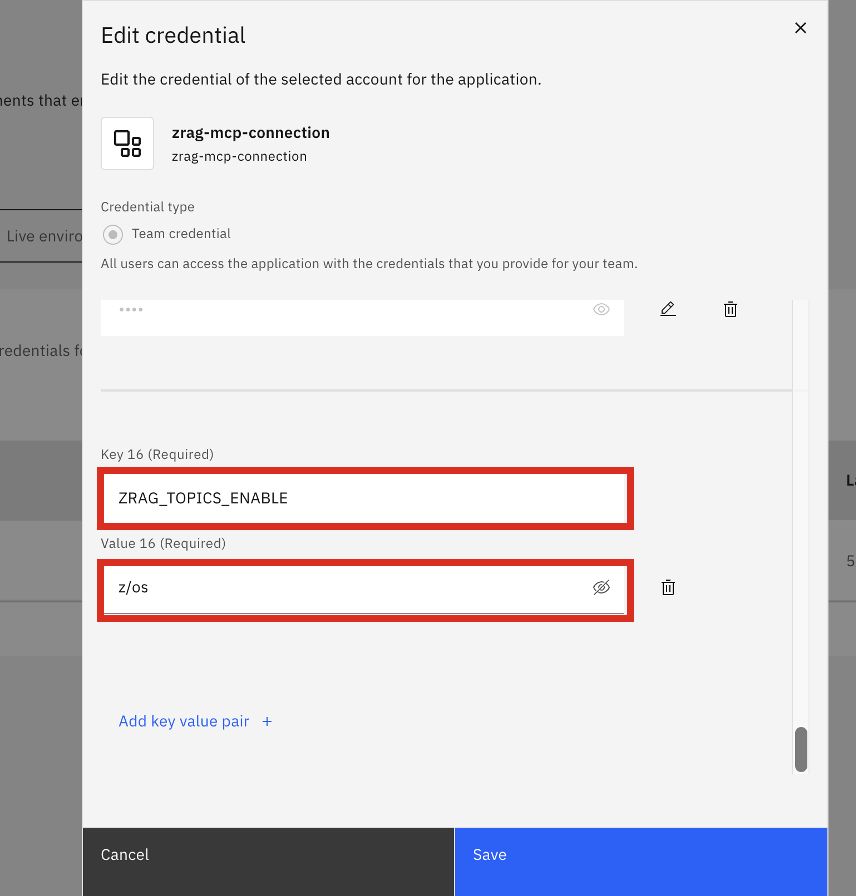

3. Then click **Save**. 
   
    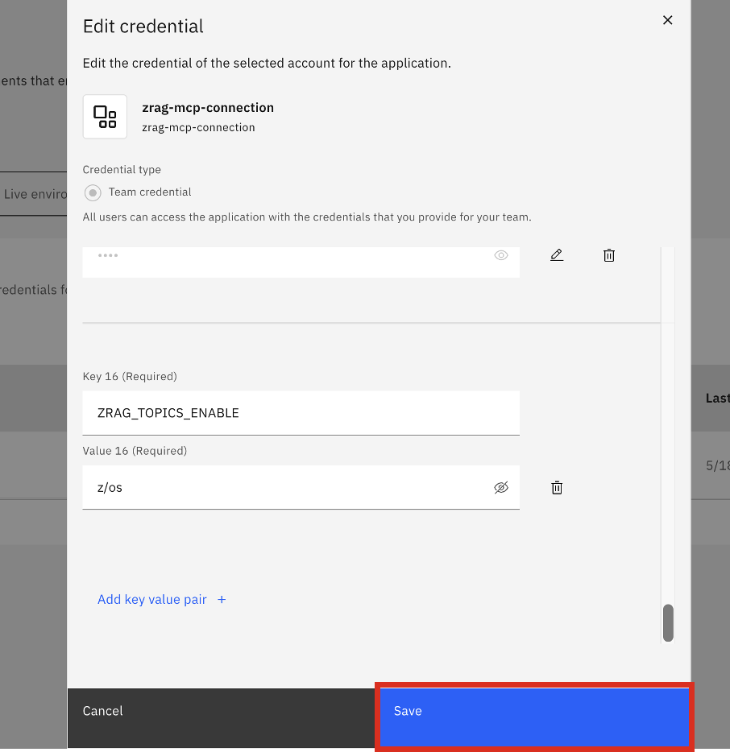

### Testing the configuration

Just as before, prompt the agent with a query in the **Draft** view, then view the logs of the **opensearch-wrapper** pod on OpenShift. 

You should be able to see the following message in the latest pod logs:

`"topics_enable":["z/os"],` 

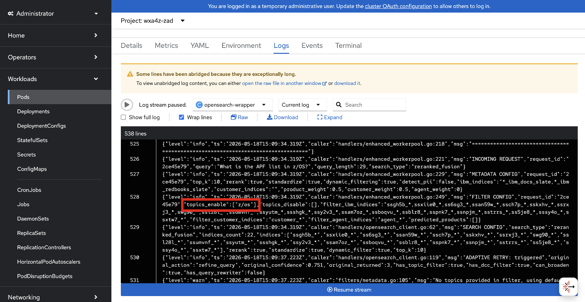

## 3.) Modifying doc weights

Another common scenario may be modifying the weights assigned to the zRAG's default **product docs** versus any additionally ingested **customer docs**. For example, if you want to prioritize documents that a customer ingested versus the default IBM docs. This can be done by setting the `ZRAG_METADATA_PRODUCT_WEIGHT` and `ZRAG_METADATA_CUSTOMER_WEIGHT` parameters in the connection credentials. 

!!! Warning "Important note on product versus customer weight..."

    The weights assigned for product and customer docs must sum to 1.0, i.e. 0.3/0.7 or 0.9/0.1. 

    By default, these parameters are left out of the connection settings and falls back to 0.5/0.5. 

    When modifying the weights to prioritize product docs over customer docs (or vice versa), it's recommended to first test with smaller increments (i.e. 0.45/0.55).

For this scenario, you will configure customer docs to be slightly more prioritized over the default product docs by setting the following key-value pairs:

- `ZRAG_METADATA_PRODUCT_WEIGHT` : `0.45`
- `ZRAG_METADATA_CUSTOMER_WEIGHT` : `0.55`

1. At the bottom of the **Edit credential** view of your **Draft** connection, click **Add key value pair +** and enter `ZRAG_METADATA_PRODUCT_WEIGHT` for the **Key** field, and `0.45` for the **Value** field. 
   
    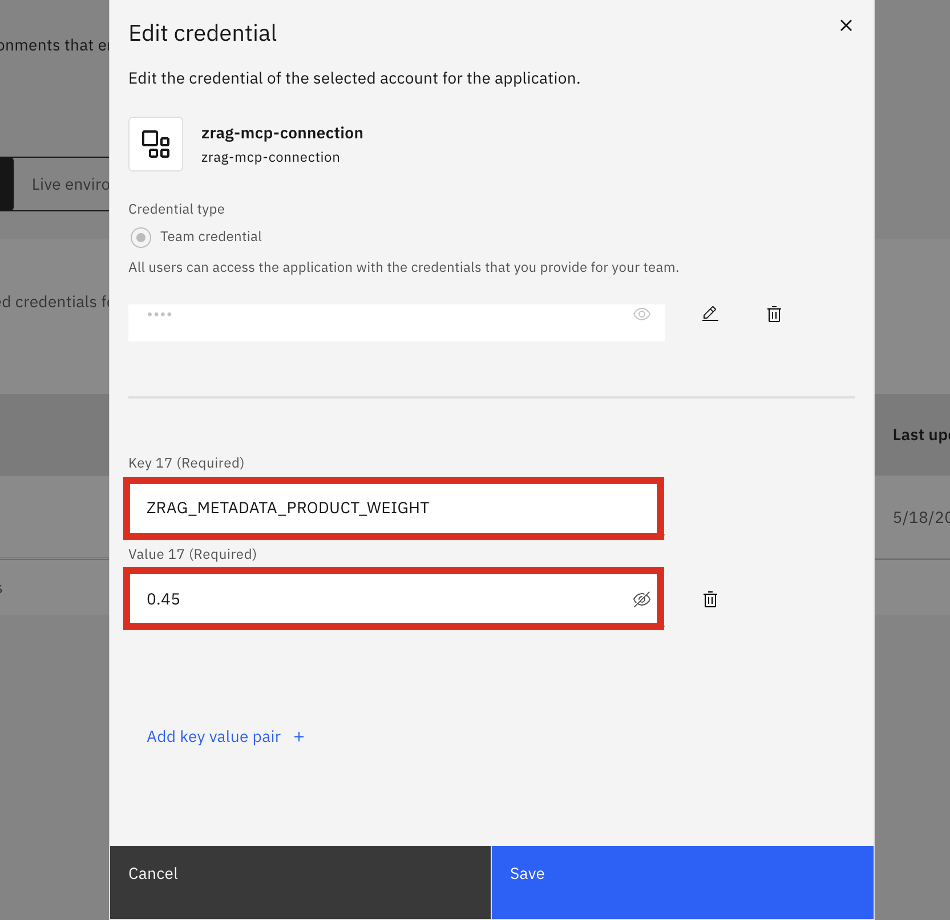

2. Then click **Add key value pair +** once more to enter `ZRAG_METADATA_CUSTOMER_WEIGHT` for the **Key** field, and `0.55` for the **Value** field. 
   
    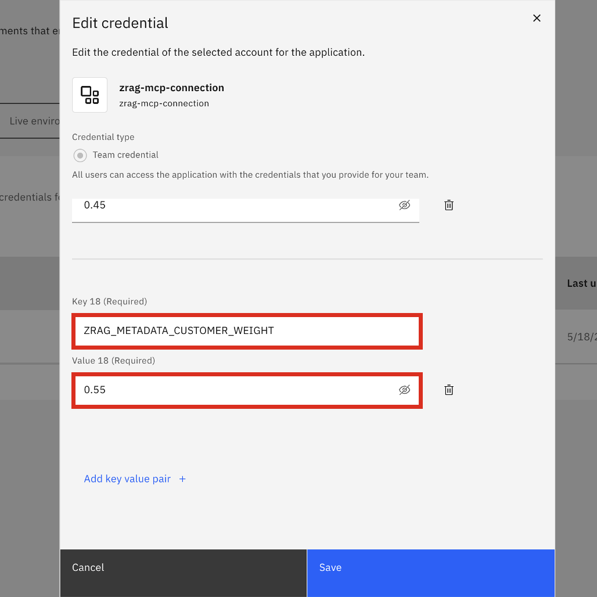

3. Then click **Save**. 
   
    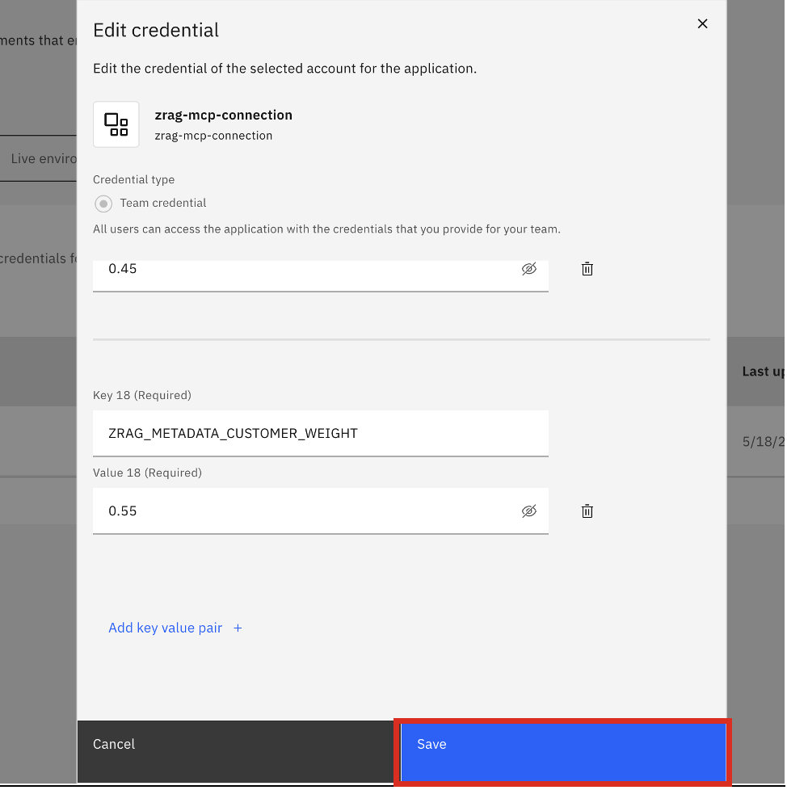

### Testing the configuration

To verify whether the weights were properly set in the **Draft** environment, prompt your `zRAG Agent` just as before from the Agent Builder page. 

In the logs of the opensearch-wrapper pod on OpenShift, you should see log messages similar to what's shown below:

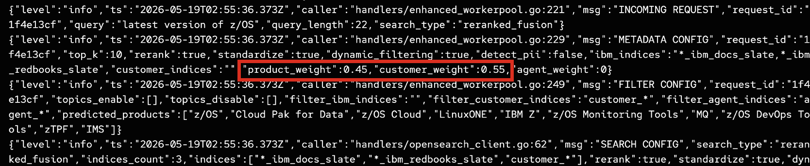

## 4.) Modifying specific doc indices to search

The last scenario you may face is the need to set the scope of the zRAG searches to very specific documentation sources. This can be a set of default product docs included in the zRAG, or specific customer docs that were ingested. Narrowing index scope can improve both performance and relevance, although the scope of topics available are more limited. The following variables can be used to configure this:

- `ZRAG_DEFAULT_IBM_INDICES`: comma-separated list of IBM documentation indices to search. The default is `"*_ibm_docs_slate,*_ibm_redbooks_slate"` which searches all default IBM doc indices and IBM Redbook indices
- `ZRAG_DEFAULT_CUSTOMER_INDICES`: comma-separated list of customer ingested indices. The default is `""` which includes all ingested indices. 

When it comes to narrowing the scope of the IBM indices to search, the list of available indices can be found in 1 of 2 easy ways:

1. Viewing the official **zRAG Content** Spreadsheet available on Seismic: https://ibm.seismic.com/Link/Content/DCHg9CqFb7CXhG7DVMDQj8qd2PhV
   

2. Issuing an API call via CURL command using your environment's OpenSearch cluster endpoint: https://www.ibm.com/docs/en/watsonx/waz/3.2.0?topic=cluster-testing-your-zassistantdeploy-connection

For this scenario, let's say you want to narrow the scope of the search on the IBM Documentation indices to only the larger z/OS documentation available. This will exclude documentation on all other topics, products, software, etc. and only include the base z/OS documentation if that's suitable. 

1. First identify the index value of that documentation in the zRAG. From viewing the spreadsheet, we can see the base z/OS doc has an index value of `swg90` as shown below:
   
    **IMAGE**

2. In order to scope the searched IBM indices to only this document, you'll need to set the `ZRAG_DEFAULT_IBM_INDICES` connection parameter to `"swg90_ibm_docs_slate"`. 
   
    Instead of searching all of the ibm doc indices and redbooks (i.e. `"*_ibm_docs_slate,*_ibm_redbooks_slate"`), it'll only search that single index. 

3. When editing the **Draft** version of your connection credentials in the Orchestrate UI, locate the existing parameter for `ZRAG_DEFAULT_IBM_INDICES` and click the **pencil icon**.
   
    **IMAGE**

4. In the **value** field, enter the comma-separated list of ibm indices to search, in our case `swg90_ibm_docs_slate`.
   
    **IMAGE**

5. Once done, click **Save** at the bottom. 

### Testing the configuration

To verify whether only the single or set of indices are being search, prompt the zRAG Agent and view the pod logs. You should see the list of indices you set in the connection parameter:

**IMAGE**

