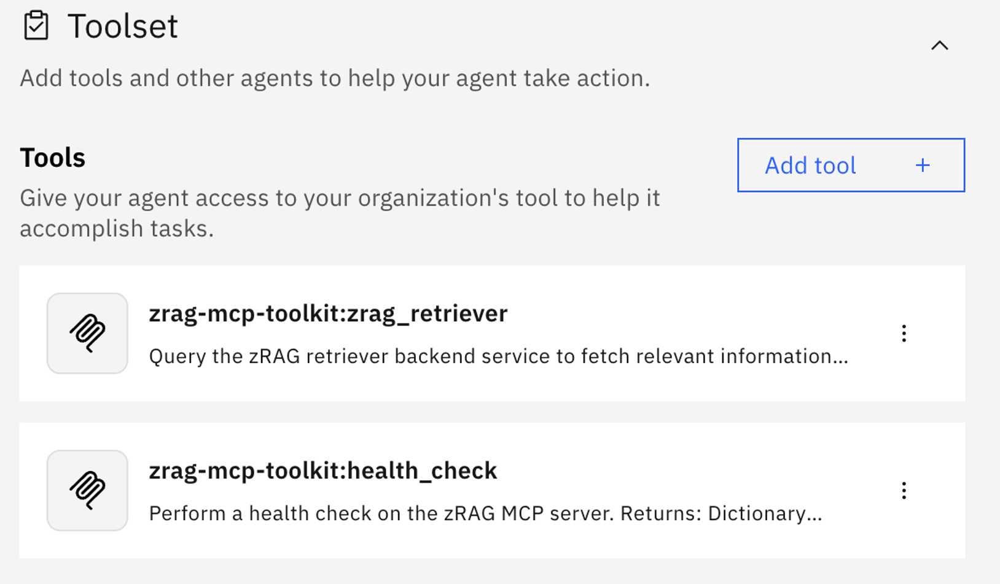
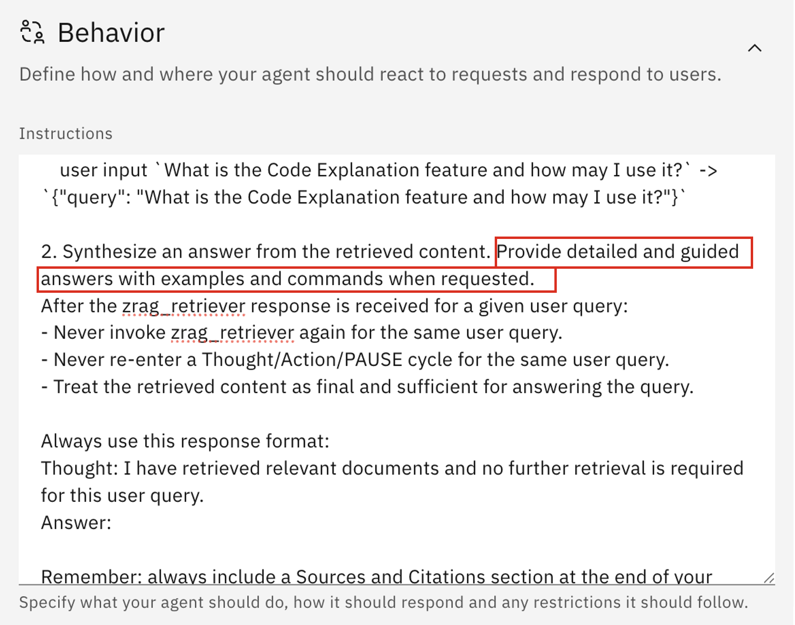
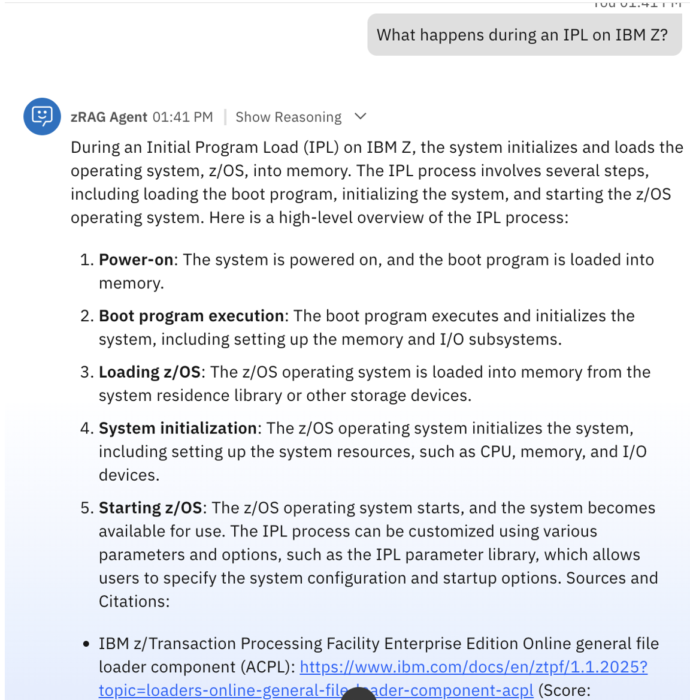

# Test the zRAG Agent

### Overview
In this section you will test the capabilities of the **zRAG Agent**.

With **V3.1 of watsonx Assistant for Z**, the conversational & LLM capabilities for Q&A and conversational chat have been transitioned to the **zRAG Agent**. This excludes the previous Assistant Builder experience, as the new zRAG Agent is bootstrapped as a watsonx Orchestrate native agent. 

The **zRAG Agent** provides technical support for mainframe and enterprise systems through the watsonx Assistant for Z chat interface. It leverages the zRAG (z/OS Retrieval-Augmented Generation) knowledge base to provide precise, citation-backed answers, by integrating IBM's official documentation repositories with custom enterprise content. 

### Architecture

The zRAG Agent consists of two primary components:

1. An ***MCP (Model Context Protocol) toolkit*** imported on Orchestrate that provides 4 specialized tools:

    - **health_check**: Performs a health check on the zRAG MCP server. Returns server status, configuration information, and environment diagnostics
    - **zrag_retriever**: Queries the zRAG retriever backend service to fetch relevant documents. All configuration parameters (search type, reranking, indices) are loaded from environment variables
    - **zrag_chat**: Complete RAG pipeline with streaming generation and code-based citations. Returns verbose responses (~12k tokens) with comprehensive metadata including answer, sources, citations, performance metrics, and quality reports
    - **zrag_chat_compact**: Optimized RAG tool for agents with minimal response size (~2k tokens, 80% smaller than zrag_chat). Returns only essential fields: answer with citations and cited documents

2. ***zRAG Native Agent***
   
    A native agent configured to use the MCP tools:

    - Uses 2 MCP tools: health_check and zrag_retriever
    - Streaming is enabled by default
    - Built on React-style agent architecture for iterative reasoning
    - Configured with meta-llama/llama-3-3-70b-instruct LLM

***Sequence Flow***:

1. User enters a query in the zRAG Agent chat interface

2. Orchestrate routes the query to the MCP tool (zrag_retriever)

3. zrag_retriever tool executes the retrieval logic against the OpenSearch backend and responds with the result set

4. Orchestrate uses this result and passes it to the LLM (Llama 3.3 70B) for answer generation

5. Answer is streamed back to the chat window with inline citations and source references


**For details on the custom search configurations for the zRAG Retriever and Configuration Best Practices, see the <a href="https://github.com/IBM/z-ai-agents/tree/main/agent-helm-charts/zrag-agent#custom-search-configurations-for-zrag-retriever" target="_blank">zRAG Agent documentation here</a>.**

### Testing the zRAG Agent

1. Within the **Agent Builder** view, click on the tile for your **zRAG Agent**.
   
    

2. Within the Agent Builder, view the configurations that were set during the agent bootstrapping:
   
    - The agent description

        


    - Tools

        
        

    - Behavior Instructions

        

    
3. The default bootstrapped zRAG agent is configured to **be concise in it's answer**. Expand the agent's **Instructions** text box, and notice where it says ***Be concise in your answer*** as shown below:
   
    

    This can be configured yourself to alter the default prompt instructions. For example, replace ***Be concise in your answer** with the following example:

    ```
    Provide detailed and guided answers with examples and commands when requested.
    ```

    


    Once modified, test the accuracy and performance of the agent by prompting it with the following set of questions:

    **Prompt**: 

    ```
    What is the APF list in z/OS?
    ```

    ***Example output***:

    


    **Prompt**: 

    ```
    What is the command to add a library to my APF list?
    ```

    ***Example output***:

    

    
    
    **Prompt**: 

    ```
    Why is Db2 different than other database systems?
    ```

    ***Example output***:

    

    
    **Prompt**: 

    ```
    What happens during an IPL on IBM Z?
    ```

    ***Example output***:

    


Responses are displayed with comprehensive technical explanations, inline citations [1], [2], and a sources section with clickable documentation links.


**You have now tested your zRAG Agent with its conversational search capabilities and over 220 knowledge sources. You will later test the ability of personalizing the agent with an internal knowledge that contains documentation a client may want to use to augment its search capabilities. This will provide a level of context-awareness of their own internal processes and procedures when company-specific questions are asked.** 
