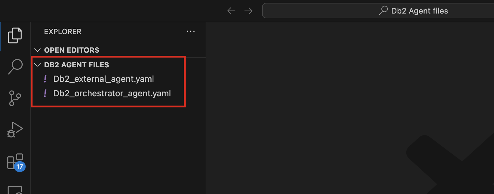
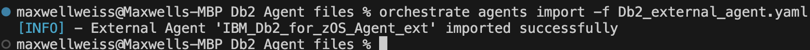
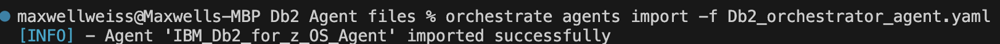
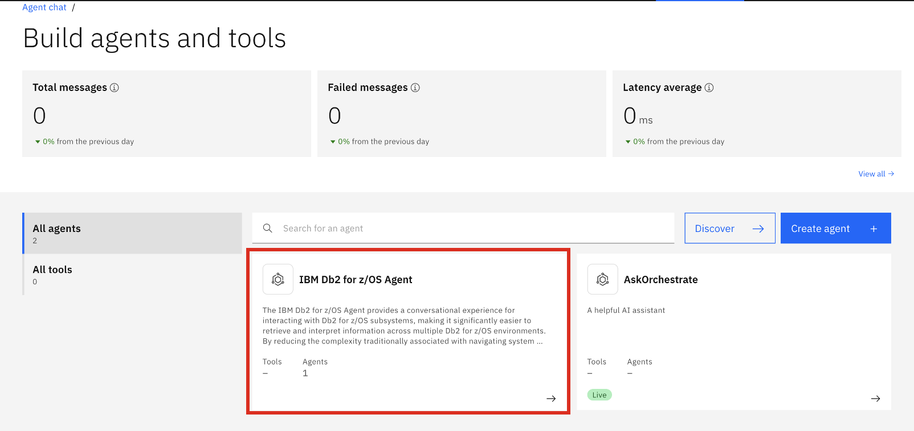
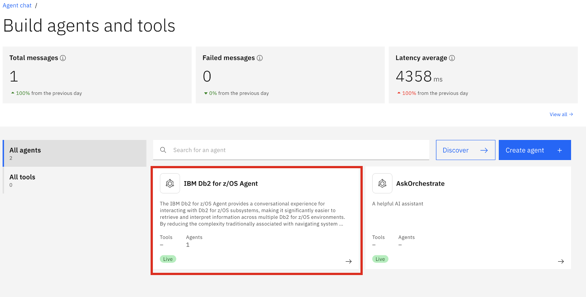
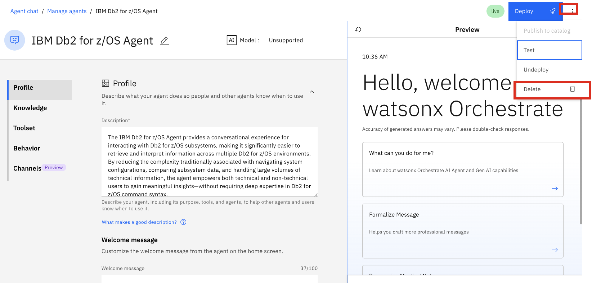
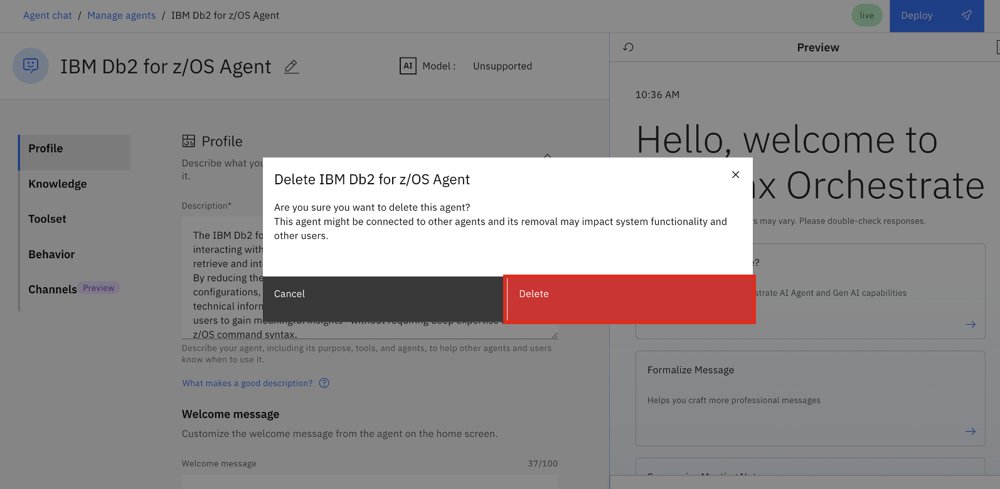

# Enabling hands-on client access for supported agents

As part of a client engagement (i.e. customer pilot), you may have a need to provide hands-on access to one or more of the supported watsonx Assistant for Z agents not covered in earlier sections. This section is intended to walk you through the process of setting up pre-deployed (hosted) agents ***that you can import into your instance of watsonx Orchestrate***. This allows for a way to provide your client hands-on access for a **defined amount of time** for the purpose of use case discovery and execution. 

!!! Tip "Existing agent demos..."

    The hosted agents discussed in this section are already available for IBMer & Business Partner access <a href="https://techzone.ibm.com/collection/ibm-watsonx-assistant-z/journey-step-1-briefings-and-demos" target="_blank">on TechZone here</a>. This section is intended to guide Tech Sellers on extending hands-on access to these hosted agents externally, which can be included as part of a pilot engagement.

*The process consists of 2 steps:*

- Importing the pre-hosted agents into your watsonx Orchestrate environment using the Agent Development Kit (ADK)

- Embedding the agent chat in an HTML file to share with a client for external access

***NOTE:*** *It's crucial that you clearly define the amount of time clients will have access. Following the end time, you must **make sure you clean up the environment** and **delete your imported agent** to prevent persisted access*.  


### Importing the hosted agents into watsonx Orchestrate using the ADK

As mentioned, there may be a need to extend access to a set of demo agents that you are not able to deploy yourself and are not documented in this guide (i.e. infrastructure requirements, network connectivity challenges, etc.). This section provides a way to import pre-deployed agents used for demos into your own watsonx Orchestrate environment using the ADK. 

For each of the agents discussed in this section, there are a set of **YAML** files which define the following:

- an **Orchestrator (native)** agent which the end-user interacts with
  
- the **external agent(s)** which point to a hosted agent deployed on OpenShift you import to demonstrate various use cases. 

The process of using the **ADK** to import the agents into your watsonx Orchestrate environment firstly involves importing the 1 or more external agents (as collaborators), and secondly, importing the orchestrator agents which you will publish and embed into a web chat. 

This section documents the process of importing the following pre-deployed agents into your watsonx Orchestrate environment: 

- IBM Db2 for z/OS Agent
  
- IBM Operations Agent for Z
  
- IBM IMS Agents

1. The first step before importing agents are to activate the ADK using your watsonx Orchestrate environment. You may have already done this in Section ***[Installing and setting up your ADK environment](../adk/setup.md)***. 
   
    As a reminder this can be done using the following command: 

    ```
    orchestrate env add -n <env name> -u <your Service Instance URL> --type ibm_iam --activate
    ```

    For more details on how to activate the ADK using your watsonx Orchestrate environment, see the <a href="https://developer.watson-orchestrate.ibm.com/getting_started/installing#ibm-cloud" target="_blank">ADK documentation here</a>.


2. One activated, you can download the appropriate Agent folder containing the agent YAML files for each:
   
    
    <a href="https://ibm.box.com/s/2i295wv0obbtjctdi6p30wlojwlcnee0" target="_blank">IBM Db2 for z/OS Agent</a>

    <a href="https://ibm.box.com/s/1fyccoymkz2ghshdu4okreh491lijoqw" target="_blank">IBM Operations Agent for Z</a>

    <a href="https://ibm.box.com/s/ryufp5bkbtmjcjl25p8k45ly62xnv641" target="_blank">IBM IMS Agents</a>

    !!! Tip "The example instructions below..."

        The example steps below will illustrate how to import the **Db2 for z/OS Agent** into the watsonx Orchestrate ADK environment. 

3. Once downloaded to your local PC, extract the **.zip** file which contains an **Orchestrator agent** YAML file as well as 1 or more **External agent** YAML files. 
   
    Then open up the folder within VS Code which should look similar to the following:

    

4. The first step in importing the agent is to firstly import the **External agent(s)**. 

    The **External agent(s)** can be imported using the following ADK command.

    ```
    orchestrate agents import -f <file.yaml>
    ```

    In the case of the **Db2 for z/OS Agent**, this can be imported by running the following command in a **Terminal** window: 

    ```
    orchestrate agents import -f Db2_external_agent.yaml
    ```

    You should then see a **Success** message similar to what's shown below:

    

5. After importing the **External agent(s)**, you can finally import the **Orchestrator agent** using the same command. 
   
    In the case of the **Db2 for z/OS Agent**, this can be done with the following command:

    ```
    orchestrate agents import -f Db2_orchestrator_agent.yaml
    ```

    

6. Once done, you can navigate to your **watsonx Orchestrate** UI, go into the **Agent Builder** view as shown below, and then you should see your imported agent:
   
    

7. Click on the imported agent and test the capabilities. 
   
    !!! Tip "Testing the agent..."

        As you are using the Demo agents available on TechZone, you can use the <a href="https://ibm.ent.box.com/s/mulk8hrxz37kitgd53zvnxrox0mi8c0r" target="_blank">Demo Script</a> in order to test.


### Embedding the agent chat for external access

Once you've successfully tested your agent, you are ready to embed the agent chat to share for external access. To do this, you will first need to **publish** the agent to the **Live** version. 

1. You will first need to **publish** the agent to the **Live** version. 
   
    Follow the steps in Section ***[Deploy the agent](../agentdeploy/demo-scenarios/support-agent.md#deploy-the-agent)*** for an example on how to do this. 

2. Once you've published the agent, you can follow the steps in ***[Embed Agent Chat in Web Page](../agentdeploy/embed.md)*** to embed your agent within an HTML file. 

After following the steps above, you can share the configured HTML file with a customer to test the agent scenarios.

Following the alloted time to test, it's crucial you cleanup your environment by deleting the agent chat. This will prevent those you've shared the HTML file with to continue accessing the agent chat.

### Cleanup the agent deployment

Follow the steps below to delete the agent environment.

1. Go to the **Agent Builder** page and click on the tile for your deployed agent. 
   
    

2. In the **Agent Editor** view, click on the ellipses in the top-right corner and select **Delete**. 
   
    


3. In the pop-window, select **Delete** once more. 
   
    

You have now disabled access to the deployed agent. 
   
