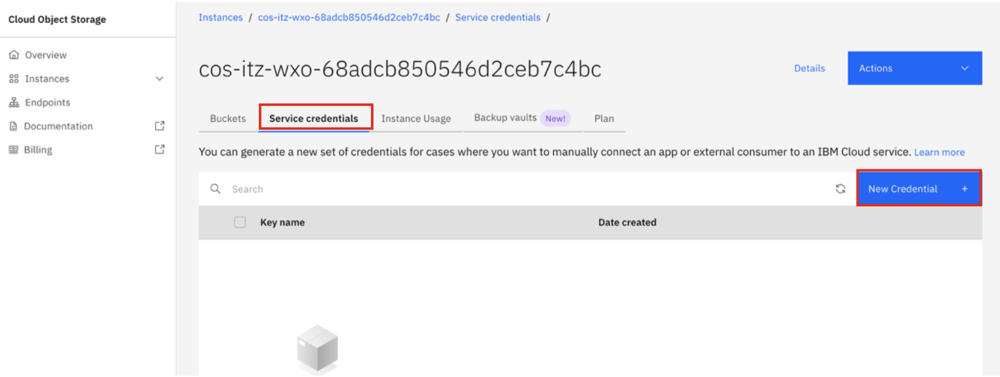
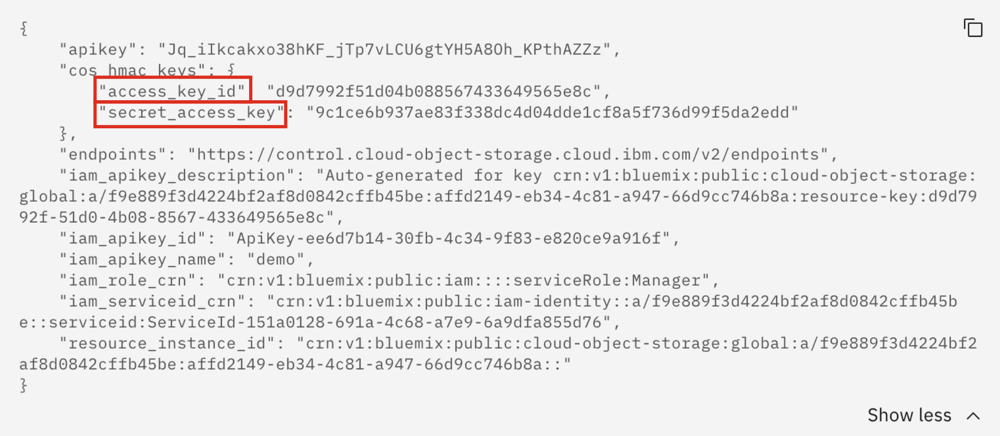

# Create service credentials for IBM Cloud Object Storage (COS)

Before uploading the provided sample documents to IBM Cloud Object Storage (COS), you must first create service credentials that you will use to connect to your instance.

1. Navigate to the **Resource List** of your provisioned SaaS services in IBM Cloud (ensuring you're in the correct IBM Cloud account). The steps to access your Resource List can be found by following the instructions in ***PLACEHOLDER*** Section 3.1: Accessing IBM watsonx Orchestrate Trial/Standard Plan. 

2. In the **Resource List** page, click on the **Storage** drop-down and click on the name of your COS instance. 
   
    
   
3. Click on the **Service credentials** tab and then click on **New Credential +**

    

4. In the **Create credentials** window, set the following values and then click **Add**. 

    **a**. **Name:** *enter any name*

    **b**. **Role:** select **Manager**

    **c**. Toggle ***Include HMAC Credential*** to **On**

    **d**. Toggle the ***Control by Secrets Manager*** to the **Off** position

    

5. You should then see your new credential in the list. Click on the drop-down next to your credentials to display the credentials details.
   
    

6. Then you should see your credential details as shown below.
   
    **Copy and record** your unique values for the following parameters as you will need them in the next steps: 

    **a**. **access_key_id**

    **b**. **secret_access_key**

    
