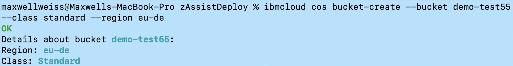
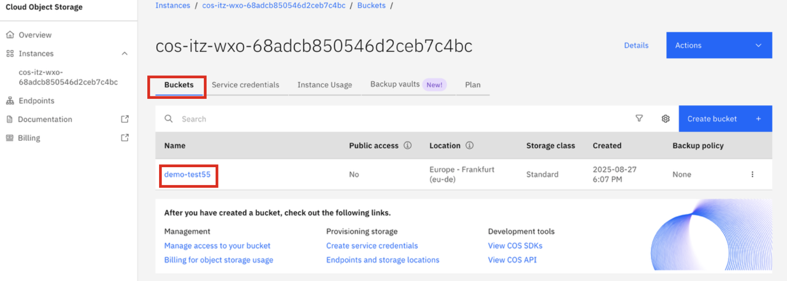

# Create a new storage bucket

Next you will create a new bucket in your COS instance which will you will later upload the provided sample documents to for ingestion.

1. In your local workstation's command prompt or terminal window, run the following command to create a new bucket, replacing:
   
    - **<unique_bucket_name>** - any unique name for your bucket
    - **<your_region>** - replace with the region your ***Single Node OpenShift*** environment is provisioned in (check your environment details). Options include:
        - us-south
        - eu-de
        - eu-gb
        - us-east
        - ...

   
    ```
    ibmcloud cos bucket-create --bucket <unique_bucket_name> --class standard --region <your_region>
    ```

2. If created successfully, you should see output similar to what's shown below:
   
    

3. Verify the bucket was successfully created by going back to your **COS Instance** in IBM Cloud and clicking on the **Buckets tab**. You should see your new bucket listed.
   
    