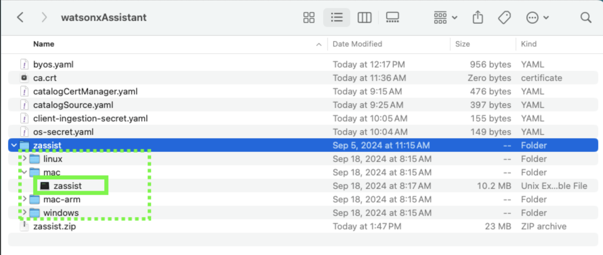

# Download and configure the ***zassist*** utility

The ***zassist*** utility is an executable program that automates the ingestion of client documentation into the RAG for
watsonx Assistant for Z. A version of *zassist* is available for download for IBMers and Business Partners for
conducting pilots. Follow the steps below to download and install *zassist*.

1. Click the following link and download the **zassist.zip** file from Box:
   
    <a href="https://ibm.box.com/s/bm1df1gakz4302vrfd9to3rf221420ze" target="_blank">https://ibm.box.com/s/bm1df1gakz4302vrfd9to3rf221420ze</a>


2. Extract the **.zip** file.


3. Locate the appropriate file for your local workstation's operating system. 
   
    
   

4. Either copy the appropriate *zassist* file to a directory in your **PATH**, or add the appropriate directory to your **PATH** environment variable. 
   
    Additional information for doing this can be found here. 

    ***NOTE***: *Windows users may need to rename the file to **zassist.exe** for proper execution*
   

5. Run the following command to verify it's working:
   
    ```
    zassist
    ```

    

6. And finally, enable the client-side ingestion feature through a remote S3 source by running the following command on your local terminal / command-line:
   
    ***Mac users:***
    ```
    oc -n wxa4z-zad patch zassistantdeploy zassistantdeploy --type='merge' -p='{"spec": {"clientIngestion": {"beta": {"enabled": true}}}}'
    ```

    ***Windows users:***
    ```
    oc -n wxa4z-zad patch zassistantdeploy zassistantdeploy --type="merge" -p="{\"spec\": {\"clientIngestion\": {\"beta\": {\"enabled\": true}}}}"
    ```