# Execute Document Ingestion (using UI)

Using the watsonx Assistant for Z **Management Console**, you can upload content stored in a remote S3-compatible location and ingest it into a dedicated collection source. 

### Access your Management Console Web UI

1. First, access your Web UI for Client Ingestion by logging into your OpenShift web console and navigating to **Networking** --> **Routes**. 
   
    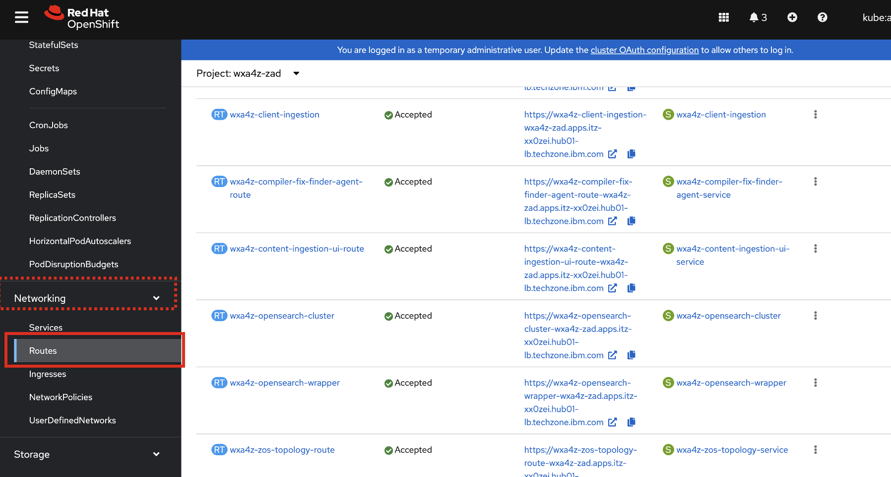

2. Click the URL for **wxa4z-content-ingestion-ui-route** as shown below.

    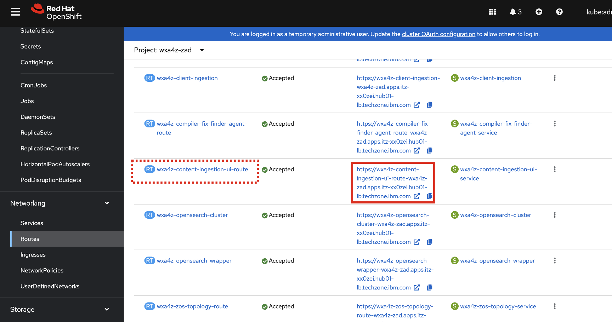

    You will then be redirected to the **watsonx Assistant for Z Management Console** login page. 

    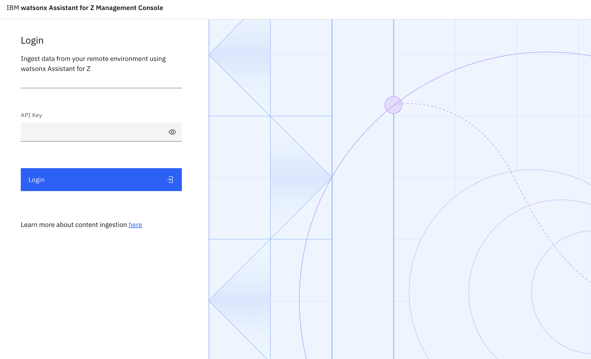

3. Enter the API key created when setting up the client ingestion authentication secret and click **Login**. 
   
    !!! Tip "Retrieving your client ingestion authkey...."
    
        To locate your **client ingestion authkey**, navigate to **Workloads** --> **Secrets** in the OpenShift web console. 

        Then click on the **client-ingestion-authkey** secret as shown below. At the bottom of the page you can copy the value of your secret. 

        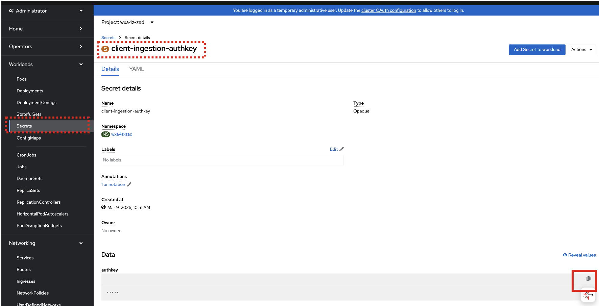

    Once logged in, you should see the following:

    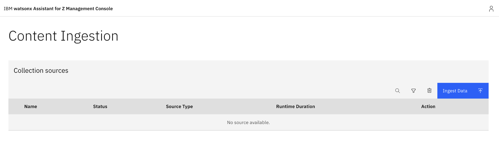

### Connect to remote S3 source

1. To begin ingesting content, click **Ingest Data** in the top-right corner of the screen. 
   
    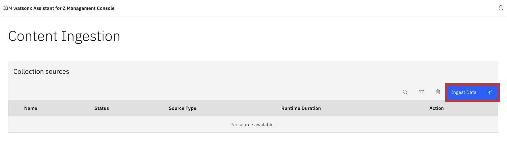

2. In the pop-up screen, select **S3 Bucket** as the *source type*, then click **Next**.

    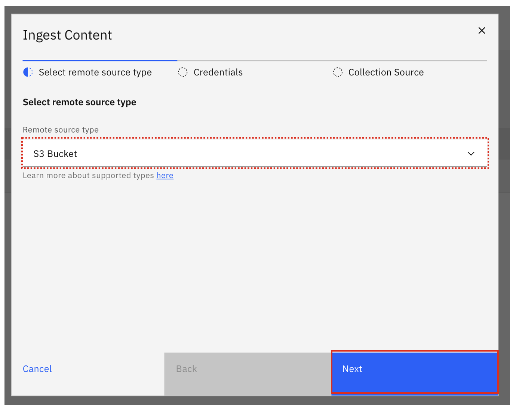

3. In the screen that follows, enter the following connection details for your S3 bucket:

    **a**. **URL**: URL of the remote source from which the content must be ingested. 

    - Navigate to your **COS instance** in IBM Cloud
  
    - Click on the **Endpoints** tab on the left-hand menu
        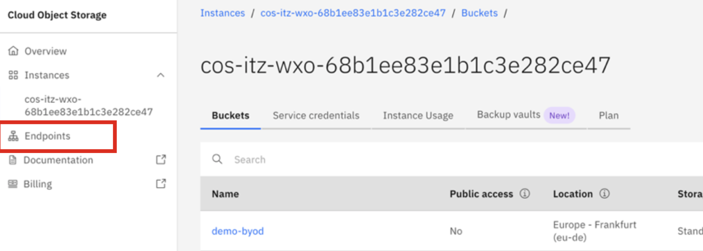

    - In the **'Select resiliency'** drop-down, select **Regional**:
        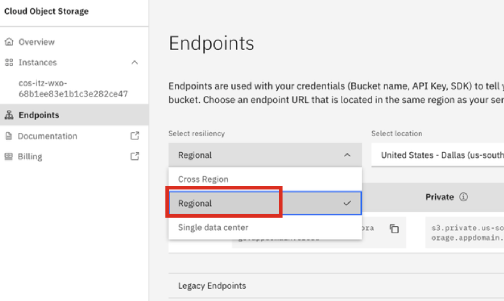

    - In the ‘**Select location**’ drop-down click on the region where you created your bucket. 
        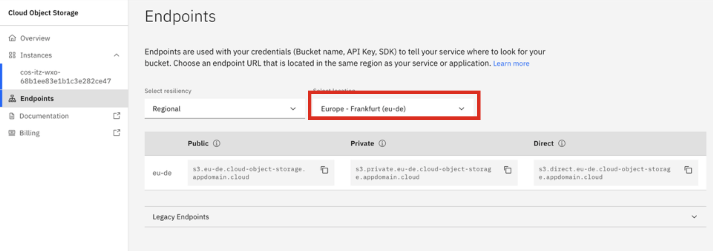
        ***Make sure to select the region that corresponds to your own bucket.***

    - Based on the region you selected, copy and record the region's **Public** endpoint as shown below (*in this example, it's for the **eu-de** region*)
        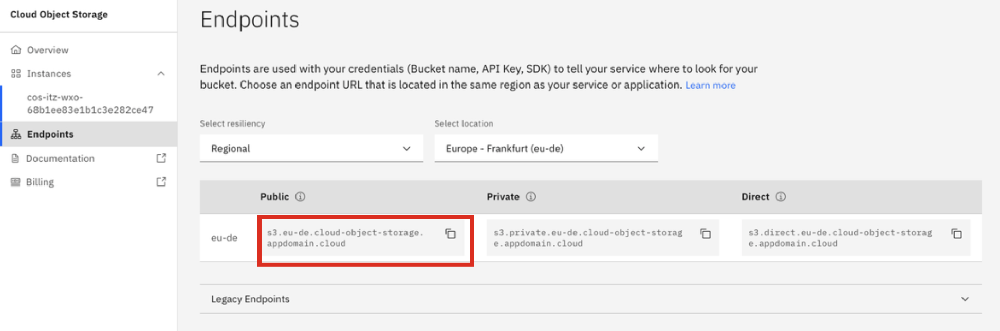
    
    - After recording your **Public endpoint** in a local notepad, append `https://` to the front of it. In the example shown above, the new endpoint URL would become:
    
    `https://s3.eu-de.cloud-object-storage.appdomain.cloud`
    
    - Copy and paste the full value into the `URL` field within the UI, as shown below:
        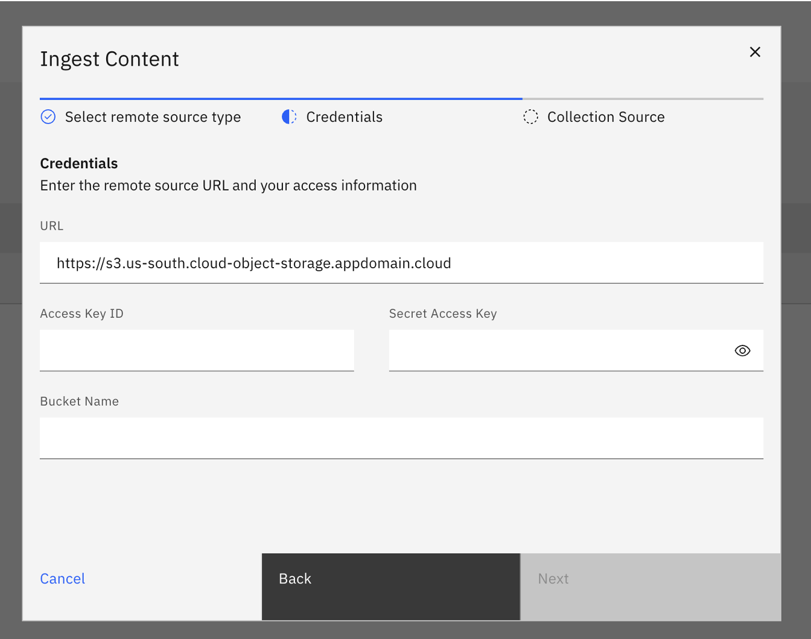

    **b**. **Access Key ID**: replace this with the ‘**access_key_id**’ value in the **Service Credentials** you created for your COS instance in **Step 6** of Section [Create service credentials for IBM COS](./cos-service-credentials.md#create-service-credentials-for-ibm-cloud-object-storage-cos)

    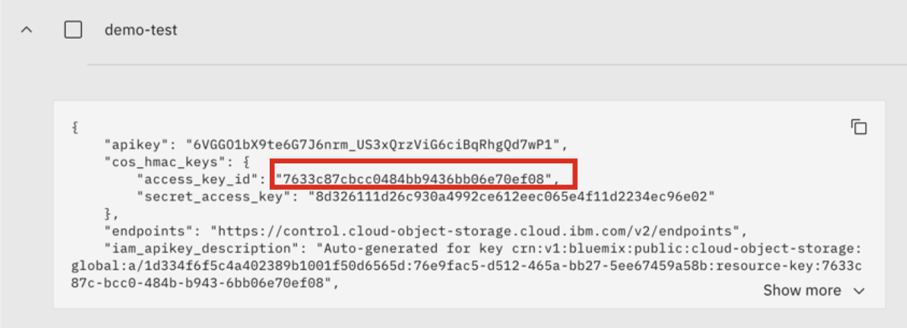

    **c**. **Secret Access Key**: replace this with the '**secret_access_key**' value in the **Service Credentials** you created for your COS instance in **Step 6** of Section [Create service credentials for IBM COS](./cos-service-credentials.md#create-service-credentials-for-ibm-cloud-object-storage-cos)
    
    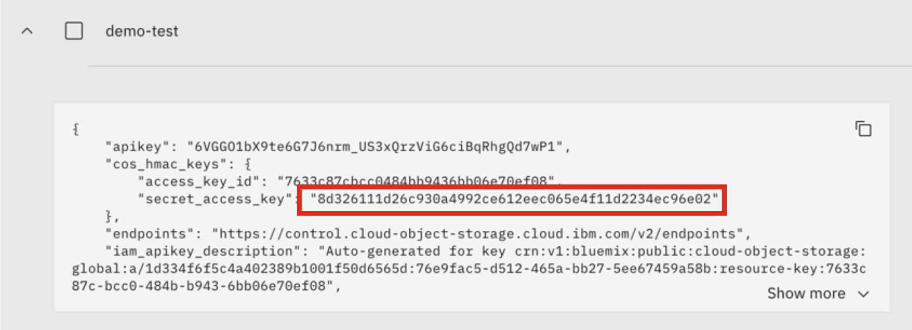

    **d**. **Bucket Name**: replace this with the name of your bucket you originally created in your COS instance. 

    *Once completed, click *Next*, as shown below:*

    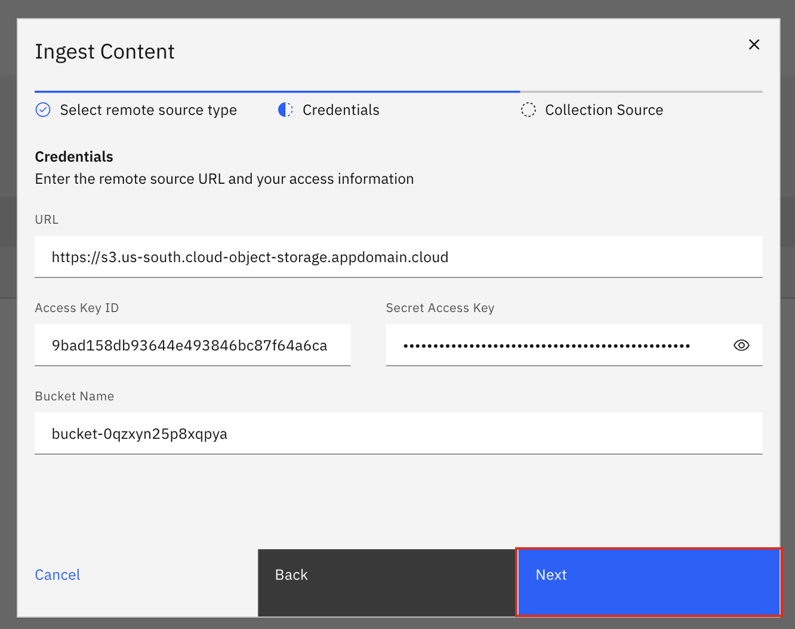

### Select collection source

On the last page, choose a **collection source** where you want to ingest your content. You can either select from the available list or create a new collection source. 

1. From the **Collection Source** drop-down, select **New collection source** then provide a name. 

2. Ensure the **Tabular support** toggle is left on, and disable the toggle for **PII Check**. 
   
   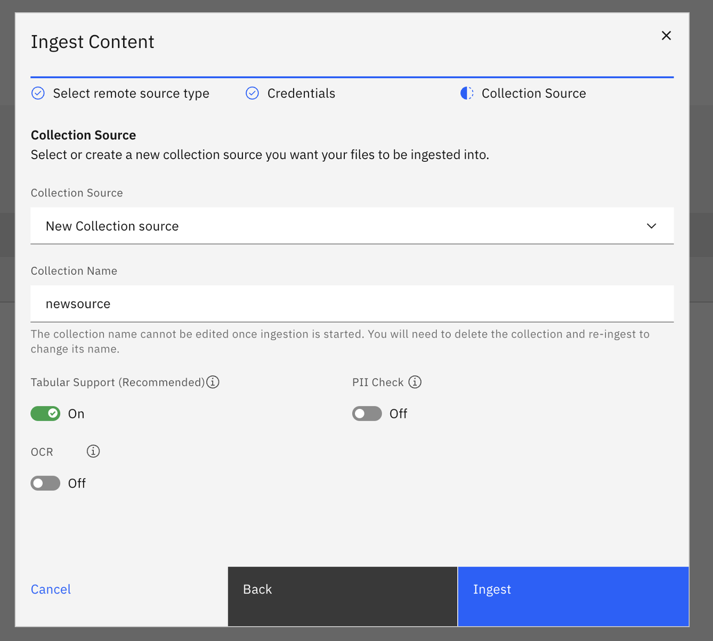

   Then click **Ingest**. 

   !!! Tip "Ingestion settings..."
    
        - **Tabular support** stores data in a structured format, enabling the LLM to retrieve information efficiently (enabled by default). This is useful for the structured spreadsheet that was uploaded. 
        - **PII Check** filters sensitive information form the content source. In this example, we disabled it for better performance as the documents don't contain any PII. 
        - **OCR** is used in scenarios where images stored in documents must be processed and extracted from the content source. In this scenario we left this disabled. 

### Following the ingestion

After the ingestion begins processing, sources in the **processing** stage appears under your defined collection source name from the specified bucket. 

Once the ingestion completes, the collection source appears on the Content Ingestion pages. From there, you can: 
- Search for a collection source by name using the search icon.
- Filter collection sources by type or ingestion status by using the filter icon.
- Delete collection sources by selecting them and clicking Delete.