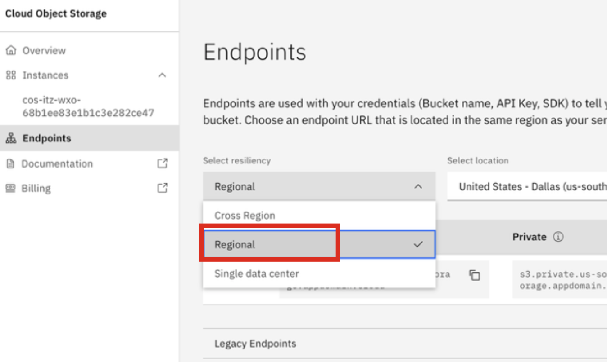

# Execute Document Ingestion

In this step you will log into your **client ingestion server** and kickoff the ingestion pipeline for your uploaded files.

1. Navigate to your local command-prompt or Terminal window and set the **WXA4Z_TLS_VERIFY** environment variable to **false** to skip server certificate verification by running the following command (depending on your operating system):

    ***Mac users:***
    ```
    export WXA4Z_TLS_VERIFY=false
    ```

    ***Windows users:***
    ```
    set WXA4Z_TLS_VERIFY=false
    ```

    ***Windows PowerShell Users:***
    ```
    Set-Item Env:\WXA4Z_TLS_VERIFY “false”
    ```

2. Retrieve the **Server URL** for your Client Ingestion Server.

    ***Mac users:***
    ```
    echo https://$(oc -n wxa4z-zad get route wxa4z-client-ingestion -o jsonpath="{.spec.host}")
    ```

    ***Windows users (this method can also be used by Mac users):***

    You can retrieve the URL in your OCP Web console by navigating to **Networking -> Routes**, and then copy the URL for the **wxa4z-client-ingestion** route as shown below:

    

3. Retrieve the **client-ingestion-authkey** for your Client Ingestion server by running the following command: 
   
    ```
    oc -n wxa4z-zad get secret client-ingestion-authkey -o jsonpath="{.data.authkey}" | base64 -d
    ```
    
    The output of this command is your unique **auth-key** that you had previously set. You will need the output of both previous commands in the next step.

    !!! Warning "If the command doesn't work for you"

        If the command doesn't work for you, you can find the **authkey** value by viewing the ***client-ingestion-secret.yaml*** file you modified, and copying the value set for the ***authkey*** parameter. 


4. Log into your client ingestion server using the **zassist** utility by running the following command, replacing `<server_url>` with the value from **step 2** above:

    ```
    zassist login <server_url>
    ```

5. When prompted, enter the **authkey** value from **step 3** above. Then verify that a **Success** message is returned. 

6. Verify that you're connected by running the following command:

    ```
    zassist list
    ```

    This command will return all connected remote sources to your client ingestion server. By default, you should see in the output that there are no connected sources under `ID`.

7. Start the ingestion process to connect your remote COS source to the watsonx Assistant for Z data ingestion pipeline by running the following command (***see below the command on how to retrieve each of the parameters listed***):

    ```
    zassist ingest s3 "<SOURCE_NAME>" "<S3_URL>" "<S3_KEY_ID>" "<S3_SECRET_KEY>" "<BUCKET_NAME>" --watch --skip-pii
    ```

    **a**. **<SOURCE_NAME\>** : replace this with any name of your choice. Make sure the name is in lowercase, uses only underscores, and does not start with a number. 

    **b**. **<S3_URL\>**: 

     - To retrieve your `<S3_URL>`, navigate to your **COS instance** in IBM Cloud 
     - Click on the **Endpoints** tab on the left-hand menu:
    
         
        
     - In the **'Select resiliency'** drop-down, select **Regional**: 
  
         
    
     - In the ‘**Select location**’ drop-down click on the region where you created your bucket. In the example shown earlier, the bucket was created in the **eu-de** region, so you would select the **Europe – Frankfurt (eu-de)** region as shown below.
  
         

        ***Make sure to select the region that corresponds to your own bucket***

     - Based on the region you selected, copy and record the region's **Public** endpoint as shown below (*in this example, it's for the **eu-de** region*)

         

     - After recording your **Public endpoint** in a local notepad, append `https://` to the front of it. In the example shown above, the new endpoint URL would become:
  
         ```
         https://s3.eu-de.cloud-object-storage.appdomain.cloud
         ```

        ***This is the final value of your <S3_URL> variable that you will use for the above zassist command.***


    **c**. **<S3_KEY_ID\>**: replace this with the ‘**access_key_id**’ value in the **Service Credentials** you created for your COS instance in **Step 6** of Section [Create service credentials for IBM COS](./cos-service-credentials.md#create-service-credentials-for-ibm-cloud-object-storage-cos)

    
    

    **d**. **<S3_SECRET_KEY\>**: replace this with the '**secret_access_key**' value in the **Service Credentials** you created for your COS instance in **Step 6** of Section [Create service credentials for IBM COS](./cos-service-credentials.md#create-service-credentials-for-ibm-cloud-object-storage-cos)
    
    
    
    **e**. **<BUCKET_NAME\>**: replace this with the name of your bucket you originally created in your COS instance.

    The final result of the command (once you've plugged in your unique values) should look something like the example command below (*these values will not work for you*):

    ```
    zassist ingest s3 "my_source" "https://s3.eu-de.cloud-object- storage.appdomain.cloud" "7633c87cbcc0484bb9436bb06e70ef08" "8d326111d26c930a4992ce612eec065e4f11d2234ec96e02" "demo-byod" --watch -- skip-pii
    ```

8. Execute the previous command from your local command-prompt/terminal. Once executed, the ingestion process will begin. You should see output similar to below:
   
    

    !!! Tip "Command options used...."
    
        Because you used the **--watch** flag in the command, it will begin monitoring the status of the ingested source. In our case there are 3 files to be ingested, as shown in the screenshot above.
        
        Additionally, notice that you also used the **--skip-pii** flag at the end of your command. This will bypass any automatic PII checks that are done. This is suitable for the Lab as we’re using test data. For typical customer pilots, you should not be ingesting any PII data, otherwise cleaning the data to ensure no sensitive data is included.

9. Once the ingestion process completes (***typically less than 5 min.***) you will see something like what’s shown below, indicating that the new 3 files have been successfully ingested.

    


    ??? Failure "If the ingestion process doesn't progress within 3 minutes...."

        In the case that the ingestion process doesn't progress within 3 minutes and you don't see the output shown above, you likely need to **restart the client-ingestion pod** within OpenShift (as a one-time fix). After restarting the pod, repeat the steps in this section to ingest the provided documentation. 

        Follow the below steps to restart the pod:

        1. Within your **OCP Web Console**, navigate to **Deployments** and then click on **wxa4z-client-ingestion** as shown below:
    
            
        
        2. Under **Deployment details**, click on the 'down' arrow to scale the pod to 0, and then immediately after click on the 'up' arrow to scale the pod back to 1. 

            
        
        3. Navigate back to the **Pods** section and wait until the pod comes back up as shown below:
    
            

        4. Repeat the above steps in this section to successfully ingest your documents. 

10. Finally, verify that the documents are now ingested in your remote S3 source by running the following command:

    ```
    zassist list
    ```
    
    This will list all connected remote sources, as shown below:

    

    In the above command, you can see the original **Source Name** that you inputted into the zassist ingest command parameter, as well as it’s **ID** and **Status**.

11. To view detailed information about the source, run the following command, replacing `<id>` with the **ID** value returned in the previous command:

    ```
    zassist details <id>
    ```

    This should return something similar to below:

    

    In the returned output, you should see that the **Completed** state is set to ‘true’, and you should see all 3 files that you uploaded to your S3 bucket in your COS instance.


    ***For more information on the zassist command syntax, reference the IBM docs page [here](https://www.ibm.com/docs/en/watsonx/waz/2.0.0?topic=ingestion-ingesting-data-through-remote-s3-source).***

