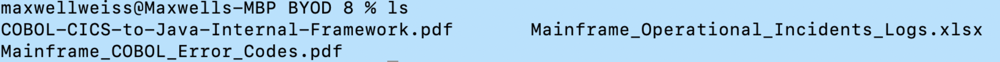
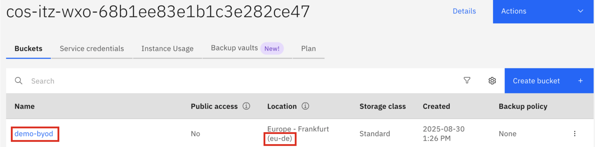
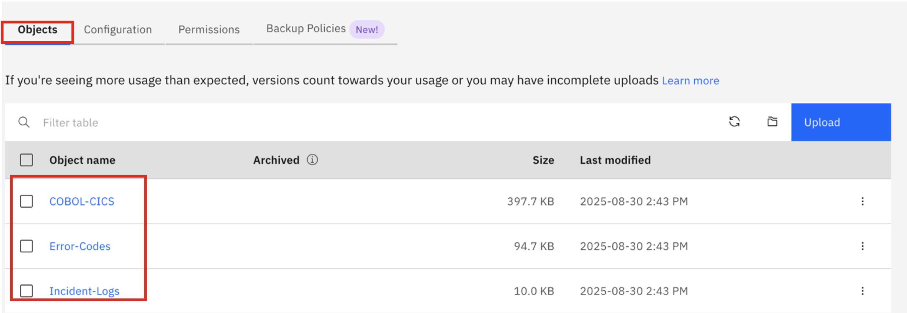

# Upload sample documents to storage bucket

Before you can begin the ingestion process, you must first upload your files to the S3 source (in this case your IBM COS bucket). In this lab, there are three sample documents provided to illustrate the types of internal documentation a customer may want to ingest, which you will use for the purpose of this lab.

These documents include:

- ***Mainframe_COBOL_Error_Codes.pdf***
    This is a document containing company-specific mainframe COBOL error codes for their application. Developers within the organization typically review this document to quickly diagnose issues based on the application error codes returned.

- ***Mainframe_Operational_Incidents_Logs.xlsx***
  
    This is an Excel spreadsheet that is leveraged by the organization’s operational support team and contains historical records of production-level incidents that occurred. For each incident, there’s a record of what the incident was, the date, how it was resolved and who was involved in resolving the incident.

- ***COBOL-CICS-to-Java-Internal-Framework.pdf***

    This document is leveraged by the development team and contains details about the organization’s internal framework for developing applications consisting of legacy COBOL CICS interoperating with new Java code. Within the document contains company-specific coding practices and code syntax that the developers frequently reference.


1. Download the following **BYOD.zip** file containing the sample documents: 
   
    <a href="https://ibm.box.com/s/abvi4lujh01xxu2zw9frvfp5b5g48522" target="_blank">https://ibm.box.com/s/abvi4lujh01xxu2zw9frvfp5b5g48522</a>


2. Unzip the file on your local machine. 


3. On your local command-line, `cd` to that directory. Your working directory should contain the 3 included document files to later be ingested, as shown below:
   
    

4. For each of the 3 documents in your directory, upload it to your bucket using the command below, replacing:

- **<your_bucket_name\>:** replace this with the name of your bucket used in section ***Create a storage bucket***

- **<file_key\>:** replace this with a unique name for the file - this is the file name that will appear in your bucket

- **<local_file_path\>:** replace this with the path to the file in your directory

- **<your_region\>:** replace this with the region in which you created your bucket in the previous step. Options include:

    - us-south
    - eu-de
    - eu-gb
    - us-east
    - ... 
   
    ```
    ibmcloud cos object-put --bucket <your_bucket_name> --key <file_key> --body <local_file_path> --region <your_region>
    ```

    !!! Tip "EXAMPLE"
    
        As an example, let’s say I previously created a bucket in the previous step with bucket_name ***demo-byod*** and I created it in the ***eu-de*** region as shown below:

        

        In this case, I would upload each of my 3 sample files to the bucket using the commands below (one command for each local file):

        ```
        ibmcloud cos object-put --bucket demo-byod --key COBOL-CICS --body COBOL- CICS-to-Java-Internal-Framework.pdf --region eu-de
        ```

        ```
        ibmcloud cos object-put --bucket demo-byod --key Error-Codes --body Mainframe_COBOL_Error_Codes.pdf --region eu-de
        ```

        ```
        ibmcloud cos object-put --bucket demo-byod --key Incident-Logs --body Mainframe_Operational_Incidents_Logs.xlsx --region eu-de
        ```


5. Once, all three files have been successfully uploaded to your COS bucket, you should be able to verify they now exist by clicking on your bucket name in your COS instance within IBM Cloud.
   
    

    In your bucket, click on the **Objects** tab and you should see all 3 files present, as shown below:

    