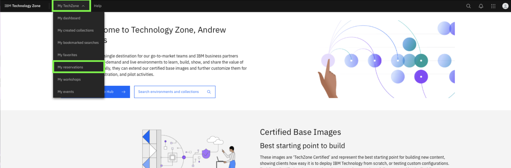
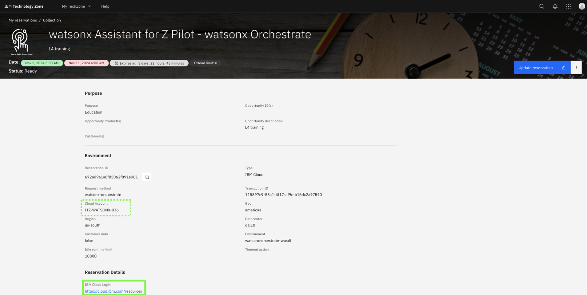
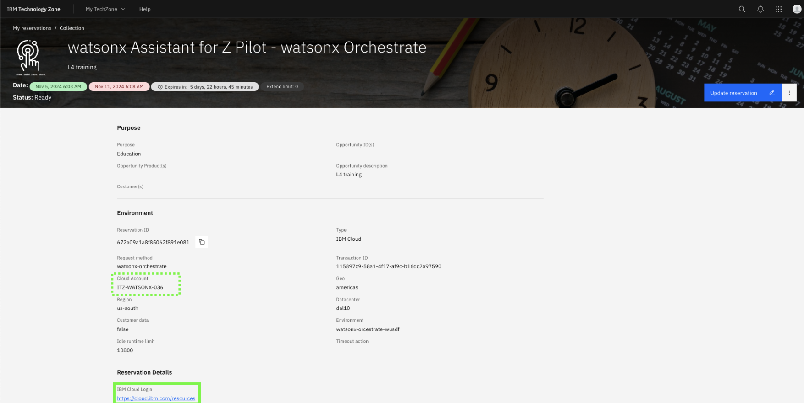
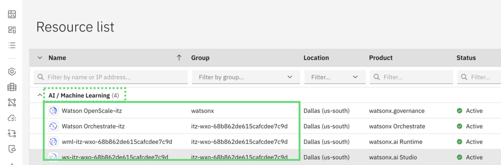

# watsonx Orchestrate and other SaaS services

### Summary of the environment

The first Lab environment is a set of ***IBM Cloud SaaS resources*** we’ll refer to in this Lab as the **IBM watsonx Orchestrate environment**. The resources are dedicated to you and are all available within the same IBM Cloud account you’ve been granted access to. The SaaS resources used in this Lab guide consist of the three components below:

1. **watsonx Orchestrate**
   
    IBM watsonx Assistant for Z is powered by watsonx Orchestrate, a generative AI platform for building, accessing and testing AI agents and assistants. As an on-prem solution, the watsonx Orchestrate component of watsonx Assistant for Z is deployed on Red Hat OpenShift and the IBM Cloud Pak platform. With version 3 of the offering comes the ability to connect your agents to a broad range of components, including IBM Z infrastructure, middleware, tools, third-party software and custom applications, forming the foundation for scalable and secure enterprise operations.

    The chat interface allows users to engage with the system through conversational AI and goal-oriented agents. It provides an intuitive and responsive way to access the platform’s capabilities.

    For the purpose of the Lab, you will be using a **dedicated SaaS tenant of watsonx Orchestrate on IBM Cloud** where you will be able to deploy your AI agents for watsonx Assistant for Z, as well as zRAG assistants to demonstrate various use cases.

    Later in the lab you will also use your watsonx Orchestrate environment to build your own agents for a set of Z specific use cases.

2. **watsonx.ai Studio (WML)**
   
    As mentioned above, you will be leveraging a cloud-based deployment to configure and execute various use cases supported by watsonx Assistant for Z. As such, you will leverage the **watsonx.ai Studio** SaaS component on IBM Cloud to provide the underlying compute resources and services to power the AI agents you deploy. This provides a way to enable the Agentic AI features of the solution for the purposes of demos and pilots without having to install the full solution on-prem.

3. **IBM Cloud Object Storage (COS)**
   
    The last IBM Cloud SaaS service in scope for the Lab is **IBM Cloud Object Storage (COS)** which is used for ingesting customer documentation into the zRAG component of watsonx Assistant for Z. It will be used to demonstrate how clients can augment their agent and assistants’ conversational search capabilities by creating an internal knowledge base with their own documentation. This allows users to get insightful responses to a rnage of questions not possible with the default documentation within the zRAG.

### Accessing the environment

Follow the below instructions to access your IBM Cloud SaaS environment containing dedicated resources for
**watsonx Orchestrate**, **watsonx.ai Runtime (WML)**, and **Cloud Object Storage**:

1. In the IBM Technology Zone portal, expand **My TechZone** and select **My Reservations**, or click the following link.

    <a href="https://techzone.ibm.com/my/reservations" target="_blank">ITZ My reservations</a>

    

2. Click the **watsonx Assistant for Z Pilot - watsonx Orchestrate** tile.
   
    

3. Record the ITZ IBM Cloud account name associated with the reservation.
   
    

4. Click the **IBM Cloud Login** link. 
   
    

5. After logging in, verify that the current IBM Cloud account is the same as the account name recorded in the previous step. If the account is not the same, switch to the proper account.
   
    

    **NOTE:** **if the cloud account is not listed in the possible options in the drop-down**, you will first need to **join the IBM Cloud account**. Follow the optional steps below to illustrate the process, and then repeat the above steps to access your cloud resources.

    **a.** When you were invited to join the cloud account, you should have received an email invitation to join. The email should look like the following:

    

    Click **Join now** in the email invitation.

    **b.** In the **Join IBM Cloud** browser window that opens, select the **I accept the product Terms and Conditions** of the registration form, and then click **Join Account**.

    

    **c.** After joining the account, verify that the account appears in your available account list in the IBM Cloud portal.

    

    ***Note:*** your cloud account will be different. Refer to your environment details to identify the correct cloud account.

6. Once the appropriate Cloud account is selected from the drop-down, navigate to your **Resources** by clicking on the **Resources** icon.
   
    

7. Expand the **AI / Machine Learning** section and you should see the following resources available:
   
    

8. Additionally, you should have an instance of **Cloud Object Storage** available. Confirm the resource availability by scrolling down in the Resource list, and then expand the **Storage** section which should show your Cloud Object Storage instance as shown below:
   
    

    Once verified, you can proceed to the next section. Later on in this lab you will be instructed to access a particular resource within your IBM Cloud account. Ensure you follow the instructions above to reach your Resources list.

