# Z Dev & Test (zD&T) image for zOS

## Summary of the environment

The third lab environment you will use is the ***Z Dev & Test (zD&T)*** environment for z/OS. This is an emulated z/OS image running on IBM Cloud which is pre-configured to simulate a running z/oS environment for the purpose of demos and pilots. This environment will come into play when deploying various agents requiring back-end access to a z/OS environment - i.e. IBM Z Upgrade Agent and building your own custom agents. 

The image comes pre-configured with a subset of middleware and products available, including: 

- Db2 v13
- IMS v15
- JES
- z/OS USS 
- z/OSMF
- Additional program products - i.e. COBOL, REXX, Java, PLI, System Automation, NetView, z/OS Connect, ZOAU

??? Tip "Middleware limitations"

    Due to TechZone/storage limitations for environment templates, there are certain middleware missing from the image. This includes CICS and MQ. Additional images will be made available in the future with these components available.

The below section describes how to access your environment, change your RACF password and log into TSO and z/OSMF.


## Accessing the environment

Follow the below instructions to access your ***Z Dev & Test (zD&T) environment for zOS***.

1. In the IBM Technology Zone portal, expand **My TechZone** and select **My Reservations**, or click the following link:
   
    <a href="https://techzone.ibm.com/my/reservations" target="_blank">ITZ My reservations</a>

    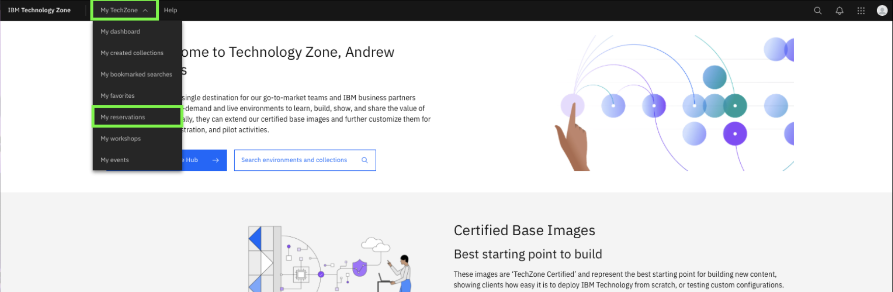

2. Click the **z/OS Dev & Test Image** tile.
   
    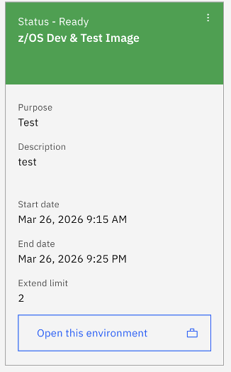

3. Locate and record the **Public IP** field for your environment.

    

4. At the bottom of the reservation page, click on **Download SSH key** to download the SSH key locally.
   
    

### SSH into z/OS Unix System Services

In order to set a new **Passphrase** for your **IBMUSER** zOS user, you will first need to SSH into z/OS USS, using port **2022**. 

1. On your local command line, navigate to the directory of your downloaded SSH key from the previous step (i.e. **Downloads**).
   
    `cd Downloads`

2. Set the permissions of your downloaded key to allow SSH access:
   
    `chmod 600 <ssh-key.pem>`

    For example:

    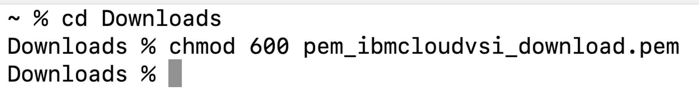

3. Then SSH into z/OS UNIX, by running the below command, replacing `<ssh-key.pem>` with the name of your downloaded key, and replacing `<public ip>` with the IP you recorded in the above section:
   
    ```
    ssh -i <ssh-key.pem> ibmuser@<public ip> -p 2022
    ```

    Once SSH'ed in successfully, you should see something similar to below:

    

### Set new Passphrase for IBMUSER

Next, set a new zOS Passphrase for your **IBMUSER** zOS user by running the following command. This is the RACF Passphrase that you will use to log into TSO as the IBMUSER ID. 

Once you're SSH'ed into zOS USS, enter the following command, substituting a passphrase of your choice for the string `YOUR PASSWORD PHRASE` :

    ```
    tsocmd "ALTUSER IBMUSER PHRASE('YOUR PASSWORD PHRASE') NOEXPIRE RESUME"
    ```
    
    ??? Tip "Syntax rules for RACF Password Phrases (below):
    
        - minimum length: 9 characters
        - Must contain at least 2 alphabetic characters (A - Z, a - z)
        - Must contain at least 2 non-alphabetic characters (numerics, punctuation, or special characters, including spaces)
        - Must not contain more than 2 consecutive characters that are identical
  
    **Note:** *if you typed the command yourself, be sure to include the single-quotes before and after the password.* ***Record the passphrase as it will be needed later.***

Afterwards, you should see something similar to the following:


### Accessing TSO Session

The zD&T image uses port **992** for accessing TSO sessions. In order to access TSO, you must first retrieve your environment's self-signed **CA certificate**. 

To do this, you should follow the instructions for <a href="https://www.ibm.com/docs/en/wazi-aas/1.1.0?topic=vpc-connecting-zos-virtual-server-instances#using-terminal-emulator__title__1" target="_blank">Using TN3270 terminal emulator</a>. 

Optionally, if using **Host-On-Demand**, you can import the CA certificate by following the below steps:

1. Download the certificate file from the z/OS system by running the following command, replacing `<ssh-key.pem>` with the name of your downloaded SSH key, and replacing `<public ip>` with the public IP of your environment:

    ```
    scp -O -P 2022 -i <ssh-key.pem> ibmuser@<public ip>:/u/ibmuser/common_cacert ./common_cacert.crt
    ```

    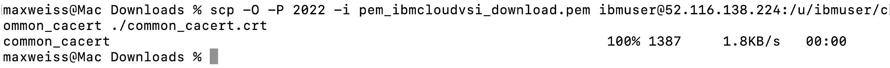

2. Import the downloaded certificate into your Host-On-Demand keystore using the following command, replacing `<alias>` with any recognizable alias:
   
    ```
    keytool -importcert -alias <alias> -file ./common_cacert.crt -keystore /Applications/HostOnDemand/lib/CustomizedCAs.jks -storepass hodpwd
    ```

    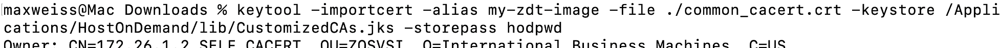


    When asked `Trust this certificate? [no]`, enter `yes` and you should see output similar to the following:

    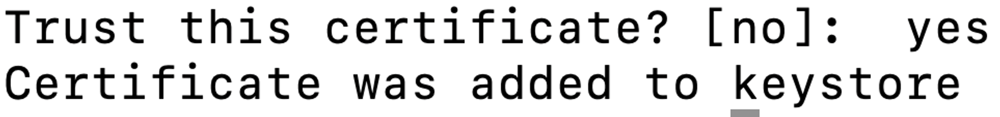


3. Once done, you can start a TSO session in the **Host-On-Demand** application.

### Creating TSO session in IBM Host On-Demand

The below steps illustrate how to define and connect to a TSO session for your Z Dev & Test image using **IBM Host On-Demand**. If using a different application as a TN3270 emulator, the connection settings should be similar. 

1. After opening the application, click the **Add Sessions** option and select the **3270 Display**

    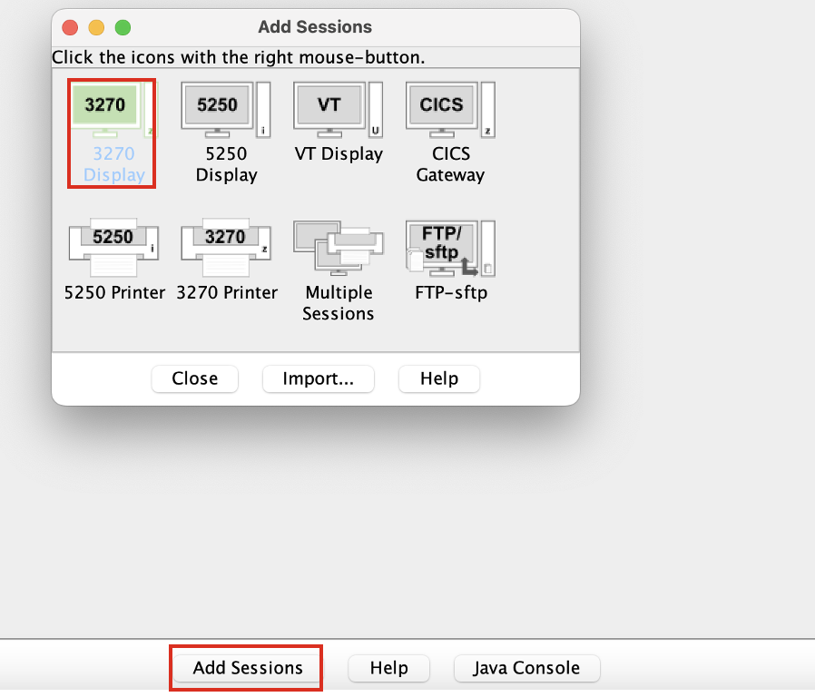

2. Enter the following Connection Settings then click **OK**. 

    **a**. **Session Name:** *enter any unique name for your instance*

    **b**. **Destination Address:** *Copy and paste the unique value for the **public IP** address of your zD&T image*

    **c**. **Destination Port:** 992

    **d**. **Protocol:** From the drop-down, select the **Telnet - TLS** option. 

    *Leave all other fields the default options.*

    For example:

    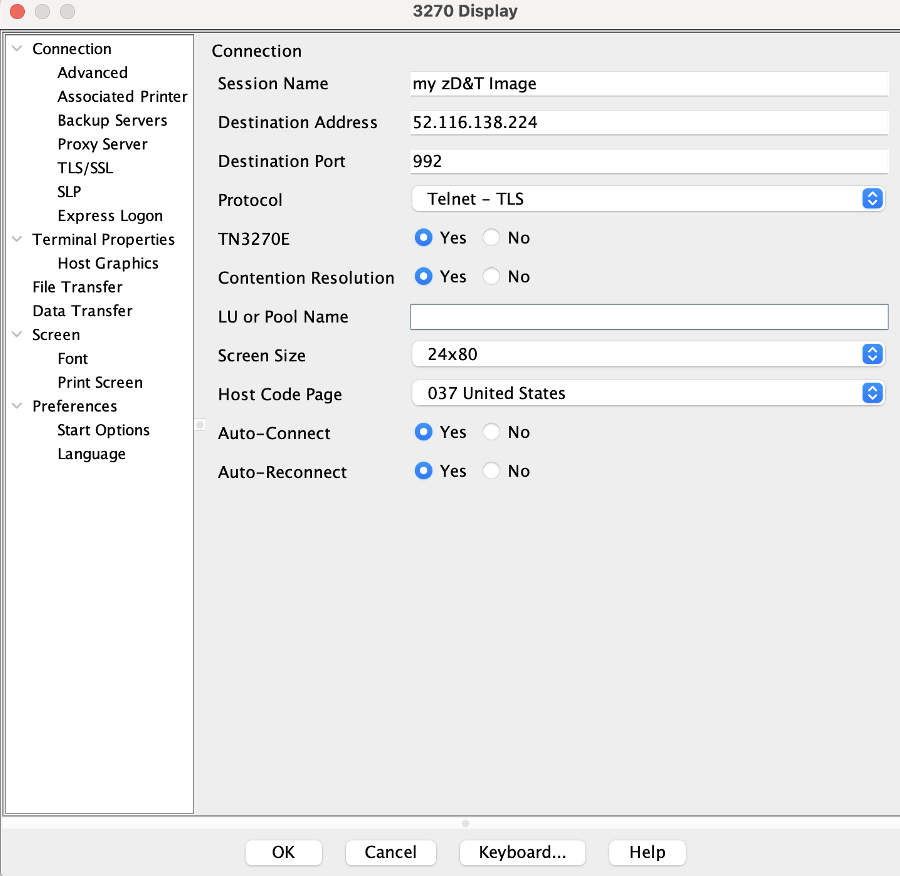

3. Then start the TSO session by clicking on your new connection definition. You should see the Login screen as shown below:
   
    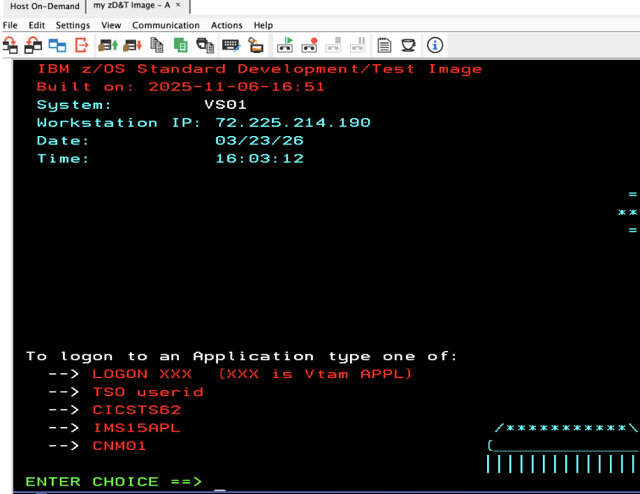

   Proceed to login by entering `TSO IBMUSER`, then when prompted, enter the **Passphrase** you set for the IBMUSER ID earlier in this section. 


### Accessing z/OSMF Web-UI

Accessing the z/OSMF Web-UI can be done by navigating to the following URL within your local web-browser, replacing `<public ip>` with the public IP address found in your environment's TechZone reservation:

`https://<public ip>:10443/zosmf`

***Note:*** it may take a few seconds for the login page to finish loading. Eventually you should see a login screen similar to what's shown below:

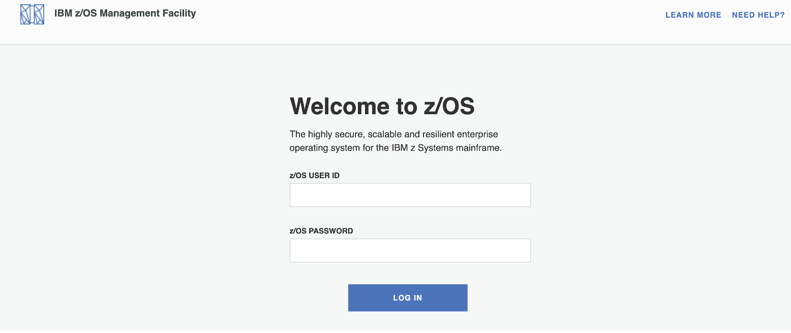

Enter `IBMUSER` for the **z/OS USER ID** field.

For **z/OS PASSWORD**, enter the Passphrase you set for the IBMUSER ID earlier in this section.  

Then click **LOG IN**. 

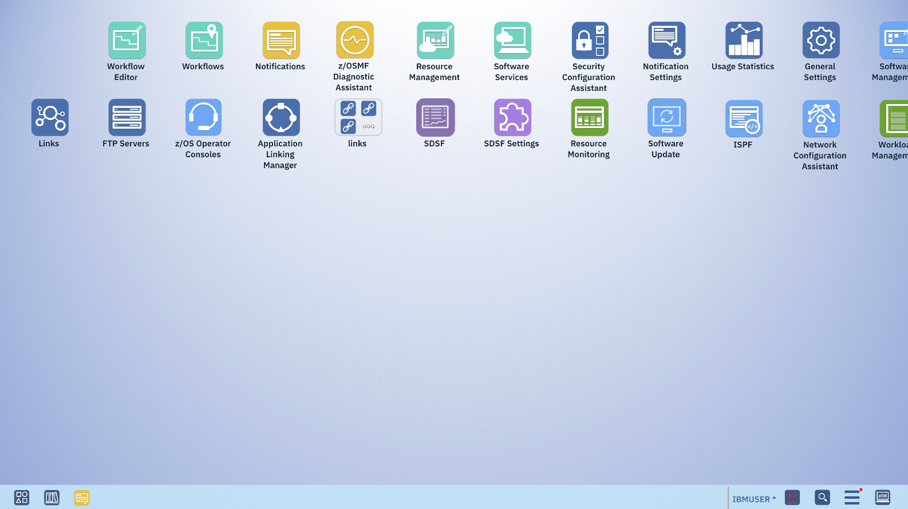


