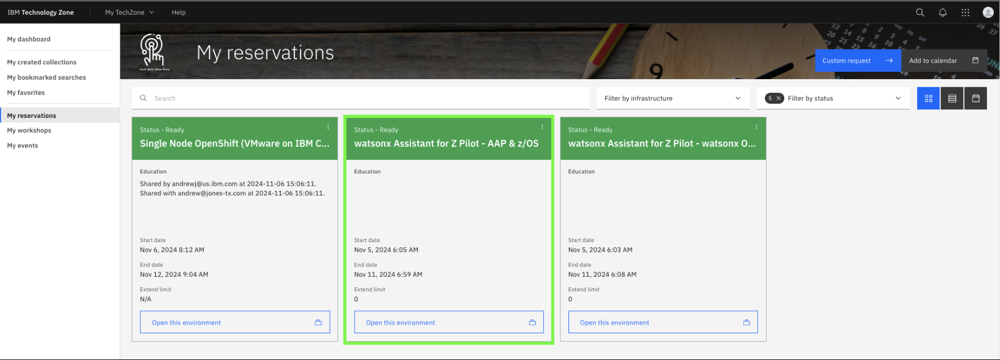
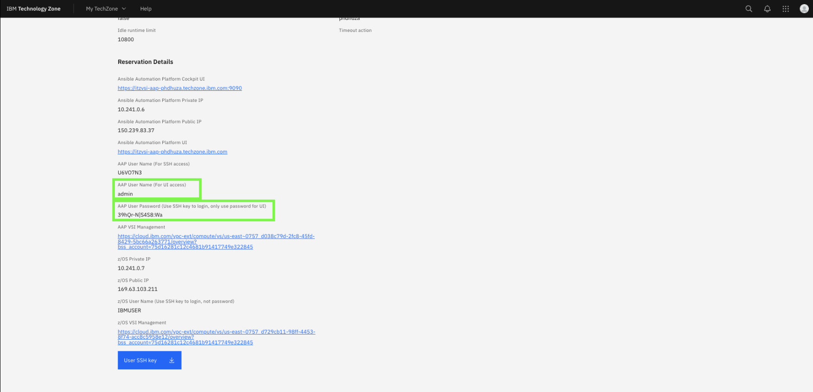
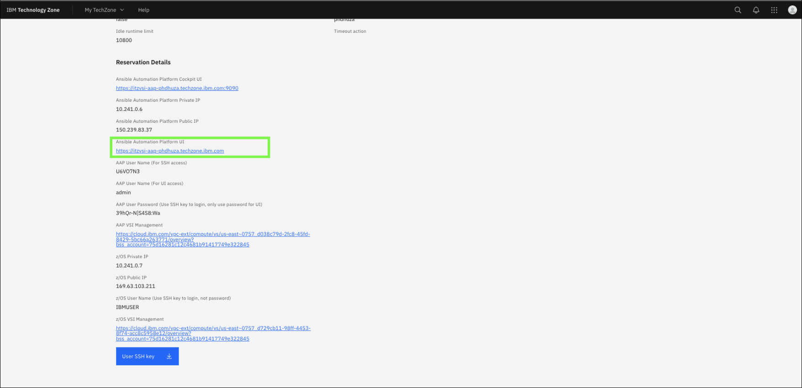

# Z Dev & Test (zD&T) image for zOS

## Summary of the environment

The third lab environment you will use is the ***Ansible Automation Platform (AAP) & z/OS*** environment. This provides a pre-configured instance of both **Ansible Automation Platform (AAP)** and **Wazi aaS z/OS** deployed on IBM Cloud.

The two resources are provisioned together in the TechZone environment and enables users to manage and automate z/OS tasks and subsystems with various pre-installed Ansible playbooks. It includes a z/OS back-end (Wazi as a Service) with all needed pre-requisites to quickly get started.

This environment will come into play later on in the Lab when deploying your AI Agents. Each Agent has its own mechanism for accessing the back-end environment and performing tasks, gathering insights, etc.

As an example, you will later deploy the **IBM Z Upgrade Agent** which leverages z/OSMF APIs to your back-end Wazi z/OS system. As another example, the **IBM Z Support Agent** you will later deploy will connect to your Ansible Automation Platform (AAP) instance to automate the collection and transfer of z/OS dumps.

This environment will also be later used when building your own agent to automate the certificate renewal process on z/OS.


## Accessing the environment

Follow the below instructions to access your ***Z Dev & Test (zD&T) environment for zOS***.

1. In the IBM Technology Zone portal, expand **My TechZone** and select **My Reservations**, or click the following link:
   
    <a href="https://techzone.ibm.com/my/reservations" target="_blank">ITZ My reservations</a>

    

2. Click the **watsonx Assistant for Z Pilot - AAP & z/OS** tile.
   
    

3. Locate and record the **Public IP** field for your environment.

    

4. At the bottom of the reservation page, click on **Download SSH key** to download the SSH key locally.
   
    

### SSH into z/OS Unix System Services

In order to set a new **Passphrase** for your **IBMUSER** zOS user, you will first need to SSH into zOS USS, using port **2022**. 

1. On your local command line, navigate to the directory of your downloaded SSH key from the previous step (i.e. **Downloads**).
   
   `cd Downloads`

2. Set the permissions of your downloaded key to allow SSH access:
   
   `chmod 600 <ssh-key.pem>`

   For example:

   IMAGE

3. Then SSH into z/OS UNIX, by running the below command, replacing `<ssh-key.pem>` with the name of your downloaded key, and replacing `<public ip>` with the IP you recorded in the above section:
   
    ```
    ssh -i <ssh-key.pem> ibmuser@<public ip> -p 2022
    ```

    Once SSH'ed in successfully, you should see something similar to below:

### Set new Passphrase for IBMUSER

Next, set a new zOS Passphrase for your **IBMUSER** zOS user by running the following command. This is the RACF Passphrase that you will use to log into TSO as the IBMUSER ID. 

Once you're SSH'ed into zOS USS, enter the following command, substituting a passphrase of your choice for the string `YOUR PASSWORD PHRASE`:

    ```
    tsocmd "ALTUSER IBMUSER PHRASE('YOUR PASSWORD PHRASE') NOEXPIRE RESUME"
    ```

    ??? Tip "Syntax rules for RACF Password Phrases (below)"
    
        - minimum length: 9 characters
        - Must contain at least 2 alphabetic characters (A - Z, a - z)
        - Must contain at least 2 non-alphabetic characters (numerics, punctuation, or special characters, including spaces)
        - Must not contain more than 2 consecutive characters that are identical
  
    **Note:** *if you typed the command yourself, be sure to include the single-quotes before and after the password.* ***Record the passphrase as it will be needed later.***

Afterwards, you should see something similar to the following:

### Accessing TSO Session

The zD&T image uses port **992** for accessing TSO sessions. In order to access TSO, you must first retrieve your environment's self-signed **CA certificate**. 

To do this, you should follow the instructions for <a href="https://www.ibm.com/docs/en/wazi-aas/1.1.0?topic=vpc-connecting-zos-virtual-server-instances#using-terminal-emulator__title__1" target="_blank">Using TN3270 terminal emulator</a>. 

Optionally, if using **Host-On-Demand**, you can import the CA certificate by following the below steps:

1. Download the certificate file from the z/OS system by running the following command, replacing `<ssh-key.pem>` with the name of your downloaded SSH key, and replacing `<public ip>` with the public IP of your environment:
   
    ```
    scp -O -P 2022 -i <ssh-key.pem> ibmuser@<public ip>:/u/ibmuser/common_cacert ./common_cacert.crt

    ```

2. Import the downloaded certificate into your Host-On-Demand keystore using the following command, replacing `<alias>` with any recognizable alias:
   
    ```
    keytool -importcert -alias <alias> -file ./common_cacert.crt -keystore /Applications/HostOnDemand/lib/CustomizedCAs.jks -storepass hodpwd
    ```


3. Once done, you can start a TSO session in the **Host-On-Demand** application by clicking **Create new session**. 


