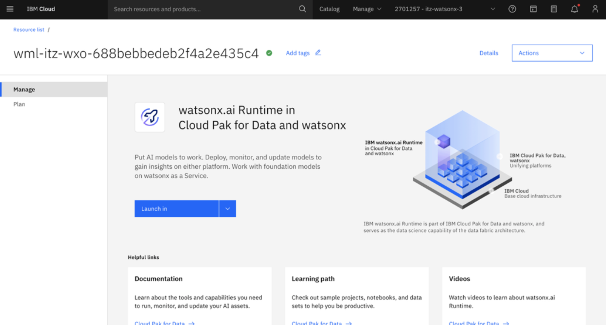

# Generate IBM Cloud API key

In addition to the **Project ID** and **Deployment Space ID** secrets, you will also need an IBM Cloud **API key** configured as a secret in your agents’ deployment. This section walks through the creation of a new API key for later use.

1. Go back to your previous tab where you launched the **watsonx.ai Studio** service in IBM Cloud. The screen should look similar to the following:

    

2. Select **Manage --> Access (IAM)**
   
    

3. In the **IAM** settings page, select **API keys** from the left-hand menu.
   
    

4. In the **API keys** screen, click on **Create +**.
   
    

5. Enter any **Name** for your **API Key** and click Create.
   
    

6. You’ll then see a window appear “*API key successfully created*”

    **IMPORTANT:** Make sure to **Download** and **Copy** your API key (this can only be retrieved once).

    

    **Copy and record your API key value in a local notepad on your workstation for later use. This will later be referenced in your agents configuration as a shared secret.**

    Once recorded successfully, you can close out of the window and proceed to the next section.