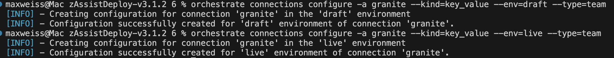
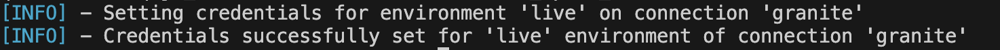

# OPTIONAL: Configuring Model Gateway service for Granite LLM 

***This is an optional*** step that would only need to be completed if you intend to leverage the **granite-3-3-8b-instruct** LLM for your agents' deployment. 

**Note:** for x86 based deployments, the **llama-3-3-70b-instruct** LLM is the default option. However, completing this step will allow you to configure your agents to use the granite LLM that would be used for an s390x deployment. 

For an on-prem s390x deployment, the Model Gateway service is configured using the Agent Development Kit (ADK) for accessing the granite-3-3-8b-instruct LLM. The documentation <a href="https://www.ibm.com/docs/en/watsonx/waz/3.1.0?topic=s390x-configuring-model-gateway" target="_blank">here</a> outlines the official steps. The below section provides a quick set of tasks that you'd complete when testing the LLM using watsonx Orchestrate SaaS. 

1. Configuring the model gateway service requires the setup of the Agent Development Kit (ADK) to connect to your watsonx Orchestrate tenant. 

    Follow the steps here to **add** and **activate** your environment: https://developer.watson-orchestrate.ibm.com/getting_started/installing#ibm-cloud

    Alternatively, follow the steps in Section ***[Installing and setting up your ADK environment](../adk/setup.md)***.

 
2. Once your environment is activated, configure the credentials to the target IFM Instance in the ADK by running the following commands to create a new connection with the app-id *granite*:

    ```
    orchestrate connections add -a granite
    ``` 

    

3. Next, configure the authentciation method for the draft and live versions of your connection by running the following commands:
   
    ```
    orchestrate connections configure -a granite --kind=key_value --env=draft --type=team
    ```

    ```
    orchestrate connections configure -a granite --kind=key_value --env=live --type=team
    ```

    

4. Configure your connection credentials using: 
   
    a. The **API Key** you generated and recorded in Section ***[Generate IBM Cloud API key](./api-key.md)***.

    b. Your **Deployment Space ID** you recorded in Section ***[Create Deployment Space](./deployment-space.md)***.

    Execute the following commands, replacing `<API Key>` and `<Space ID>` with your own values:

    ```
    orchestrate connections set-credentials --app-id granite --env draft -e api_key=<API KEY> -e watsonx_space_id=<Space ID>
    ```

    ```
    orchestrate connections set-credentials --app-id granite --env live -e api_key=<API KEY> -e watsonx_space_id=<Space ID>
    ```

    

    


5. Add the model to your environment by copy and pasting the following into a file called **model.yaml**, replacing `<SPACE ID>` with the same deployment space ID used in the previous step:

    ```
    spec_version: v1
    kind: model
    name: watsonx/ibm/granite-3-3-8b-instruct
    display_name: granite-3-3-8b-instruct
    description: granite-3-3-8b-instruct
    tags:
      - default
    model_type: chat
    provider_config:
      watsonx_space_id: <SPACE ID>
    ```


6. Then finally, within your command-line where you previously activated your ADK environment, run the following command to import the model:
   
    ```
    orchestrate models import --file model.yaml -a granite
    ```

    

7. Lastly, run the following command to verify that the model you imported is available:
   
    ```
    orchestrate models list
    ```

    