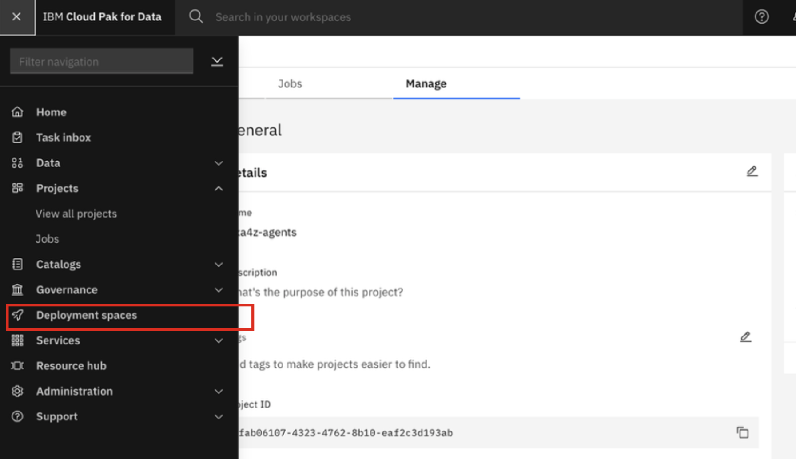
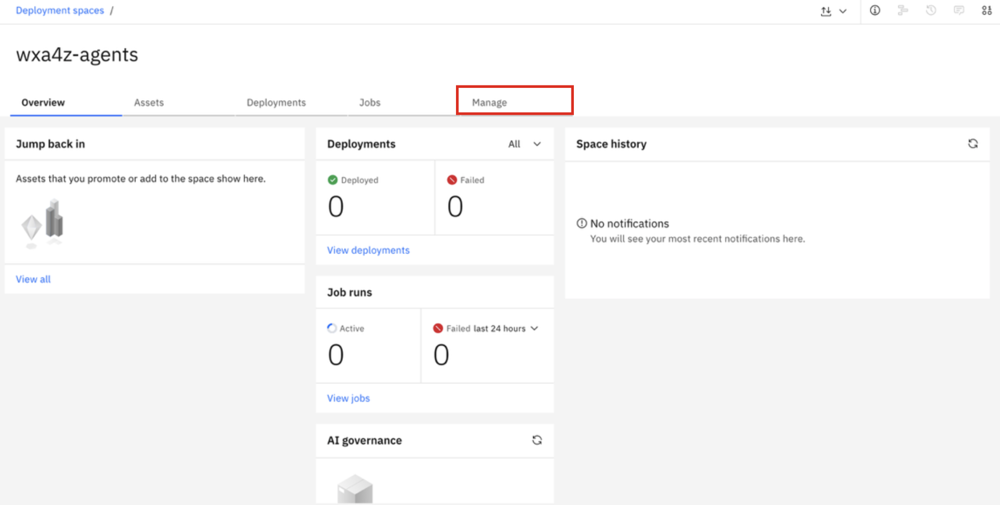
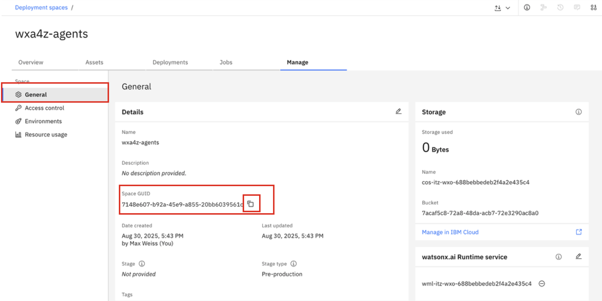

# Create Deployment Space

The next step in your watsonx.ai configuration is creating a new **Deployment space**. Your ***Deployment Space ID*** is another secret that will be referenced later on in the configuration of your agents deployment.

1. Click on the 'hamburger' menu icon in the top-left corner of the screen and click on **Deployment spaces**.
   
    

2. In the upper-right hand corner, click **New deployment space +**.
    
    

3. In the **Define details** section:
   
    - **Name:** enter a unique name for the deployment space
    - **Storage:** ensure your COS instance is selected
    - **Watsonx.ai Runtime (optional):** ensure your existing service is selected
  
    Then click **Create**.

    

4. Wait until a window appears with *'The space is ready'* message. 
   
    Then click **Go to space**.

    

5. In the new deployment space view, click on the **Manage** tab.
   
    

6. Finally, in the **General** tab, locate your **Space GUID**. This is your ***Deployment Space ID*** that will be frequently referenced in your agents configuration. 
   
    *Copy and record your **‘Space GUID’** value in a local notepad for later use*.

    

    ***IMPORTANT: copy and record your ‘Space GUID’ value in a local notepad for later use - and label it as your ‘Deployment Space ID’***.