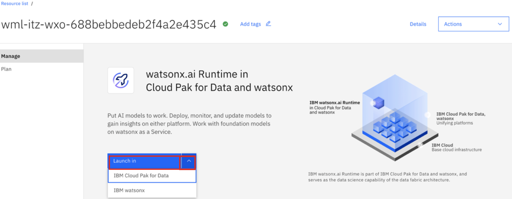
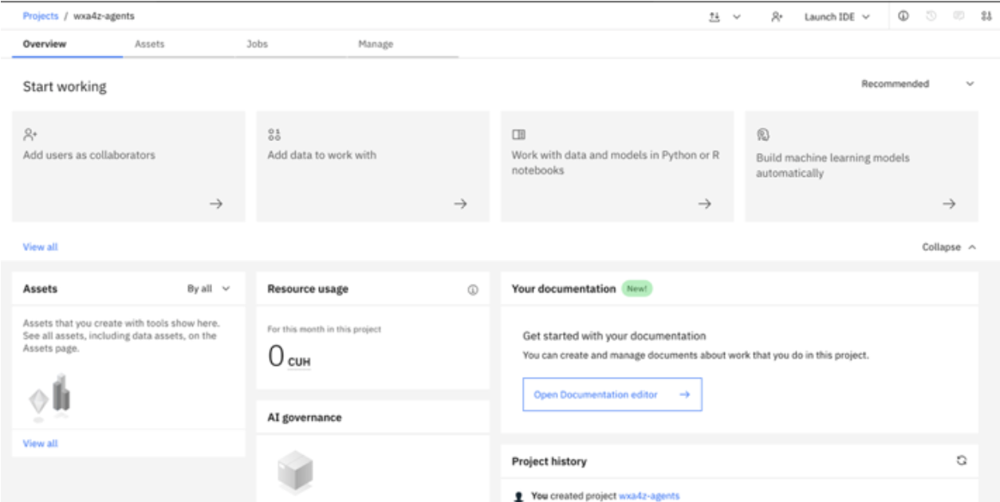
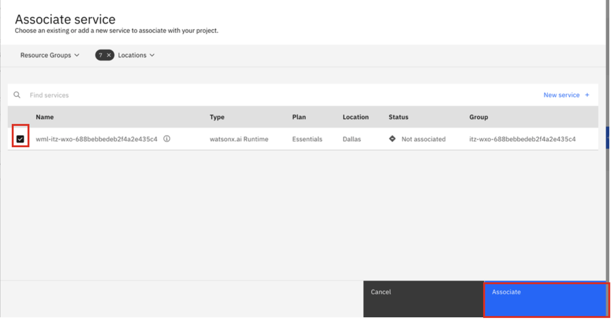

# Create watsonx.ai Project

Now that you’ve tested the conversational search features of your zRAG assistant and tested document ingestion
using the sample documents provided, you will prepare for agent deployment of a subset of foundational agents
entitled with watsonx Assistant for Z. As part of the deployment, you will first need to configure your ***watsonx.ai
services*** and captured the needed secrets to provide in your agents’ deployment. This section covers this process
in detail.

***NOTE:*** as you complete each following sub-section, ensure you’re recording all of the values being
referenced in a local notepad. This will make life much easier later on during the agent deploy

The first secret needed in configuring your watsonx Assistant for Z agents for deployment is retrieving your
`<WATSONX_PROJECT_ID>`. This step will walk you through creating a **Project** in **watsonx.ai** and retrieving
that secret for later use. 

1. Navigate to your ***Resources List*** in the IBM Cloud web console using the first Lab environment. Reference
the instructions in `Section 3.1: Accessing IBM watsonx Orchestrate Trial/Standard Plan` for a reminder on
how to get to your **Resource List**.

2. In the **Resource List** page, click on the **AI/Machine Learning** drop-down and click on the name of your **watsonx.ai Runtime** resource:
   
    

3. On the ***watsonx.ai Runtime in Cloud Pak for Data*** resource page, click on the drop-down arrow next to
**‘Launch in’** and click on **IBM Cloud Pak for Data**

    

4. This should open up a new tab with a **Getting started** window. Exit out of the **Getting started** window and click on the ‘hamburger’ menu icon in the top-left corner of the screen:
   
    

5. Then click on the **Projects** drop-down and click on **View all projects**:
   
    

6. You should then see you don’t have any existing projects. Click on **New project +** in the top-right corner of the screen:
   
    

7. In the ***Create a project*** window:

    - enter any **Name** for the project
    - Ensure a COS instance is selected for the **Storage** field
    - Click '**Create**'
  
    

8. You will then see a ‘loading’ screen while your project is being created. Wait until the project finishes creating and you’ll see something similar to what’s shown below:
   
    

9. In the Project view, click on the **Manage** tab, and then select **Services & integrations**, as shown below:

    

10. Then click on **Associate service**:
    
    

11. In the pop-up window, click the **checkbox** next to the displayed service and click **Associate**.
    
    

12. Once done, you should see the new service added to the Services & integrations page.

13. Finally, click on the **General** tab on the left-hand menu and copy and paste your **Project ID** to a local notepad for later reference.
    
    

    ***NOTE:** make sure to copy and record your Project ID in a local notepad for later use. This will be referenced later during the configuration of your agents deployment.*