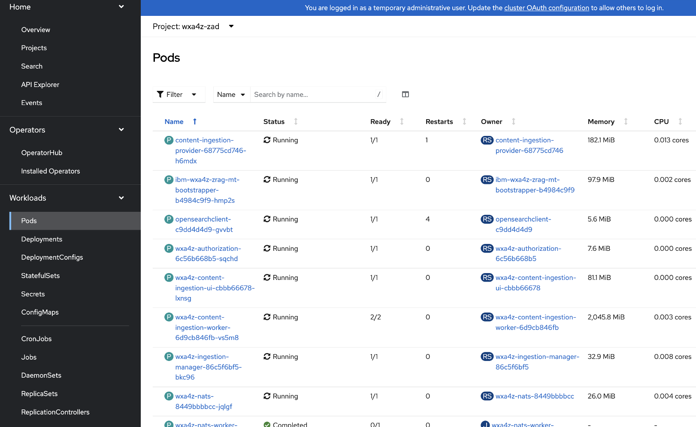
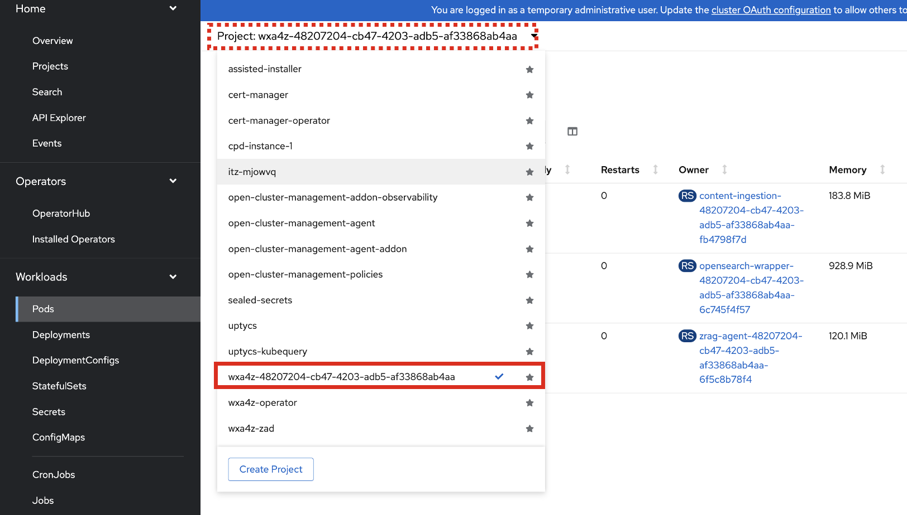
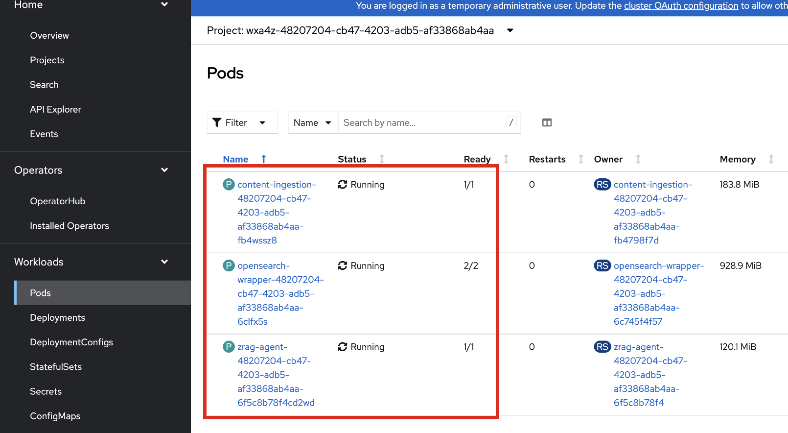

# Deploy *zAssistantDeploy* service on your cluster

With VS Code opened and successfully logged into your cluster via the command-line (as referenced in [this section](./overview.md#log-into-your-openshift-cluster-from-your-local-terminal)), you can kick off the script execution. This will automate the following tasks:

- Install the watsonx assistant for Z operator
- Create and configure the necessary secrets and image pull secrets
- Deploy the zAsssistantDeploy Custom Resource which makes the core wxa4z services available, including:
  - auth service
  - opensearch cluster
  - opensearch wrapper
  - ingestion nodes
  - tenant manager
  - topology service
  - zrag tenant bootstrapper
- Deploy a zRAG "tenant" in a new namespace on your cluster, with the automated creation and bootstrapped zRAG Agent deployed onto your watsonx Orchestrate instance
- Registers the tenant and configures the needed secrets in the tenant namespace


To kick off the script, first set the proper "executor" permissions on the downloaded `deploy-operator-saas.sh` file. For example:

`chmod +x deploy-operator-saas.sh`

Then, kick off the deployment by submitting the following command in your local Terminal session:

```
./deploy-operator-saas.sh deploy
```

Once executed, the script will guide you through the configuration. Examples shown below for reference...

1. Once executed, you should firstly see a return message in the Terminal showing:
   
    ```
    [WARN] Pull secret 'tz-pull-secret' does not exist in 'wxa4z-operator'
    Enter your entitlement key for tz-pull-secret: 
    ```

    Copy and paste the `tz-pull-secret` entitlement key you copied in the previous step. 

2. Later once the operator is successfully deployed, you should see something like what's shown below:

    ```
    [OK] Operator has been successfully deployed!

    [INFO] The operator is cluster-scoped and watches ALL namespaces.
    [INFO] This means ZragTenant CRs in any wxa4z-<tenant-id> namespace
    [INFO] will be automatically reconciled.

    Do you want to apply the ZAssistantDeploy CR now? (y/n): 
    ```

    Enter `y` to proceed with the creation of the ZAD core services. 


3. Next, the script will create the needed secrets for the **authorization** service as shown below:
   
    ```
    Create secrets for auth service....

    [INFO] Creating wxa4z-authorization-secrets...
    [INFO] Configure authorization secrets (press Enter to accept defaults):

    STS_SECRET [fJKVZgLQNaz9EPa2z7Ukx9oqw4Csm7zP]: 
    P12_PASSWORD [wxa4z-sts-auth-client]: 
    JWT_SIGNING_KEY [e73a2e7f-8932-47e6-a5de-0f5ca583586d]: 
    PLATFORM_AGENT_SECRET [!platformagent@]: 
    ```

    Feel free to keep the defaults by clicking `<enter>` through these prompts. 

4. Next it will create the **wxa4z-ifm-credentials** secret:

    ```
    [INFO] Creating wxa4z-ifm-credentials secret (watsonx.ai SaaS / cloud mode)...

    [INFO] Configure watsonx.ai SaaS credentials:

    WATSONX_URL [https://us-south.ml.cloud.ibm.com]: 
    WATSONX_API_KEY (required): 
    WATSONX_SPACE_ID (required): 71c88097-a690-4e0f-ad5d-9e5667775ba6
    WATSONX_MODEL_ID [openai/gpt-oss-120b]: 

    secret/wxa4z-ifm-credentials created
    ```

    - When prompted for your `WATSONX_URL`, provide your **WML Base URL** you recorded in section ***[Locate your WML Base URL](../watsonx-ai/wml-base-url.md)*** **OR**, client `<enter>` if the default value suffices (depending on region)
    - When prompted for your `WATSONX_API_KEY`, provide the value of the IBM Cloud API key you generated and recorded in section ***[Generate IBM Cloud API key](../watsonx-ai/api-key.md)***.
    - For `WATSONX_SPACE_ID`, copy and paste the value you recorded in section ***[Create Deployment Space](../watsonx-ai/deployment-space.md)***.
    - Lastly, for `WATSONX_MODEL_ID`, use the default (`openai/gpt-oss-120b`) for best results, otherwise provide the **MODEL_ID** for the desired model. 


5. Afterwards, the script will then configure secrets for zRAG Agent registration to the watsonx Orchestrate instance:
   
    ```
    [INFO] Configure watsonx Orchestrate (SaaS) for zRAG agent registration:

    WXO_ORCHESTRATE_URL (required): https://api.us-south.watson-orchestrate.cloud.ibm.com/instances/48207204-cb47-4203-adb5-af33868ab4aa
    WXO_TOKEN_URL [https://iam.cloud.ibm.com/identity/token]: 
    
    Save this API key (used for transform config): Ubtujy1s4Km3nJTfjS4GuSwl9qd2+mEiEUPMNcYZuhU=
    ```

    - When prompted for your `WXO_ORCHESTRATE_URL`, copy and paste the full value of your environment's service Instance URL you recorded in section ***[Retrieve watsonx Orchestrate Service Instance URL](../watsonx-ai/service-instance-url.md)***.
    - And finally for `WXO_TOKEN_URL`, use the default.


6. Finally, you'll begin seeing some output similar to what's shown below. Make sure you don't exit the script execution. Wait until you're prompted to deploy the **AIOpsIntegration CR** - then enter `n` as you won't be deploying the AIOpsIntegration resource. 

    ```
    [INFO] Creating ZAssistantDeploy CR...
    zassistantdeploy.wxa4z.watsonx.ibm.com/zassistantdeploy created
    [OK] ZAssistantDeploy CR created
    [INFO] Waiting for zassistantdeploy 'zassistantdeploy' to reach Deployed state (timeout: 900s)...
    .[OK] zassistantdeploy 'zassistantdeploy' is deployed
    [OK] ZAssistantDeploy is ready
    [INFO] Patching OpenSearch keys into wxa4z-ingestion-credentials...
    [OK] OpenSearch keys patched
    [INFO] Waiting for bootstrapper to be ready...
    [INFO] Triggering provision for tenant 48207204-cb47-4203-adb5-af33868ab4aa...
    [OK] Tenant 48207204-cb47-4203-adb5-af33868ab4aa provisioned
    
    Do you want to deploy the AIOpsIntegration CR? (y/n): n
    ```

7. Following the completion of the script, and after waiting a few minutes, navigate to the `wxa4z-zad` namespace in your OpenShift web console and verify all the pods are in a **Running** state as shown below:
   
    


8. Additionally, the bootstrapper process will create a **tenant namespace** on your cluster with the pattern `wxa4z-<tenant-id>`. 
   
    Within the OCP Web console, click on the **Project** drop-down and select the tenant namespace, as shown below as reference:

    

    Then go to the **Pods** view in the tenant namespace and confirm you see the following pods in a **Running** state:

    - zrag-agent
    - content-ingestion
    - opensearch-wrapper 


    
    

### Troubleshooting:


------

    - Execution / troubleshooting
        - if service account pod doesn't get fixed - run the following:
            - oc secrets link ibm-wxa4z-operator-controller-manager tz-pull-secret --for=pull -n wxa4z-operator
            - oc rollout restart deployment/ibm-wxa4z-operator-controller-manager -n wxa4z-operator
        - if one of content-ingestion pods in wxa4z-zad is stuck in error/pending status due to OS url secret not being passed, run the particular command
    - Tearing down the cluster


