# Overview

IBM watsonx Assistant for Z, ***version 3.3***, provides multi-tenancy support for isolating core services by tenants. This allows for compliance and security across end-users and the data they interact with. 

As this is an on-prem product, the look and feel won't be exactly as experienced with the full on-prem deployment, but many of the same capabilities are supported for demo and pilot purposes. 

In this section, you will deploy the core services of watsonx Assistant for Z onto your OpenShift cluster, and create a **zRAG Tenant** with automated bootstrapping of the zRAG Agent, along with a dedicated instance of OpenSearch and the Client Ingestion service. 

To accomplish this, an automated script is provided to you in order to automate the deploy of the watsonx Assistant for Z multi-tenant operator on a SaaS cluster, with the zRAG agent provisioned on Orchestrate as part of the bootstrapper flow. 

The ***deploy-operator-saas.sh*** script will automate everything needed to successfully deploy the core ZAD services and bootstrap the zRAG Agent within your tenant and onto watsonx Orchestrate SaaS. 

## Pre-requisites and setup

### Completed setup of watsonx.ai services

Prior to kicking off the automation script, you will need to gather and record the following information which you would've completed in the previous section. You will be prompted for this during execution.

- **Deployment space id** from Section [Create Deployment Space](../watsonx-ai/deployment-space.md)
- **IBM Cloud API Key** from Section [Generate IBM Cloud API Key](../watsonx-ai/api-key.md)
- **watsonx Orchestrate Service Instance URL** from Section [Retrieve watsonx Orchestrate Service Instance URL](../watsonx-ai/service-instance-url.md)
- **WML URL** from Section [Locate your WML Base URL](../watsonx-ai/wml-base-url.md)

### Download *deploy-operator-saas.sh* script

Next, download the <a href="https://ibm.box.com/s/3v5id2girkzyol9grjicoqj5e07784dp" target="_blank">deploy-operator-saas.sh</a> automation script to your local machine. 

This shell script targets clusters using watsonx.ai SaaS for inferencing rather than the on-prem AIO inference gateway. 

Once downloaded, open up the script in a Visual editor of your choice, preferable VS Code. 

### Install the `oc` command-line utility

The Red Hat OpenShift command line interface (CLI) utility, which is known as `oc`, must be installed on your local workstation. If you already installed the `oc` utility, you can proceed to the next section.

This can be verified by issuing the `oc` command on your local command-line. If you already installed the `oc` utility, you can proceed to the next section.

1. Log into your ***OpenShift*** cluster via web console by following the instructions ***[here](../techzone/sno.md#accessing-the-environment)***.
      
2. Click the **Help** icon and then click **Command Line Tools**.
   
    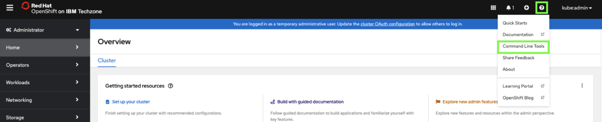

3. Click the link under **oc - OpenShift Command Line Interface (CLI)** for the operating system of your local machine.
   
    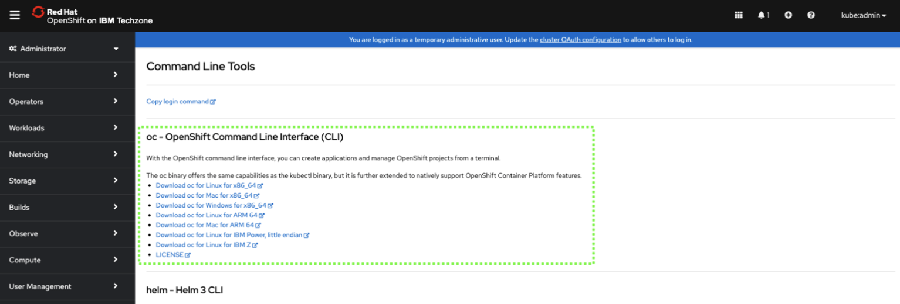

    Clicking the preceding link automatically downloads either a **.zip** or **.tar** file specific to your operating system. Extract the file's content.

    Place the **oc** binary for your operating system (OS) in a directory that is in your default `PATH`, or set the `PATH` environment variable to include the location of the **oc** binary.

4. Verify the installation by running the `oc` command on your local workstation. 

    `oc --help`

    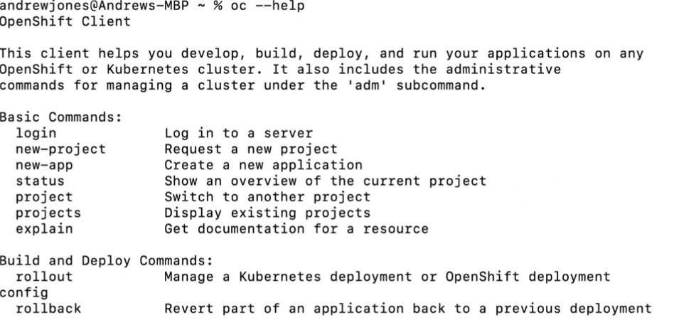

### Log into your OpenShift cluster from your local terminal

**Note:** If you just installed the `oc` utility, you should already be logged into the cluster and can skip the first couple of steps.

1. Log into your ***OpenShift*** cluster via web console by following the instructions ***[here](../techzone/sno.md#accessing-the-environment)***.
      

2. Click the `kube:admin` profile drop-down and click **Copy login command**.
   
    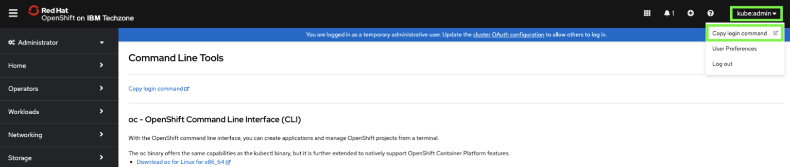

3. Click **Display Token**.
   
    

4. Select and copy the ***Log in with this token*** string.

    *For most operating systems, double-click the value, then right-click and select **Copy***.

    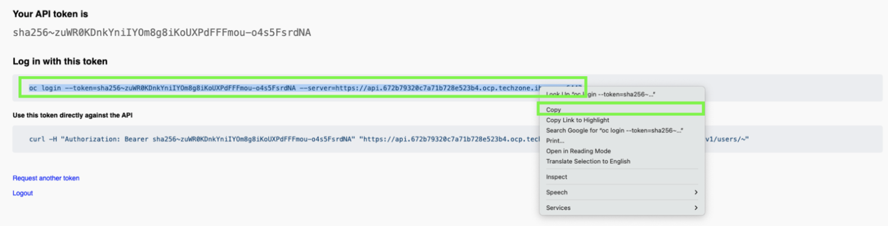

5. Open a command prompt or terminal window on your local workstation. Then paste the login command and press **enter**.
   
    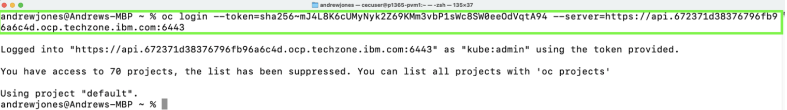

### Install `cert-manager` operator

Next, log into your OpenShift cluster and install the **Red Hat cert-manager operator**. 

1. Log into your ***OpenShift*** cluster via web console by following the instructions ***[here](../techzone/sno.md#accessing-the-environment)***.

2. Click the `kube:admin` profile drop-down and click **Copy login command**.
   
    

3. Click **Display Token**.
   
    

4. Select and copy the ***Log in with this token*** string.

    *For most operating systems, double-click the value, then right-click and select **Copy***.

    

5. Within your previously opened VS code session, open a terminal window and paste the command and press **enter**. 

6. Once you've logged into your cluster via the command-line, navigate back to the web console.

7. In the OpenShift web console, click **Operators** and then select **OperatorHub**.
   
    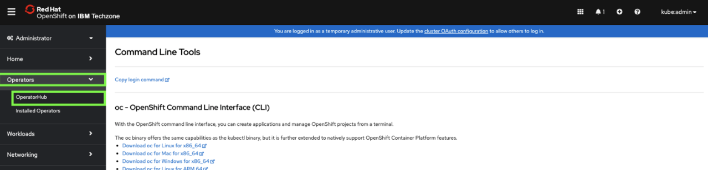

8. Click the **Project** to pull-down menu and click the **Show default projects** toggle.
   
    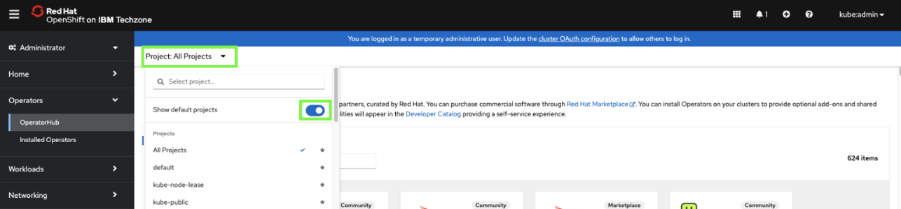

9. Scroll down and select **openshift-marketplace**.
   
    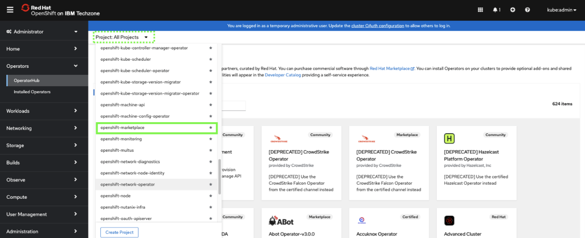

10. Enter `cert-manager` in the search field and then click the **cert-manager Operator for Red Hat OpenShift** tile.
   
    ***Note:** it may take a minute or 2 for the tile to appear. Click on a different tab and go back to it to refresh*.
   
    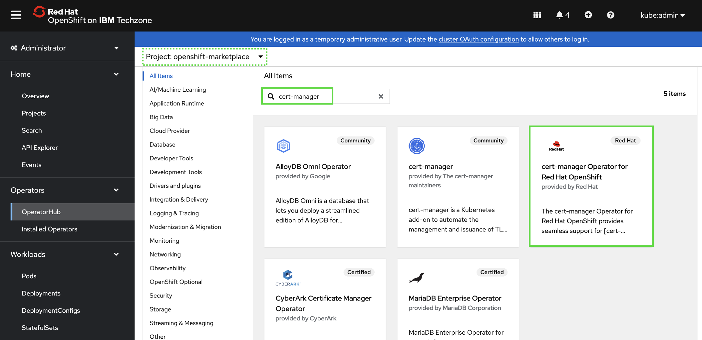

11. Click **Install**.
   
    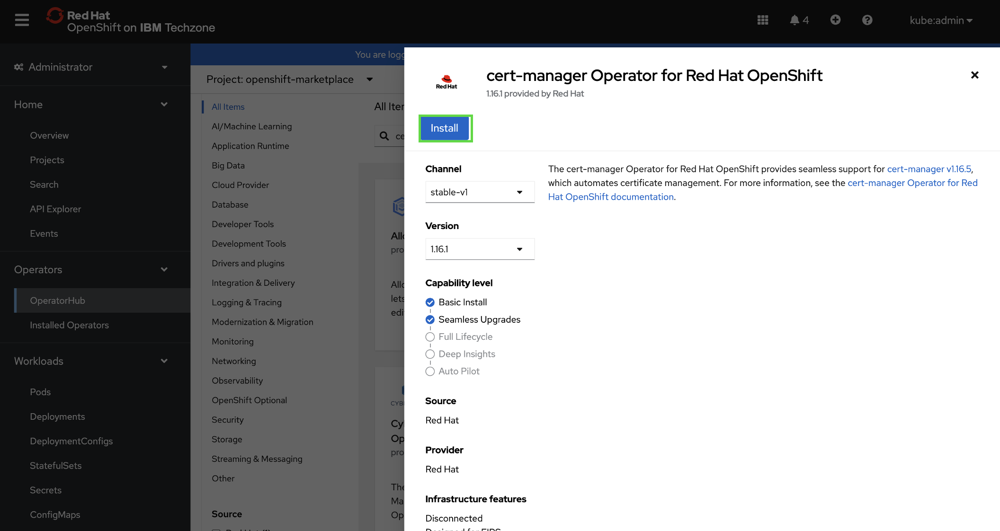

12. Keep the default settings and click **Install**.
   
    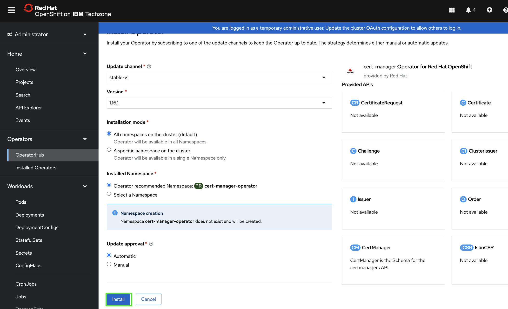

    ***NOTE:*** *the installation process takes a few minutes. DO NOT continue until you see the following message: `Installed operator: ready for use`.*

    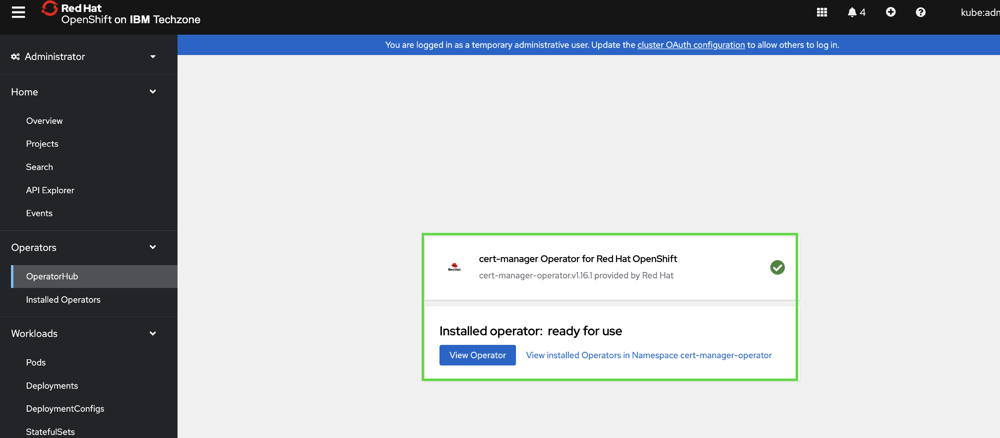

Once completed, you can move on. 

### Obtain `tz-pull-secret` entitlement key

Finally, as this is a modified version of the operator deployment for SaaS based deployments, there are a set of images designed specifically for this workflow that you'll use. In order to pull the necessary images, you will need to retrieve the entitlement key to the image registry. You will also be prompted for this during the script execution. 

Retrieve the <a href="https://ibm.box.com/s/7sm5v6nfzrm7r0vz64zyb81cmgx1x40e" target="_blank">entitlement key here</a>.

**Note:** you will supply this entitlement key when the script prompts you for the `tz-pull-secret` entitlement key. 