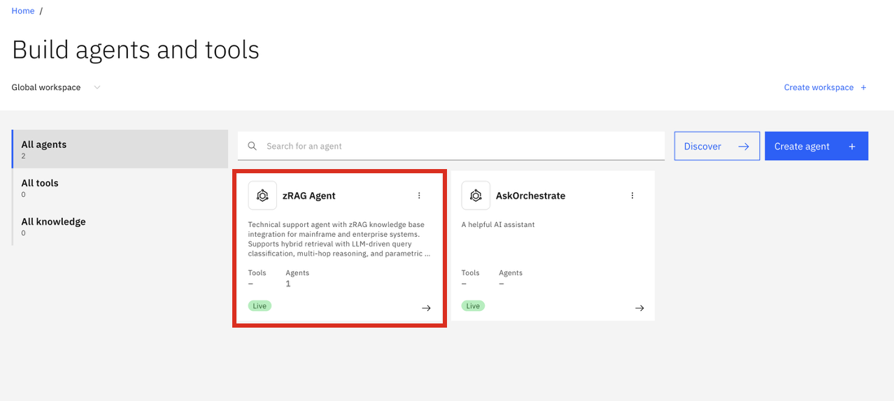
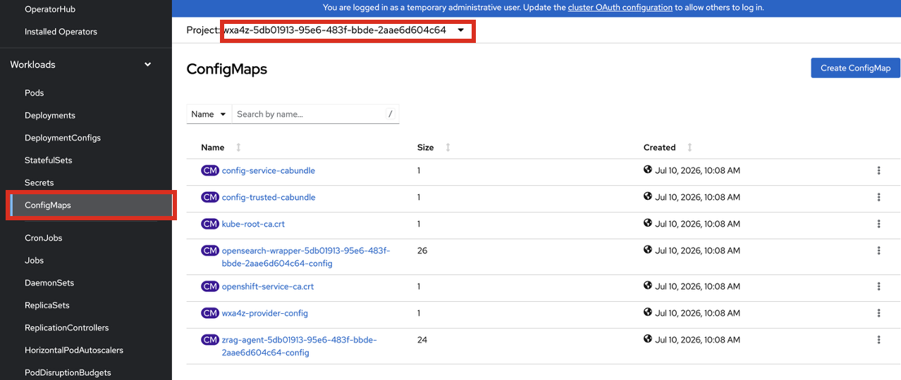
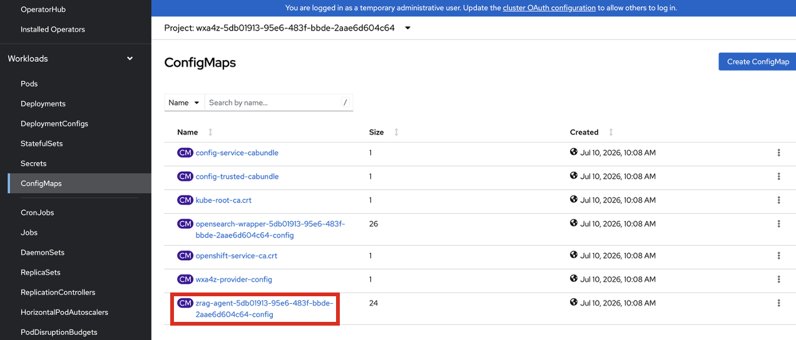
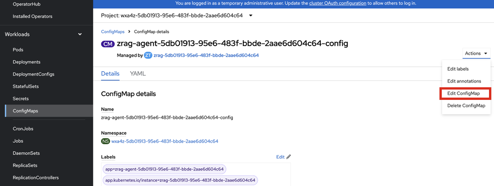
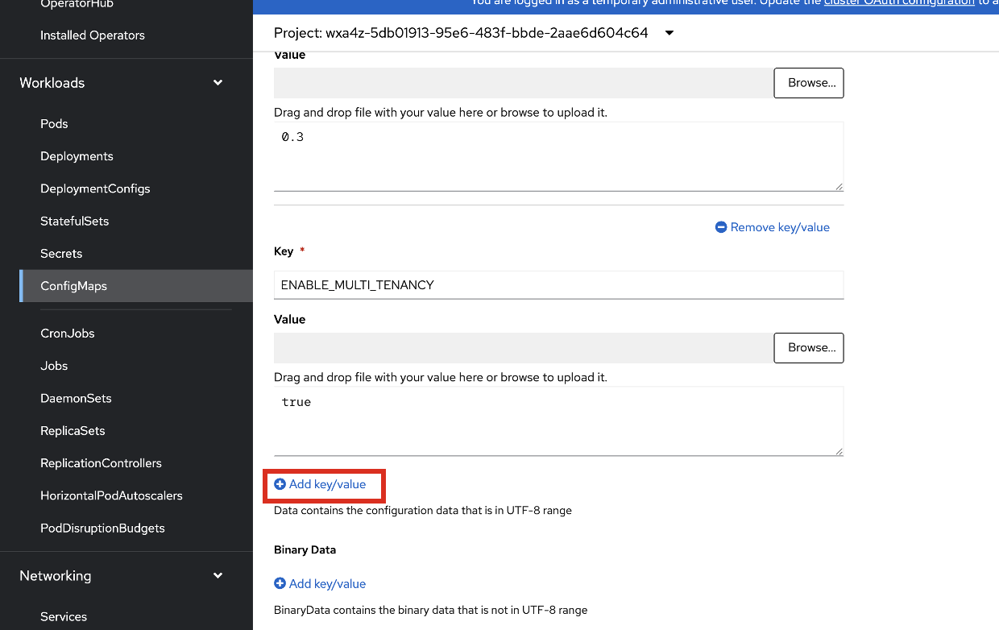
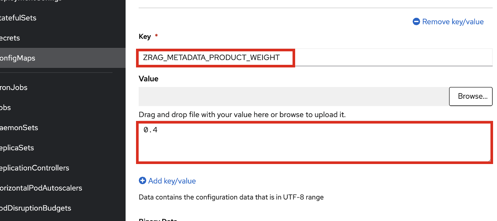
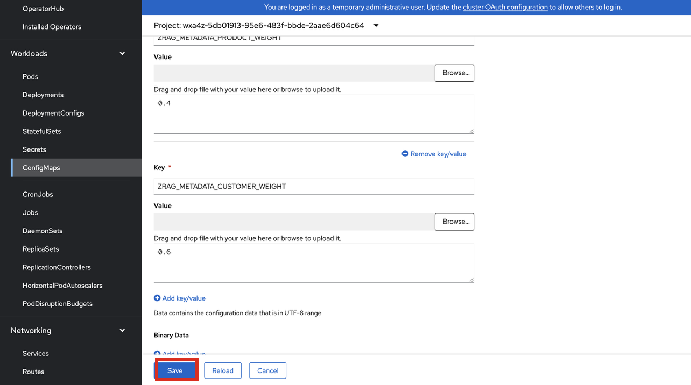

# Verification and Testing zRAG Agent

### Log into watsonx Orchestrate and test zRAG Agent

Once confirmed that the tenant services are deployed and running, navigate to your **watsonx Orchestrate** service UI and find your deployed **zRAG Agent** by clicking on the tile for your **zRAG Agent** within the Orchestrate Agent Builder:



Begin testing queries to the zRAG Agent and verifying the responses.


## Modifying Search Parameters

The deployment of the zRAG Agent uses a set of default search parameters that can be found in the associated **configMap** within your **tenant namespace (`wxa4z-<tenant_id>`)**.

These search parameters can be modified and include **Index filters** and **Document ranking weights**:

***Index filters:***

- `ZRAG_DEFAULT_IBM_INDICES=<ibm_indices_pattern>`
- `ZRAG_DEFAULT_PROVIDER_INDICES=<provider_indices_pattern>`
- `ZRAG_DEFAULT_TENANT_INDICES=<tenant_indices_pattern>`

!!! Tip "PROVIDER vs TENANT indices"

    It is important to note that both the `PROVIDER_INDICES` and `TENANT_INDICES` are referring to customer ingested doc indices. When ingesting docs using the ingestion service in the **tenant namespace**, the `TENANT_INDICES` variable should be used. The `PROVIDER_INDICES` refers to docs ingested using the ingestion service in the `wxa4z-zad` namespace.


***Document ranking weights:***

- `ZRAG_METADATA_PRODUCT_WEIGHT=<product_weight>`
- `ZRAG_METADATA_PROVIDER_WEIGHT=<provider_weight>`
- `ZRAG_METADATA_TENANT_WEIGHT=<tenant_weight`

!!! Tip "What do these weights mean?"

    `ZRAG_METADATA_PRODUCT_WEIGHT` refers to the weight of the *default* IBM docs. 
    
    Both the `ZRAG_METADATA_PROVIDER_WEIGHT` and `ZRAG_METADATA_TENANT_WEIGHT` reference ingested content. While `PROVIDER_WEIGHT` references customer docs ingested in the `wxa4z-zad` namespace, the `TENANT_WEIGHT` references docs ingested using the ingestion service within the **tenant** namespace specifically. In this case, all three weights must sum to 1. For Pilot purposes, you can ingest documents in the tenant namespace and configure the `PRODUCT_WEIGHT` and `TENANT_WEIGHT` exclusively, summing to 1.0.

To configure these search parameters:

1. Navigate to your `wxa4z-<tenant_id>` tenant namespace and view **ConfigMaps** under the **Workloads** section:
   
    

2. Select your `zrag-agent-<tenandid>` configmap:
   
    

3. As an example, to modify the **Product Docs Weight** to 0.4 and **Tenant Doc Weight** to 0.6, simply edit the ConfigMap:
   
    

4. At the bottom of the page, select **Add key/value**.
   
    

5. Enter the following
   
    - `Key` : `ZRAG_METADATA_PRODUCT_WEIGHT`
    - `Value` : `0.4`
  
    

6. Repeat by adding another key/value and entering:
   
    - `Key` : `ZRAG_METADATA_TENANT_WEIGHT`
    - `Value` : `0.6`


7. Then click **Save**. 
   
    

    The new search configuration will automatically be picked up by the zRAG Agent in future queries. 

### Configuring Websearch

Additionally, **Web Search** can be configured for your zRAG Agent to retrieve up-to-date and relevant information from external sources. It enhances the accuracy, completeness, and usefulness of responses by supplementing internal knowledge with live web results. 

To setup the **Web Search** capability, follow the instructions <a href="https://www.ibm.com/docs/en/watsonx/waz/3.3.0?topic=z-configuring-web-search-zrag-agent" target="_blank">here.</a>

**NOTE:** to set up a free trial and get access to a **SERPER** API key for the purpose of enabling web search, you can follow the steps below:

```
Step 1 — Open the signup page
Go to:
https://serper.dev/
Click "Get 2,500 free queries" or "sign up"

Step 2 — Create your account
Fill in:
* Name
* Email address
* Password
Then click Create account.
You do not need a credit card for the free tier.

Step 3 — Verify your email
Serper will send a verification email to your inbox.
* Open the email
* Click the verification link
After verification, log in to your dashboard.

Step 4 — Get the free credits
Once your account is active, Serper automatically adds:
* 2,500 free search credits
to your account dashboard.

Step 5 — Access your API key
After logging in:
1. Open the dashboard
2. Look for:
    * API Key
    * or API Keys in the sidebar
3. Copy the generated key
That key is your authentication token for all API requests.
```