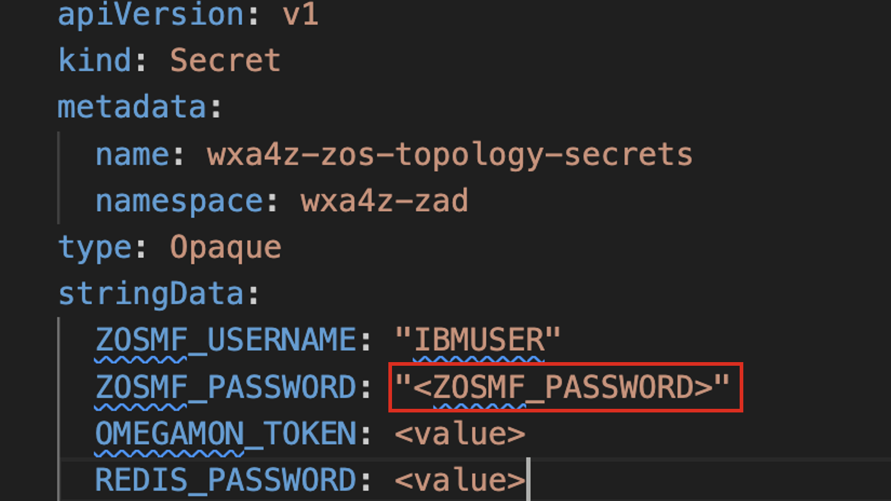

# Deploy required secrets for OpenSearch and Client Ingestion

In this step you will deploy the required secrets needed for authentication to the Z RAG and Client Ingestion service. For all of the instructions in this section, it is assumed that you’re accessing your local command line or terminal prompt in the ***zAssistDeploy*** directory.

1. In your downloaded/extracted ***zAssistDeploy*** directory, there is an `os-secret.yaml` file. In a text editor of your choice(i.e.command-line,VSCode,etc.),modify this file to replace `<OPENSEARCH_PASSWORD>` with a secure password of your choice (and save it). 
   
    ***Record this value for later use.***
    
    

2. Create the secret by running the following command within the same directory:
   
    ```
    oc apply -f os-secret.yaml
    ```
   
3. Next, modify the `client-ingestion-secret.yaml` file, replacing `<CLIENT_INGESTION_AUTHKEY>` with a 
secure authentication key of your choosing (i.e. password). 

    ***Record this value for later use.***

    

4. Create the secret by running the following command within the same directory:
   
    ```
    oc apply -f client-ingestion-secret.yaml
    ```
   
5.  Next, modify the `wrapper-creds.yaml` file, replacing `<WRAPPER_PASWORD>` with a secure password credential. **Record this value for later use as this is what you’ll later use to configure your assistant and agent OpenSearch connection.**
   
    

6. Create the secret by running the following command within the same directory:
   
    ```
    oc apply -f wrapper-creds.yaml
    ```

7. Finally, there is a `wxa4z-zos-topology-secrets.yaml` file which is used to configure the credentials for the **z/OS Topology service**. This service serves as a central repository for storing and managing the topology of z/OS systems, utilizing z/OSMF and OMEGAMON credentials for secure access and integration. 
   
    Within the ***wxa4z-zos-topology-secrets.yaml*** file, replace `<ZOSMF_PASSWORD>` with a unique password/passphrase value that the **IBMUSER** ID uses to log into TSO. 

    
    

    To set your new Password value, follow the steps outlined ***[here](../agentdeploy/upgrade-agent/secrets-data.md#set-your-zosmf_password-variable)***. 


8. And lastly, create the secret by running the following command within the same directory:
   
    ```
    oc apply -f wxa4z-zos-topology-secrets.yaml
    ```


