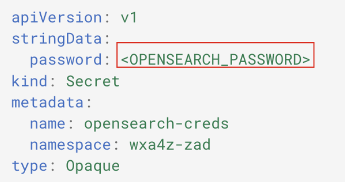
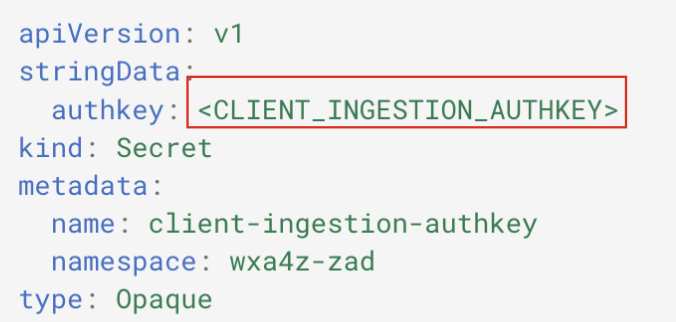

# Deploy required secrets for OpenSearch and Client Ingestion

In this step you will deploy the required secrets needed for authentication to the Z RAG and Client Ingestion service. For all of the instructions in this section, it is assumed that you’re accessing your local command line or terminal prompt in the ***zAssistDeploy*** directory.

1. In your downloaded/extracted ***zAssistDeploy*** directory, there is an `os-secret.yaml` file. In a text editor of your choice(i.e.command-line,VSCode,etc.),modify this file to replace `<OPENSEARCH_PASSWORD>` with a secure password of your choice (and save it). 
   
    ***Record this value for later use.***
    
    

2. Create the secret by running the following command within the same directory:
   
    `oc apply -f os-secret.yaml`
   
3. Next, modify the `client-ingestion-secret.yaml` file, replacing `<CLIENT_INGESTION_AUTHKEY>` with a 
secure authentication key of your choosing (i.e. password). 

    ***Record this value for later use.***

    

4. Create the secret by running the following command within the same directory:
   
    `oc apply -f client-ingestion-secret.yaml`

5. Lastly, modify the `wrapper-creds.yaml` file, replacing `<WRAPPER_PASWORD>` with a secure password credential. **Record this value for later use as this is what you’ll later use to configure your assistant and agent OpenSearch connection.**
   
    

6. Create the secret by running the following command within the same directory:
   
    `oc apply -f wrapper-creds.yaml`

