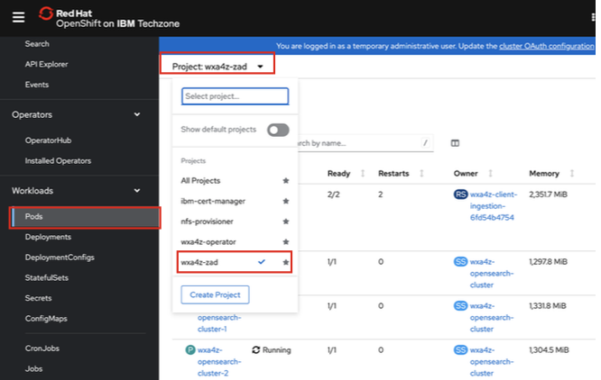

# Deploy *zAssistantDeploy* service on your cluster

In this step you will deploy ***zAssistantDeploy*** to your OpenShift cluster. **zAssistantDeploy** provides an OpenSearch deployment that is pre-installed with IBM Z documentation along with a data ingestion service that a customer can use to load their own documents to establish an internal knowledge base with their own internal processes and assets for quickly getting answers to. After deploying, you will later ingest some sample documents provided in this lab guide to show how the conversational search capability works with customer ingested documentation.

1. On your local command-line or Terminal window, obtain and record your cluster domain that is used for routes by running the following command:
   
    `oc -n openshift-ingress-operator get ingresscontroller default -o jsonpath="{.status.domain}"`

    *The output should return something similar to the following:*

    `apps.672b79320c7a71b728e523b4.ocp.techzone.ibm.com`


    ***NOTE:*** *the value outputted **should not contain the ‘%’ character at the end**. DO NOT copy this character when pasting the output in the following step.*

2. In your existing directory, there is a **deploy-zad.yaml** file. 
   
    Modify this file in a text editor of your choice, substituting the domain name recorded in the previous step for the `<YOUR_CLUSTER_DOMAIN>` string.

    

    ***Make sure to save the file before proceeding to the next step.***

3. Then deploy the **zAssistantDeploy** service by running the following command:
   
    `oc apply -f deploy-zad.yaml`

    After running the above command, the new pods will start initializing in your **wxa4z-zad** namespace. 

4. After running the previous command while the new pods are initializing, run the following command to **disable the dashboard deployment** as this is not required nor supported in the TechZone environment:
   
    ***Mac users:***

    ```
    oc -n wxa4z-zad patch zassistantdeploy zassistantdeploy --type='merge' - p='{"spec": {"dashboard": {"enabled": false}}}'
    ```

    ***Windows users:***

    ```
    oc -n wxa4z-zad patch zassistantdeploy zassistantdeploy --type="merge" - p="{\"spec\": {\"dashboard\": {\"enabled\": false}}}"
    ```

5. Then run the following command to **disable the assistantBootstrap feature**:
   
    ***Mac users:***

    ```
    oc -n wxa4z-zad patch zassistantdeploy zassistantdeploy --type='merge' - p='{"spec": {"assistantBootstrap": {"enabled": false}}}'
    ```

    ***Windows users:***

    ```
    oc -n wxa4z-zad patch zassistantdeploy zassistantdeploy --type="merge" - p="{\"spec\": {\"assistantBootstrap\": {\"enabled\": false}}}"
    ```

6. After following the above steps, the new pods will be created in your **wxa4z-zad** namespace. This process typically takes up to 15-20 minutes for the images to download and the deployment to complete.
   
    To view the progress of your pods creation, navigate back to your **OpenShift web console**. 

    Then click on the **Pods** tab and select the **wxa4z-zad** project from the **Projects** drop-down within the OCP web console. 

    

    ***REMINDER:** the deployment process may take 15-20 min or so to complete. Use this time to take a coffee break and proceed with the following section*

    


  