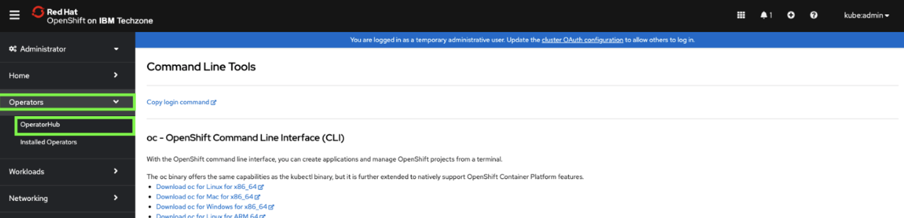
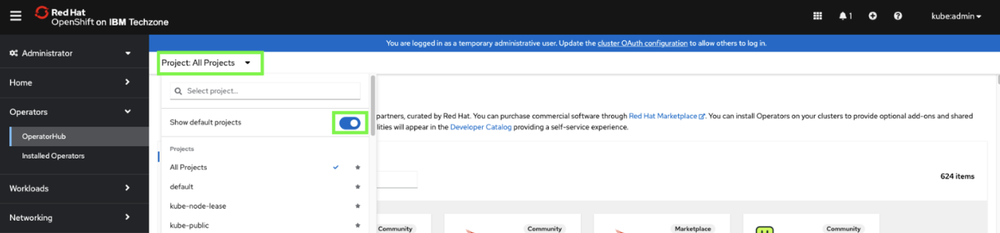
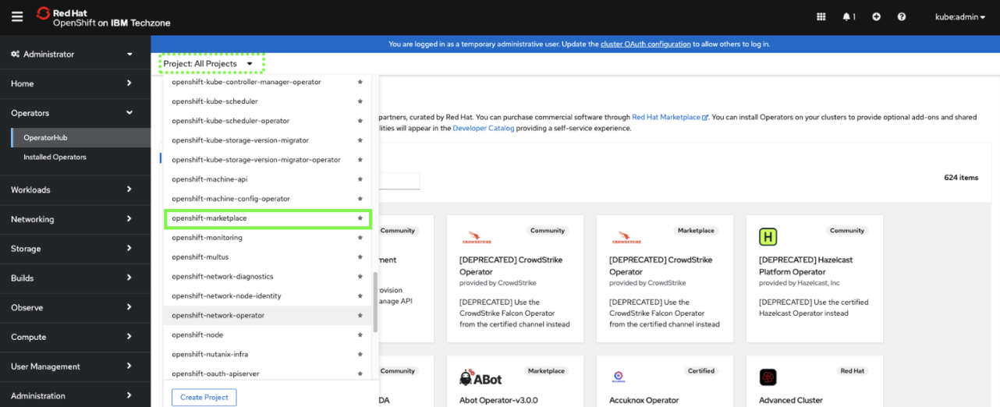
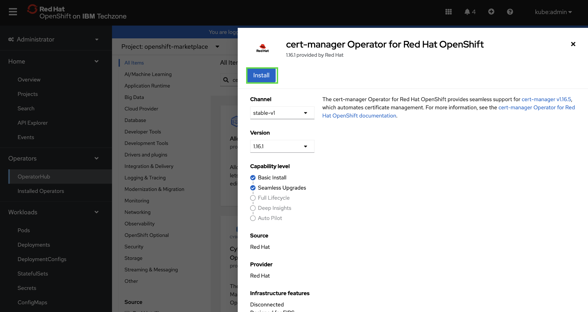

# Install cert-manager Operator for Red Hat OpenShift

1. In the OpenShift web console, click **Operators** and then select **OperatorHub**.
   
    

2. Click the **Project** to pull-down menu and click the **Show default projects** toggle.
   
    

3. Scroll down and select **openshift-marketplace**.
   
    

4. Enter `cert-manager` in the search field and then click the **cert-manager Operator for Red Hat OpenShift** tile.
   
    ***Note:** it may take a minute or 2 for the tile to appear. Click on a different tab and go back to it to refresh*.
   
    

5. Click **Install**.
   
    

6. Keep the default settings and click **Install**.
   
    

    ***NOTE:*** *the installation process takes a few minutes. DO NOT continue until you see the following message: `Installed operator: ready for use`.*

    

   