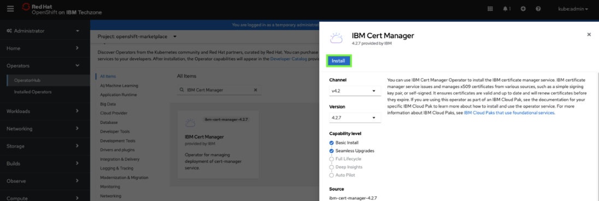

# Install IBM Cert Manager on cluster


1. On your local command-line, apply the **IBM Certificate Manager** ***Operator*** in your OpenShift cluster by running the following command:

    ```
    oc apply -f catalogCertManager.yaml
    ```
    
    The preceding command should return a message that states the ***ibm-cert-manager-catalog** was created*.

2. In the OpenShift web console, click **Operators** and then select **OperatorHub**.
   
    

3. Click the **Project** to pull-down menu and click the **Show default projects** toggle.
   
    

4. Scroll down and select **openshift-marketplace**.
   
    

5. Enter **IBM Cert Manager** in the search field and then click the **IBM Cert Manager** tile.
   
    ***Note:** it may take a minute or 2 for the **IBM Cert Manager** tile to appear. Click on a different tab and go back to it to refresh*.
   
    

6. Click **Install**.
   
    

7. Keep the default settings and click **Install**.
   
    

    ***NOTE:*** *the installation process takes a few minutes. DO NOT continue until you see the following message: `Installed operator: ready for use`.*

    

   

