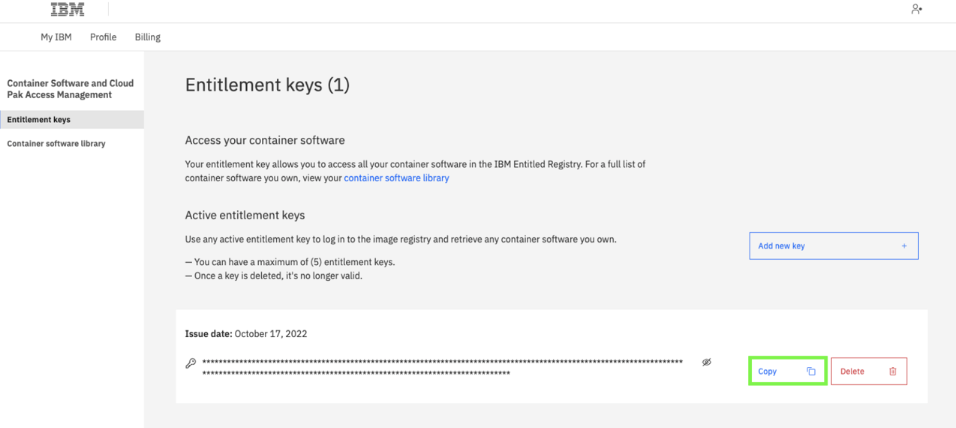
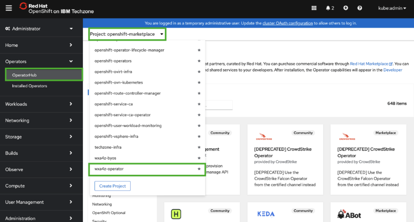
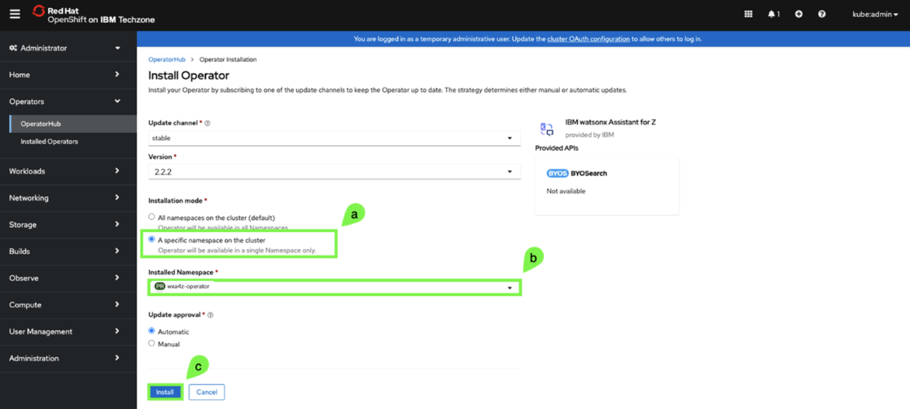

# Install the watsonx Assistant for Z Operator

In this step you will install the watsonx Assistant for Z operator to deploy and configure **zAssistantDeploy** on your cluster. First, you will need to deploy the catalog source using the provided YAML file.

1. In your local command prompt or terminal window, create 2 new namespaces called `wxa4z-operator` and `wxa4z-zad` in the cluster by issuing the following 2 commands in sequence:
   
    `oc create namespace wxa4z-operator`

    `oc create namespace wxa4z-zad`

2. Next, you will need to create or obtain your IBM Container Software production entitlement key. This is required to pull the container images that get deployed by the operator.

    You can create or retrieve an entitlement key by accessing the <a href="https://myibm.ibm.com/products-services/containerlibrary" target="_blank">Entitlement keys page here</a>.

    If you don’t have an entitlement key at the above link, click the **Add new key** to create a new one. 

    If extra assistance is needed, refer to this <a href="https://github.ibm.com/alchemy-registry/image-iam/blob/master/obtaining_entitlement.md" target="_blank">site</a>.

    ***Locate your existing key or create a new one and continue to the next step.***

3. Click **copy** and record your entitlement key for future use in a secure location.
   
    

4. In your command prompt or terminal window, set an environment variable with your production entitlement key.

    Substitute your production entitlement key copied in the last step for `<entitlement key>`.

    ***Mac users:***
    ```
    export IBM_CS_ENT_KEY=<entitlement key>
    ```

    ***Windows users:***
    ```
    set IBM_CS_ENT_KEY=<entitlement key>
    ```

5. Enter the following command (depending on operating system) to create a pull secret for the Container Registry.

    ***Mac users:***
    ```
    oc -n wxa4z-zad create secret docker-registry icr-pull-secret --docker-server=cp.icr.io --docker-username=cp --docker-password=$IBM_CS_ENT_KEY
    ```

    ***Windows users:***
    ```
    oc -n wxa4z-zad create secret docker-registry icr-pull-secret --docker-server=cp.icr.io --docker-username=cp --docker-password=%IBM_CS_ENT_KEY%
    ```

    

6. Create your **catalog source** resource in your OpenShift cluster by running the following command:
   
    ```
    oc apply -f catalogSource.yaml
    ```

    

7. In the OpenShift web console, click **OperatorHub**, toggle off **‘Show default projects’**, and then select the **wxa4z-operator** project.
   
    

8. Enter `ibm watsonx` in the search field and then click the **IBM watsonx Assistant for Z** Operator Catalog tile.
   
    ***Note:** it may take a minute or 2 for the tile to appear. Click on a different tab and go back to it to refresh.*

    

9. Click **Install**.
    
    ***Note:** the current version of the operator may differ than what’s shown in the image below.*

    

10. Select **A specific namespace on the cluster (a)** under **Installation mode** and **wxa4z-operator (b)** for the **Installed Namespace**, then click **Install (c)**.
    
    

    ***NOTE:*** the installation process may take a few minutes. **DO NOT CONTINUE** until you see the following message: **`Installed operator: ready for use.`**

    

11. In the OpenShift web console, under **Workloads**, click **Pods**.
    
    

12. Verify the two pods that start with **ibm-wxa4z-operator** have a status of **Running** and that all pods are Ready.
    
    

### Update the Operator Group

After the installation is completed, update the operator group targeting the namespaces where you will deploy the **zAssistantDeploy** resources.

1. First, run the following command to retrieve the **unique name** of your operator group:
   
    ```
    oc -n wxa4z-operator get operatorgroup
    ```

    The output should contain a single operator group as shown in the following example:

    

    ***NOTE:** record the outputted operatorgroup value as you will need it in the following step.*

2. Finally, run the following command (depending on operating system) to update the list of targeted namespaces, where `<operatorgroup-name>` is substituted with **your** unique operatorgroup name recorded in the previous step.
   
    ***Mac users:***
    ```
    oc -n wxa4z-operator patch operatorgroup <operatorgroup-name> --type=merge -p '{"spec": {"targetNamespaces": ["wxa4z-zad"]}}'
    ```

    ***Windows users:***
    ```
    oc -n wxa4z-operator patch operatorgroup <operatorgroup-name> --type=merge -p "{\"spec\": {\"targetNamespaces\": [\"wxa4z-zad\"]}}"
    ```

3. If done successfully, you should see output returned like the following:
   
   *`operatorgroup.operators.coreos.com/wxa4z-operator-fbtjx patched`*
